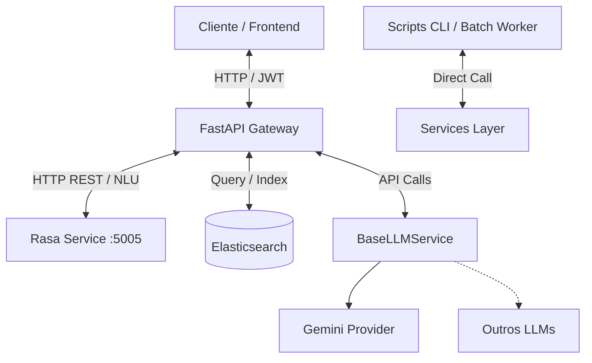

# 🤖 IUNA API

> **API do projeto IUNA - IFAL.**  
> Uma solução moderna de backend desenvolvida com **FastAPI** para gerenciar a vetorização, resumo, extração de entidades, divisão de textos (chunks) e conversação inteligente (RAG) integrada com **Elasticsearch**, **Rasa** e **LLMs** (Gemini).

---

## 🚀 Tecnologias Principais

O projeto utiliza uma stack robusta voltada para alta performance, flexibilidade e processamento de linguagem natural:

* **[FastAPI](https://fastapi.tiangolo.com/)** - Framework Python rápido e moderno para construção de APIs.
* **[Elasticsearch](https://www.elastic.co/)** - Motor de busca e análise distribuído para armazenamento, consulta e busca híbrida de documentos.
* **[Rasa](https://rasa.com/)** - Serviço conversacional independente de NLU e gerenciamento de fluxos de diálogo.
* **[Gemini API](https://ai.google.dev/)** - LLM utilizado para geração de resumos de textos longos, extração de entidades, embeddings e respostas contextuais (RAG).
* **[Pydantic v2](https://docs.pydantic.dev/)** - Validação de dados e gerenciamento de configurações.

---

## 🛠️ Arquitetura Geral do Sistema

A IUNA API é estruturada sob os princípios de Clean Architecture e separação de responsabilidades. A lógica de negócios é desacoplada dos controladores de entrada e das APIs externas.



> [!NOTE]
> **Rasa como Serviço Independente**: O Rasa não é importado como uma biblioteca interna da API, mas sim implantado como um microserviço HTTP separado (tipicamente na porta `5005`). O FastAPI atua como o cliente HTTP e orquestrador principal, repassando mensagens ao Rasa para extrair a intenção e entidades do usuário.

Para uma análise detalhada dos fluxos de dados, modelagem do Elasticsearch, treinamento do Rasa e design patterns de pré-processamento offline, consulte o **[Guia Arquitetural Detalhado (kiro.md)](file:///Users/thiagooliveira/desenv/workspace/ifal/iuna-api/kiro.md)**.

---

## 📦 Estrutura de Diretórios Proposta

O código-fonte da aplicação está organizado da seguinte forma:

```text
app/
├── api/
│   ├── dependencies.py       # Validação de segurança, autenticação de tokens
│   ├── endpoints.py          # Endpoints gerais (health-check, info)
│   └── v1/
│       ├── summary.py        # Controller de Resumos de texto
│       ├── vectorization.py  # Controller de Vetorização de texto
│       ├── entities.py       # Controller de Extração de Entidades
│       ├── chunking.py       # Controller de Divisão de Textos (Chunking)
│       └── chat.py           # Controller da API de Chat (Rasa + LLM)
├── core/
│   ├── config.py             # Configurações do sistema via variáveis de ambiente
│   └── security.py           # Funções de criptografia, hashing e geração de JWT
├── services/
│   ├── summary_service.py    # Processamento de resumos (texto bruto ou path_id)
│   ├── vector_service.py     # Processamento de embeddings (texto bruto ou path_id)
│   ├── entities_service.py   # Processamento de entidades (texto bruto ou path_id)
│   ├── chunking_service.py   # Processamento de segmentação de texto (chunks)
│   └── chat_service.py       # Orquestração do Chat (Rasa + Elasticsearch + LLM)
├── clients/
│   ├── elasticsearch.py      # Conectividade e consultas no Elasticsearch
│   └── rasa.py               # Client HTTP para comunicação com o Rasa NLU (Porta 5005)
├── providers/
│   └── llm/
│       ├── base.py           # Interface base (BaseLLMProvider)
│       ├── gemini.py         # Provedor do Gemini API
│       └── factory.py        # Factory para criação e injeção do LLM ativo
└── cli/
    └── batch.py              # Ponto de entrada CLI para execução em lote/batch
```

---

## 🐳 Execução via Docker (Recomendado)

O projeto inclui arquivos de configuração Docker para subir toda a infraestrutura local (FastAPI e Rasa) de forma isolada, evitando conflitos de dependências Python.

### 1. Inicializar os Serviços
Suba os contêineres em segundo plano:
```bash
docker-compose up -d --build
```
Isso iniciará:
* A **IUNA API (FastAPI)** na porta `8000`.
* O **Rasa Service** na porta `5005`.

### 2. Treinar o modelo do Rasa
Para treinar ou re-treinar a inteligência NLU do Rasa após alterações nos arquivos do diretório `./rasa`:
```bash
docker-compose run --rm rasa rasa train
```
O Rasa detectará o novo modelo treinado na pasta `./rasa/models/` e fará o reload automaticamente.

---

## 🔧 Configuração e Instalação Local (Sem Docker)

### Pré-requisitos
* Python 3.10 ou superior
* Elasticsearch 8.x em execução
* Rasa Open Source instalado e em execução (para o serviço de chat)

### 1. Configurar o Ambiente Virtual (venv)
```bash
python3 -m venv .venv
source .venv/bin/activate
pip install -r requirements.txt
```

### 2. Configurar Variáveis de Ambiente
Crie um arquivo `.env` na raiz do projeto contendo as seguintes configurações (ajuste os dados do Elasticsearch com as credenciais da sua instância externa):
```ini
PROJECT_NAME="IUNA API"
API_V1_STR="/api/v1"
SECRET_KEY="sua_chave_secreta_aqui_para_assinatura_jwt"
JWT_ALGORITHM="HS256"
ACCESS_TOKEN_EXPIRE_MINUTES=60

# Elasticsearch Config (Pode ser local ou apontar para sua instância externa de dados)
ELASTICSEARCH_HOSTS="https://sua-instancia-elastic:9200"
ELASTICSEARCH_USER="seu_usuario"
ELASTICSEARCH_PASSWORD="sua_senha_do_elastic"

# LLM Config
ACTIVE_LLM_PROVIDER="gemini"
GEMINI_API_KEY="sua_api_key_do_gemini"

# Rasa Config
RASA_API_URL="http://localhost:5005"
```

### 3. Executar o FastAPI localmente
```bash
uvicorn app.main:app --reload
```

---

## 📦 Processamento em Lote (Batch CLI)

A lógica de negócios é desacoplada dos controladores web. Portanto, todas as ações de **resumo, vetorização, extração de entidades e divisão de textos (chunks)** podem ser executadas offline por meio de comandos de terminal no container ou localmente.

```bash
# Executando localmente
python -m app.cli.batch --action chunk-all

# Executando dentro do container Docker
docker-compose exec web python -m app.cli.batch --action chunk-all
```

---

## 🧪 Testes

Os testes estão divididos em testes unitários e de integração utilizando a biblioteca `pytest`.

Para rodar todos os testes do projeto:
```bash
pytest
```
ou via docker:
```bash
docker-compose exec web pytest
```
