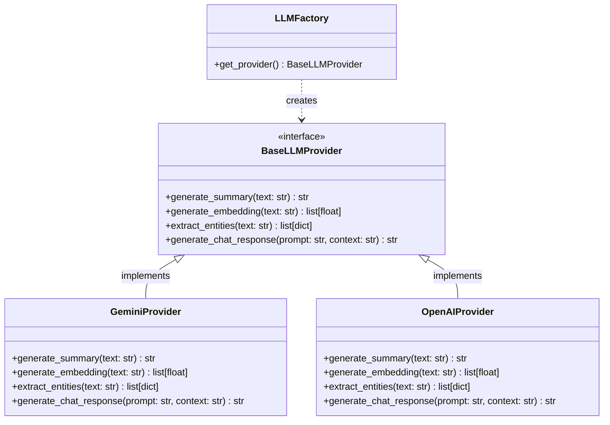
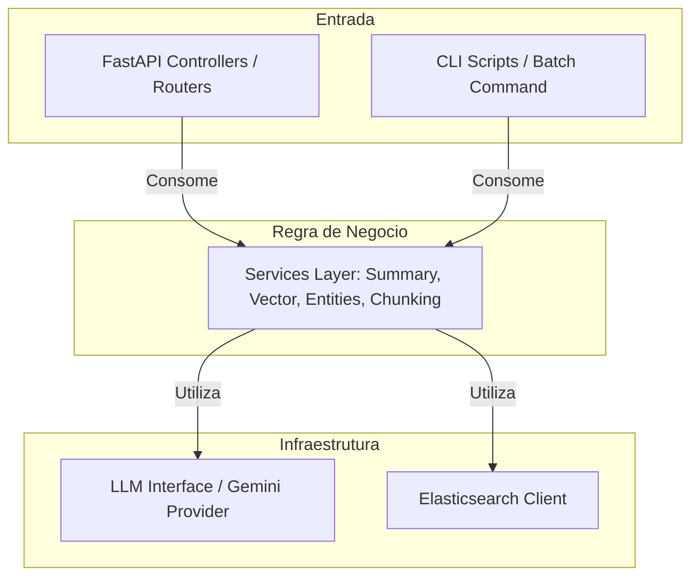
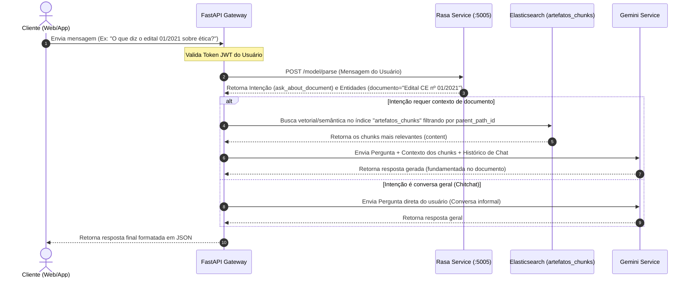

# 📐 Guia Arquitetural - IUNA API (`kiro.md`)

Este documento detalha o design arquitetural, os padrões de projeto, a modelagem de dados e as integrações da IUNA API. A arquitetura foi concebida para ser altamente extensível, segura e de fácil manutenção.

---

## 🏛️ Princípios de Design

1. **Separação de Responsabilidades (SoC)**: Os controladores HTTP (controllers) tratam apenas de requisições/respostas e validação de contratos de API. Toda a lógica de negócios reside nos *Services*.
2. **Desacoplamento de LLM**: A API não faz chamadas diretas às bibliotecas ou endpoints do Gemini (ou de qualquer outro modelo). Ela interage com uma abstração.
3. **Orquestração Inteligente**: Uso do Rasa como motor NLU para classificação de intenções do usuário, permitindo fluxos de chat direcionados.
4. **Segurança Centralizada**: Garantia de controle de acesso em todos os recursos com segurança baseada em tokens.
5. **Duplo Ponto de Entrada**: Capacidade de acionar toda a inteligência (resumos, embeddings, extração de entidades e chunking) tanto via requisições HTTP em tempo real (API) quanto via scripts em linha de comando (Batch/Lote offline).

---

## 🗄️ Integração com Elasticsearch (Mapeamento de Índices)

Trabalhamos com dois índices principais no Elasticsearch para garantir alta velocidade de busca semântica (RAG) e organização de dados estruturados:

### 1. Índice Principal: `artefatos`
Armazena a informação completa do documento original e metadados agregados de alto nível gerados.
```json
{
  "_index": "artefatos",
  "_id": "ezcC7psBL-x_8ArHXKJt",
  "_source": {
    "attachment": {
      "content": "SERVIÇO PÚBLICO FEDERAL \nCOMISSÃO DE ÉTICA PÚBLICA \n..."
    },
    "artefato": {
      "titulo": "Edital CE nº 01/2021",
      "path_id": "caminho/identificador/do/arquivo",
      "resumo": "Este edital trata do processo seletivo para...",
      "embedding_vector": [0.012, -0.045, 0.982, ...],
      "entidades": [
        {"texto": "Edital CE nº 01/2021", "categoria": "DOCUMENTO"},
        {"texto": "Comissão de Ética", "categoria": "ORGANIZACAO"}
      ]
    }
  }
}
```

### 2. Índice de Chunks: `artefatos_chunks`
Armazena os fragmentos (chunks) gerados a partir do texto do documento original, associados a seus respectivos embeddings individuais de alta definição.
```json
{
  "_index": "artefatos_chunks",
  "_id": "chunk_ezcC7psBL-x_8ArHXKJt_0",
  "_source": {
    "parent_path_id": "ezcC7psBL-x_8ArHXKJt",
    "chunk_index": 0,
    "content": "SERVIÇO PÚBLICO FEDERAL \nCOMISSÃO DE ÉTICA PÚBLICA...",
    "embedding_vector": [0.005, -0.021, 0.741, ...]
  }
}
```

---

## 🔌 Abstração de LLM (Padrão Factory)

Para permitir a substituição do Gemini por outros modelos (como OpenAI GPT, Claude, ou modelos locais via Llama.cpp), utilizamos o padrão **Abstract Factory** e injeção de dependências.



---

## ⚡ Processamento Offline de Documentos (Pre-chat RAG)

### Análise Matemática de Contextos (Livros de 200 Páginas)

| Tamanho do Documento | Palavras (Aprox.) | Caracteres (Aprox.) | Tokens (Aprox.) | Classificação Técnico-Financeira |
| :--- | :--- | :--- | :--- | :--- |
| **1 Página** | 500 | 3.000 | 670 | **Pequeno**: Processamento direto na janela de contexto de qualquer LLM. |
| **10 Páginas** | 5.000 | 30.000 | 6.700 | **Médio**: Limiar recomendado para início de Chunking no RAG. |
| **50 Páginas** | 25.000 | 150.000 | 33.500 | **Grande**: Chunking altamente recomendado devido a custos de input repetitivo. |
| **200 Páginas (Livro)** | 100.000 | 600.000 | 134.000 | **Muito Grande**: Exige obrigatoriamente chunking para evitar problemas de custo e latência. |

### Por que fazer Chunking se o Gemini aceita até 2 milhões de tokens?

1. **Custo Financeiro Escalável**: Se um usuário faz 10 perguntas em um chat sobre um livro de 200 páginas (134k tokens), e enviamos o livro inteiro de contexto a cada turno, o consumo final será de **1,34 milhão de tokens** apenas para uma conversa. Com o fatiamento (chunking), enviamos apenas os 3 chunks mais relevantes (~2k tokens), consumindo apenas **20k tokens** na mesma conversa (uma economia de 98.5%).
2. **Latência de Resposta**: Processar 134k tokens em tempo real a cada requisição de chat eleva substancialmente o tempo de processamento (Time to First Token - TTFT) do modelo.
3. **Precisão da Informação (Lost in the Middle)**: Modelos de linguagem tendem a perder a acurácia ou "ignorar" detalhes quando a informação correta está enterrada no meio de um contexto massivo de 100k+ tokens. Chunks menores e bem focados melhoram a precisão da resposta.

### Estratégia de Processamento Offline

* O **Chunking Service** realiza a segmentação e delega a geração de vetores ao **Vector Service**.
* Os chunks vetorizados são salvos no índice `artefatos_chunks`.

---

## 🛠️ Arquitetura de Duplo Ponto de Entrada (API vs. Batch CLI)

Para garantir que a aplicação seja capaz de responder a chamadas HTTP (API) e executar rotinas de processamento pesado em lote (Batch/Offline) de forma consistente, a arquitetura foi desenhada com total isolamento das camadas de entrada.



---

## 💬 Arquitetura e Orquestração do Chat (FastAPI + Rasa Service)

O **Rasa Open Source** roda como um microserviço HTTP separado (tipicamente em `http://localhost:5005`). A comunicação entre o FastAPI e o Rasa é feita exclusivamente através da API REST do Rasa.



---

## 🛡️ Modelo de Segurança (Token JWT)

Todas as rotas críticas da API são protegidas contra acesso não autorizado usando **OAuth2 Bearer Tokens**.

---

## 📂 Design dos Endpoints (APIs)

### 1. Resumos (`/api/v1/summary`)
* **`POST /api/v1/summary/generate`**: Gera o resumo de um texto (corpo ou `path_id`).

### 2. Vetorização (`/api/v1/vectorization`)
* **`POST /api/v1/vectorization/generate`**: Gera o embedding de um texto (corpo ou `path_id`).

### 3. Entidades (`/api/v1/entities`)
* **`POST /api/v1/entities/generate`**: Extrai entidades nomeadas (corpo ou `path_id`).

### 4. Segmentação (Chunking) (`/api/v1/chunking`)
* **`POST /api/v1/chunking/generate`**: Divide um documento em blocos com sobreposição.
  * Corpo da requisição aceita ou `text` ou `path_id`.
  * Parâmetros opcionais: `chunk_size` (padrão: 1000) e `chunk_overlap` (padrão: 200).
  * Se `path_id` for fornecido, a API busca no Elasticsearch, fatia o documento, gera vetores semânticos para cada bloco e os indexa no índice `artefatos_chunks` vinculados ao `parent_path_id` correspondente.

### 5. Chat (`/api/v1/chat`)
* **`POST /api/v1/chat/message`**: Envia mensagem na conversação.
  * Corpo aceita: `message`, `session_id`, e opcionalmente uma lista de `path_ids` para filtrar ou focar a busca de contexto em documentos específicos relacionados.
  * O FastAPI consulta o índice `artefatos_chunks` aplicando busca híbrida (BM25 + busca vetorial kNN) para resgatar os chunks com maior score semântico.
