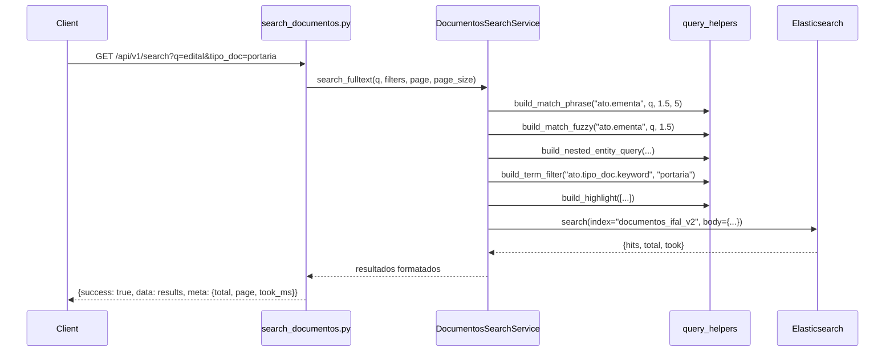
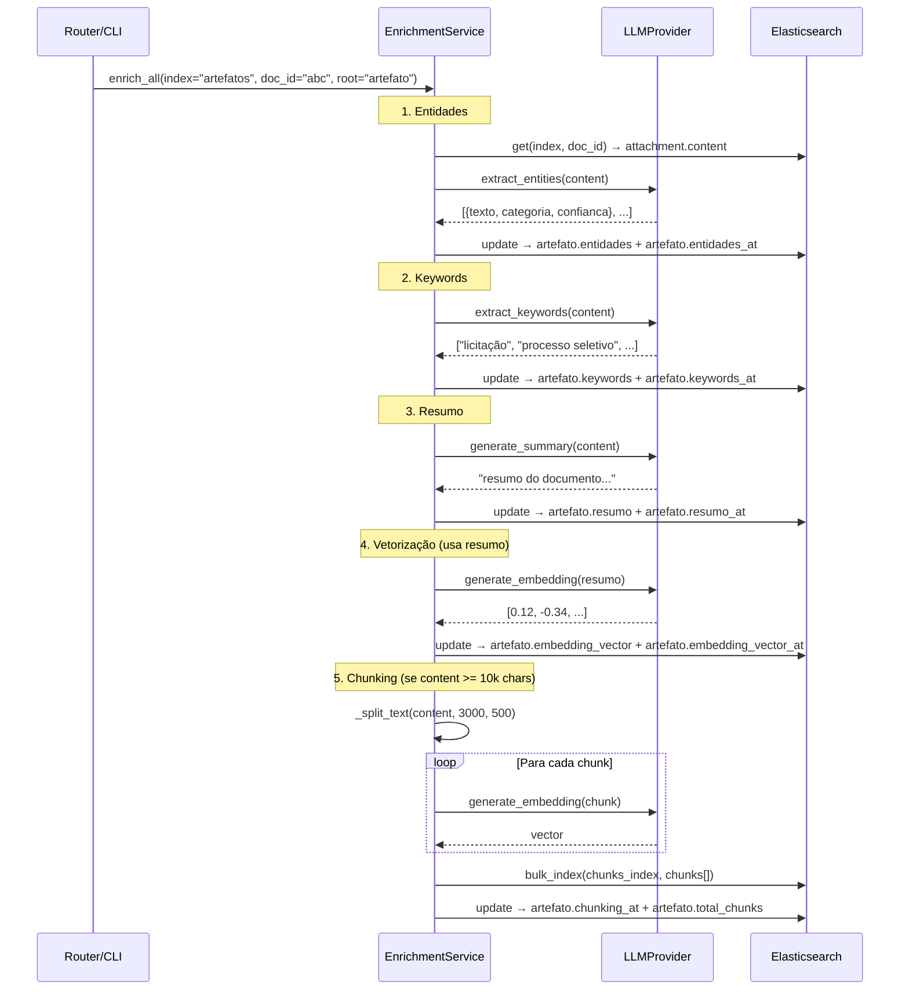
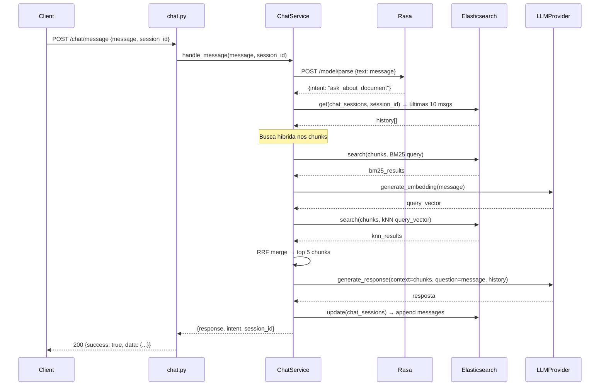
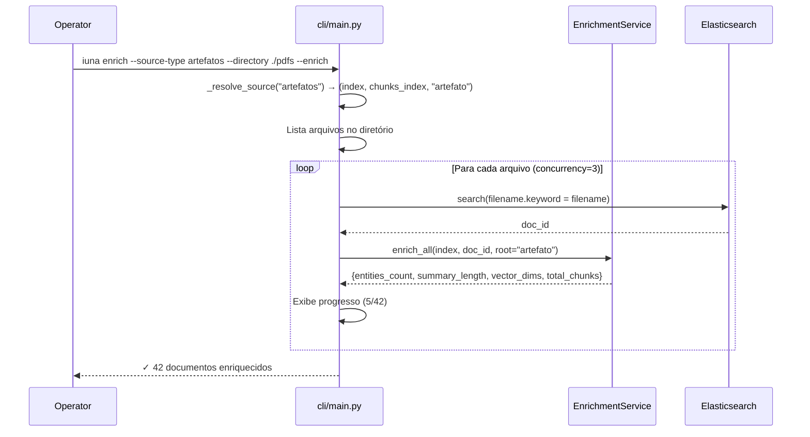

# 🏗️ Design — IUNA API (Arquitetura Simplificada)

**Projeto**: IUNA API  
**Versão**: 2.0.0  
**Princípio-Chave**: SIMPLICIDADE > GENERALIDADE

> **Existem apenas 2 tipos de objetos: `documentos_ifal_v2` e `artefatos`.**  
> Sem framework genérico. Sem DocumentAdapter. Sem SEARCH_CONFIG. Cada tipo tem seu serviço concreto.

---

## 0. Setup do Ambiente

### 0.1 Elasticsearch (dependência externa)

- ES roda fora do docker-compose (cloud ou instância dedicada).
- Credenciais via `.env`: `ELASTICSEARCH_HOSTS`, `ELASTICSEARCH_USER`, `ELASTICSEARCH_PASSWORD`.
- **Conexão via HTTPS** (URL com `https://`). Em dev com certificado auto-assinado, usar `verify_certs=False`.
- **Sufixo de índice**: variável `ES_INDEX_SUFFIX` (default `""`, valor `_test` para testes).
  - Exemplo: `documentos_ifal_v2_test`, `artefatos_chunks_test`.
- **Ingest Attachment Pipeline** é pré-requisito para extração de texto de PDFs via ES. Deve ser criado antes de indexar documentos. Ver `elastic/setup/20260622_ingest_pipeline.md`.
- **Criação de índices** via CLI:

```bash
iuna setup-indices              # cria todos os índices
iuna setup-indices --suffix _test  # cria com sufixo
iuna setup-indices --recreate      # deleta e recria
```

O comando lê os arquivos `elastic/*.json` e cria cada índice com o mapping definido.

### 0.2 Rasa (container no docker-compose)

- Container `rasa` definido no `docker-compose.yml`.
- Treinamento: `docker compose run rasa train`.
- Fallback: se Rasa indisponível, chat classifica como `ask_about_document` por padrão.
- URL configurável via `RASA_API_URL`.

### 0.3 Variáveis de Ambiente (.env.example completo)

```env
# === Projeto ===
PROJECT_NAME="IUNA API"
API_V1_STR="/api/v1"

# === Segurança ===
API_SECRET_TOKEN=              # Bearer token para autenticação

# === Elasticsearch ===
ELASTICSEARCH_HOSTS="https://seu-elastic:9200"
ELASTICSEARCH_USER=elastic
ELASTICSEARCH_PASSWORD=
ES_INDEX_SUFFIX=               # "" para prod, "_test" para testes

# === LLM Provider ===
ACTIVE_LLM_PROVIDER="gemini"   # gemini | claude | ollama
GEMINI_API_KEY=
CLAUDE_API_KEY=
OLLAMA_BASE_URL="http://localhost:11434"
OLLAMA_MODEL="llama3"

# === Rasa ===
RASA_API_URL="http://rasa:5005"

# === Chat ===
CHAT_SESSION_TTL_HOURS=24
CHAT_HISTORY_MAX_MESSAGES=10

# === Batch/CLI ===
BATCH_DEFAULT_CONCURRENCY=3
```

---

## 1. Arquitetura Simplificada

### 1.1 Diagrama em Camadas

```
┌─────────────────────────────────────────────────────────────┐
│                        CAMADA API                            │
│  search_documentos · search_artefatos · crud_documentos     │
│  crud_artefatos · enrichment · chat · stats · health        │
├─────────────────────────────────────────────────────────────┤
│                      CAMADA SERVICES                         │
│                                                             │
│  ESPECÍFICOS:                    COMPARTILHADOS:            │
│  ┌──────────────────────┐       ┌────────────────────────┐ │
│  │ DocumentosSearchSvc  │       │ EnrichmentService      │ │
│  │ ArtefatosSearchSvc   │       │ ChunkingService (*)    │ │
│  │ DocumentosCrudSvc    │       │ ChatService            │ │
│  │ ArtefatosCrudSvc     │       │ VectorService          │ │
│  └──────────────────────┘       │ SummaryService         │ │
│                                 │ EntitiesService        │ │
│                                 │ ChunksSearchService    │ │
│                                 │ StatsService           │ │
│                                 └────────────────────────┘ │
├─────────────────────────────────────────────────────────────┤
│                    CAMADA INFRAESTRUTURA                     │
│  ESClient · RasaClient · LLM Providers · PDF Extractor      │
├─────────────────────────────────────────────────────────────┤
│              DEPENDÊNCIAS EXTERNAS                           │
│  Elasticsearch (cloud) · Rasa (container) · LLM (cloud/local)│
└─────────────────────────────────────────────────────────────┘

(*) ChunkingService é parte do EnrichmentService (método enrich_chunks)
```

### 1.2 Tabela de Services

| Service | Tipo | Responsabilidade |
|---------|------|-----------------|
| `DocumentosSearchService` | Específico | Busca full-text, filtros, facetas para `documentos_ifal_v2` |
| `ArtefatosSearchService` | Específico | Busca full-text, filtros simples para `artefatos` |
| `DocumentosCrudService` | Específico | CRUD de documentos (indexação, consulta, deleção) |
| `ArtefatosCrudService` | Específico | CRUD de artefatos (upload PDF, consulta, deleção) |
| `EnrichmentService` | Compartilhado | Resumo, vetorização, entidades, keywords, chunking — recebe `(index, doc_id, root)` |
| `ChunksSearchService` | Compartilhado | Busca em chunks de ambos os tipos |
| `ChatService` | Compartilhado | RAG com Rasa + LLM + histórico |
| `StatsService` | Compartilhado | Estatísticas agregadas |

### 1.3 Princípio Fundamental

> **Existem apenas 2 tipos fixos. Não existe extensibilidade para N tipos.**

- `documentos_ifal_v2` é o mais específico (metadados ricos sob `ato.*`).
- `artefatos` é genérico (metadados mínimos sob `artefato.*`).

**O que é COMPARTILHADO** — services que recebem `index_name` + `root_prefix` + `doc_id`:
- `EnrichmentService` — sabe que conteúdo está em `attachment.content` e grava em `{root}.resumo`, `{root}.entidades`, etc.
- `ChunksSearchService` — busca em índices de chunks.
- `ChatService` — busca híbrida nos chunks de ambos os tipos.

**O que é ESPECÍFICO** — cada tipo tem seu service concreto com campos hardcoded:
- `DocumentosSearchService` — filtros ricos (tipo_doc, orgao, esfera, ano...), facetas.
- `ArtefatosSearchService` — filtros simples (tipo, uploaded_by, período).
- `DocumentosCrudService` / `ArtefatosCrudService` — lógica de criação/deleção específica.

---

## 2. Estrutura de Arquivos

```
app/
├── api/
│   └── routers/
│       ├── search_documentos.py    # GET /search (documentos)
│       ├── search_artefatos.py     # GET /artefatos/search
│       ├── crud_documentos.py      # POST/GET/DELETE /documentos
│       ├── crud_artefatos.py       # POST/GET/DELETE /artefatos
│       ├── enrichment.py           # POST /summary, /vectorization, /entities, /chunking
│       ├── chat.py                 # POST /chat/message
│       ├── stats.py                # GET /stats
│       └── health.py               # GET /health-check, /info
├── services/
│   ├── documentos_search.py        # DocumentosSearchService
│   ├── artefatos_search.py         # ArtefatosSearchService
│   ├── documentos_crud.py          # DocumentosCrudService
│   ├── artefatos_crud.py           # ArtefatosCrudService
│   ├── enrichment.py               # EnrichmentService (compartilhado)
│   ├── chunks_search.py            # ChunksSearchService (compartilhado)
│   ├── chat.py                     # ChatService
│   ├── summary.py                  # SummaryService (usado pelo Enrichment)
│   ├── vector.py                   # VectorService (usado pelo Enrichment)
│   ├── entities.py                 # EntitiesService (usado pelo Enrichment)
│   └── stats.py                    # StatsService
├── clients/
│   ├── es_client.py                # ESClient (async, singleton)
│   └── rasa_client.py              # RasaClient
├── providers/
│   ├── base.py                     # BaseLLMProvider (interface)
│   ├── gemini.py                   # GeminiProvider
│   ├── claude.py                   # ClaudeProvider
│   ├── ollama.py                   # OllamaProvider
│   └── factory.py                  # get_llm_provider()
├── core/
│   ├── exceptions.py               # Exceções customizadas
│   ├── pdf_extractor_local.py       # Extração local de texto de PDF (fallback offline/testes)
│   └── query_helpers.py            # Funções utilitárias de query ES
├── cli/
│   └── main.py                     # Comandos: setup-indices, enrich, index, delete
├── config.py                       # Settings (pydantic-settings)
└── main.py                         # FastAPI app + startup/shutdown
```

> **Nota**: A extração primária de texto de PDFs é feita via ES Ingest Attachment Pipeline (Apache Tika). O arquivo `pdf_extractor_local.py` é apenas o fallback local para cenários offline/testes.

---

## 3. Configuração

```python
# app/config.py
from pydantic_settings import BaseSettings, SettingsConfigDict

class Settings(BaseSettings):
    # Projeto
    PROJECT_NAME: str = "IUNA API"
    API_V1_STR: str = "/api/v1"

    # Segurança
    API_SECRET_TOKEN: str = ""

    # Elasticsearch
    ELASTICSEARCH_HOSTS: str = "https://localhost:9200"
    ELASTICSEARCH_USER: str = "elastic"
    ELASTICSEARCH_PASSWORD: str = ""
    ES_INDEX_SUFFIX: str = ""  # "_test" para testes

    # LLM
    ACTIVE_LLM_PROVIDER: str = "gemini"  # gemini | claude | ollama
    GEMINI_API_KEY: str = ""
    CLAUDE_API_KEY: str = ""
    OLLAMA_BASE_URL: str = "http://localhost:11434"
    OLLAMA_MODEL: str = "llama3"

    # Rasa
    RASA_API_URL: str = "http://rasa:5005"

    # Chat
    CHAT_SESSION_TTL_HOURS: int = 24
    CHAT_HISTORY_MAX_MESSAGES: int = 10

    # Batch
    BATCH_DEFAULT_CONCURRENCY: int = 3

    model_config = SettingsConfigDict(env_file=".env", case_sensitive=True)

    # Helpers para nomes de índice
    @property
    def index_documentos(self) -> str:
        return f"documentos_ifal_v2{self.ES_INDEX_SUFFIX}"

    @property
    def index_documentos_chunks(self) -> str:
        return f"documentos_ifal_v2_chunks{self.ES_INDEX_SUFFIX}"

    @property
    def index_artefatos(self) -> str:
        return f"artefatos{self.ES_INDEX_SUFFIX}"

    @property
    def index_artefatos_chunks(self) -> str:
        return f"artefatos_chunks{self.ES_INDEX_SUFFIX}"

    @property
    def index_chat_sessions(self) -> str:
        return f"chat_sessions{self.ES_INDEX_SUFFIX}"

settings = Settings()
```

---

## 3.5 Contratos da API (Endpoints)

### Visão geral das rotas

| # | Método | Rota | Módulo |
|---|--------|------|--------|
| | **Health (sem auth)** | | |
| 1 | GET | `/health-check` | Status básico |
| 2 | GET | `/info` | Nome/versão |
| 3 | GET | `/health` | Verifica ES + Rasa + LLM |
| | **Stats** | | |
| 4 | GET | `/stats` | Estatísticas agregadas |
| | **CRUD — Documentos** | | |
| 5 | POST | `/documentos/upload` | Upload PDF + metadados (opcionais) |
| 6 | GET | `/documentos/{document_id}` | Consulta por ID |
| 7 | GET | `/documentos/by-filename/{filename}` | Consulta por filename |
| 8 | DELETE | `/documentos/{document_id}` | Deletar doc + chunks |
| | **CRUD — Artefatos** | | |
| 9 | POST | `/artefatos/upload` | Upload PDF + metadados mínimos |
| 10 | GET | `/artefatos/{artefato_id}` | Consulta por ID |
| 11 | GET | `/artefatos/by-filename/{filename}` | Consulta por filename |
| 12 | DELETE | `/artefatos/{artefato_id}` | Deletar artefato + chunks |
| | **Busca — Documentos** | | |
| 13 | GET | `/documentos/search` | Full-text + filtros |
| 14 | GET | `/documentos/search/facets` | Agregações/facetas |
| 15 | GET | `/documentos/search/similar/{document_id}` | Semelhantes (kNN) |
| 16 | GET | `/documentos/search/by-entity` | Busca por entidade |
| 17 | GET | `/documentos/search/by-keyword` | Busca por keyword |
| 18 | GET | `/documentos/search/suggest` | Autocomplete |
| 19 | GET | `/documentos/search/chunks` | Busca em chunks de documentos |
| | **Busca — Artefatos** | | |
| 20 | GET | `/artefatos/search` | Full-text + filtros |
| 21 | GET | `/artefatos/search/similar/{artefato_id}` | Semelhantes (kNN) |
| 22 | GET | `/artefatos/search/by-entity` | Busca por entidade |
| 23 | GET | `/artefatos/search/by-keyword` | Busca por keyword |
| 24_s | GET | `/artefatos/search/suggest` | Autocomplete |
| 25_s | GET | `/artefatos/search/chunks` | Busca em chunks de artefatos |
| | **Enriquecimento — Documentos** | | |
| 24 | POST | `/documentos/summary/generate` | Gerar resumo |
| 25 | POST | `/documentos/vectorization/generate` | Gerar embedding |
| 26 | POST | `/documentos/entities/extract` | Extrair entidades |
| 27 | POST | `/documentos/keywords/extract` | Extrair keywords |
| 28 | POST | `/documentos/chunking/generate` | Segmentar em chunks |
| | **Enriquecimento — Artefatos** | | |
| 29 | POST | `/artefatos/summary/generate` | Gerar resumo |
| 30 | POST | `/artefatos/vectorization/generate` | Gerar embedding |
| 31 | POST | `/artefatos/entities/extract` | Extrair entidades |
| 32 | POST | `/artefatos/keywords/extract` | Extrair keywords |
| 33 | POST | `/artefatos/chunking/generate` | Segmentar em chunks |
| | **Chat** | | |
| 32 | POST | `/chat/message` | Enviar mensagem (RAG) |
| 33 | GET | `/chat/sessions/{session_id}` | Recuperar histórico |
| 34 | GET | `/chat/sessions` | Listar sessões ativas |
| 35 | DELETE | `/chat/sessions/{session_id}` | Encerrar/limpar sessão |
| 36 | POST | `/chat/sessions/{session_id}/add-documento` | Adicionar doc ao contexto |
| 37 | POST | `/chat/sessions/{session_id}/add-artefato` | Adicionar artefato ao contexto |
| 38 | DELETE | `/chat/sessions/{session_id}/context` | Limpar contexto da sessão |
| | **Gestão Complementar** | | |
| 39 | PATCH | `/documentos/{document_id}` | Atualizar metadados (sem PDF) |
| 40 | PATCH | `/artefatos/{artefato_id}` | Atualizar metadados (sem PDF) |
| 41 | GET | `/documentos` | Listagem paginada de todos |
| 42 | GET | `/artefatos` | Listagem paginada de todos |
| 43 | GET | `/documentos/{document_id}/enrichment-status` | Status de enriquecimento |
| 44 | GET | `/artefatos/{artefato_id}/enrichment-status` | Status de enriquecimento |
| 45 | POST | `/documentos/{document_id}/enrich` | Enriquecer (tudo ou selecionado) |
| 46 | POST | `/artefatos/{artefato_id}/enrich` | Enriquecer (tudo ou selecionado) |
| 47 | GET | `/documentos/entities` | Listar entidades com contagem |
| 48 | GET | `/artefatos/entities` | Listar entidades com contagem |
| | **Scoring / Relevância por Uso** | | |
| 49 | POST | `/documentos/{document_id}/score` | Registrar interação (click, add-to-chat, etc.) |
| 50 | POST | `/artefatos/{artefato_id}/score` | Registrar interação |

> Todas as rotas (exceto 1, 2) estão sob `/api/v1/` e exigem `Authorization: Bearer <token>`.
> O prefixo `/documentos/` ou `/artefatos/` no path define o tipo — mesmo controller pode servir ambos internamente.

---

### 3.5.1 CRUD — Documentos

#### `POST /api/v1/documentos/upload`
```
Request: multipart/form-data
  - file: <arquivo PDF> (obrigatório)
  - titulo: "string" (opcional — pode ser extraído do PDF)
  - ementa: "string" (opcional — pode ser gerado pelo backend)
  - tipo_doc: "string" (opcional)
  - numero: "string" (opcional)
  - ano: int (opcional — pode ser inferido)
  - data_publicacao: "YYYY-MM-DD" (opcional)
  - publico: bool (default true)
  - tags: "string,string" (opcional)
  - orgao: "string" (opcional)
  - sigla: "string" (opcional)
  - esfera: "string" (opcional)

Nota: Metadados são em grande parte opcionais — o backend pode
gerá-los/inferi-los a partir do conteúdo do PDF. O mínimo é o arquivo PDF.

Response 200:
{
  "success": true,
  "data": {
    "_id": "...",
    "ato": { "ato_id": "...", "titulo": "...", ... },
    "attachment": { "content_length": 35000 }
  }
}

Response 409 (conflito — mesmo filename):
{ "success": false, "error": "Documento já existe: filename.pdf" }
```

#### `GET /api/v1/documentos/{document_id}`
```
Response 200:
{ "success": true, "data": { "_id": "...", "_source": { ...documento completo... } } }

Response 404:
{ "success": false, "error": "Documento não encontrado" }
```

#### `DELETE /api/v1/documentos/{document_id}`
```
Response 200:
{ "success": true, "data": { "deleted": true, "chunks_deleted": 5 } }
```

---

### 3.5.2 CRUD — Artefatos

#### `POST /api/v1/artefatos/upload`
```
Request: multipart/form-data
  - file: <arquivo PDF>
  - titulo: "string" (obrigatório)
  - uploaded_by: "string" (obrigatório)
  - tipo: "string" (opcional)
  - tags: "string,string" (opcional, separados por vírgula)

Response 200:
{
  "success": true,
  "data": {
    "_id": "uuid",
    "artefato": { "artefato_id": "...", "titulo": "...", ... },
    "attachment": { "content_length": 45000 }
  }
}
```

#### `GET /api/v1/artefatos/{artefato_id}`
```
Response 200:
{ "success": true, "data": { "_id": "...", "_source": { ...artefato completo... } } }
```

---

### 3.5.3 Busca — Documentos

#### `GET /api/v1/documentos/search`
```
Query Params:
  q: "string" (obrigatório)
  page: int (default 1)
  page_size: int (default 20)
  tipo_doc, orgao, esfera, ano, fonte, publico, data_inicio, data_fim, categoria

Response 200:
{
  "success": true,
  "data": {
    "results": [
      { "_id": "...", "ato": {...}, "highlights": {"ato.ementa": ["...<em>termo</em>..."]} }
    ]
  },
  "meta": { "total": 150, "page": 1, "page_size": 20, "took_ms": 42 }
}
```

#### `GET /api/v1/documentos/search/facets`
```
Response 200:
{ "success": true, "data": { "facets": { "tipo_doc": [...], "orgao": [...], "ano": [...] } } }
```

#### `GET /api/v1/documentos/search/similar/{document_id}`
```
Query Params: limit (default 10)
Response 200: { "success": true, "data": { "results": [...] } }
```

#### `GET /api/v1/documentos/search/by-entity`
```
Query Params: entity_text (obrigatório), entity_category (opcional), page, page_size
Response 200: { "success": true, "data": { "results": [...] } }
```

#### `GET /api/v1/documentos/search/suggest`
```
Query Params: q (min 2 chars), limit (default 5)
Response 200: { "success": true, "data": { "suggestions": ["..."] } }
```

#### `GET /api/v1/documentos/search/chunks`
```
Query Params: q, document_id (opcional), page, page_size
Response 200: { "success": true, "data": { "results": [{ "chunk_index": 3, "content": "...", "parent_document_id": "...", ... }] } }
```

---

### 3.5.4 Busca — Artefatos

#### `GET /api/v1/artefatos/search`
```
Query Params: q, page, page_size, tipo, uploaded_by, data_inicio, data_fim
Response 200: (mesma estrutura, campos de artefato)
```

#### `GET /api/v1/artefatos/search/similar/{artefato_id}`
#### `GET /api/v1/artefatos/search/by-entity`
#### `GET /api/v1/artefatos/search/suggest`
#### `GET /api/v1/artefatos/search/chunks`
> Mesma estrutura das rotas de documentos, adaptada para artefatos.

---

### 3.5.5 Enriquecimento

As rotas de enriquecimento seguem o mesmo padrão para ambos os tipos, com o prefixo no path:

#### `POST /api/v1/documentos/summary/generate`
#### `POST /api/v1/artefatos/summary/generate`
```
Request Body:
{
  "document_id": "string"     // OU
  "filename": "string"        // identificar o documento
}
(Alternativamente: "text": "string" para processar texto bruto sem gravar)

Response 200:
{ "success": true, "data": { "resumo": "Resumo gerado pelo LLM..." } }
```

#### `POST /api/v1/documentos/vectorization/generate`
#### `POST /api/v1/artefatos/vectorization/generate`
```
Request Body: (mesma estrutura)
Response 200:
{ "success": true, "data": { "embedding": [0.012, ...], "dims": 768 } }
```

#### `POST /api/v1/documentos/entities/extract`
#### `POST /api/v1/artefatos/entities/extract`
```
Request Body: (mesma estrutura)
Response 200:
{
  "success": true,
  "data": {
    "entidades": [
      { "texto": "IFAL", "categoria": "ORGANIZACAO", "confianca": 0.95 }
    ]
  }
}
```

#### `POST /api/v1/documentos/keywords/extract`
#### `POST /api/v1/artefatos/keywords/extract`
```
Request Body:
{ "document_id": "string" }
(ou "text": "string" para texto bruto)

Response 200:
{
  "success": true,
  "data": {
    "keywords": ["licitação", "processo seletivo", "ética pública", "comissão permanente"]
  }
}
```

#### `GET /api/v1/documentos/search/by-keyword`
#### `GET /api/v1/artefatos/search/by-keyword`
```
Query Params: keyword (obrigatório), page, page_size

Busca documentos que possuem a keyword no campo {root}.keywords.

Response 200:
{
  "success": true,
  "data": { "results": [{ "_id": "...", "matched_keywords": ["licitação"] }] },
  "meta": { "total": 25, "page": 1, "page_size": 20, "took_ms": 12 }
}
```

#### `POST /api/v1/documentos/chunking/generate`
#### `POST /api/v1/artefatos/chunking/generate`
```
Request Body:
{
  "document_id": "string",
  "chunk_size": 3000,     // opcional, mínimo 3000
  "chunk_overlap": 500    // opcional
}

Response 200:
{ "success": true, "data": { "total_chunks": 12, "skipped": false } }

Response 200 (doc < 10k chars):
{ "success": true, "data": { "total_chunks": 0, "skipped": true, "reason": "content < 10000 chars" } }

Response 422 (chunk_size < 3000):
{ "success": false, "error": "chunk_size mínimo é 3000" }
```

> O prefixo no path (`/documentos/` ou `/artefatos/`) define o tipo. O controller resolve internamente qual índice e root usar. Mesma lógica (EnrichmentService), paths diferentes para clareza.

---

### 3.5.6 Chat

#### `POST /api/v1/chat/message`
```
Request Body:
{
  "message": "string" (obrigatório),
  "session_id": "string" (obrigatório),
  "document_ids": ["string"] (opcional),
  "source_type": "documentos" | "artefatos" (opcional, default: busca em ambos)
}

Response 200:
{
  "success": true,
  "data": {
    "response": "Resposta fundamentada nos documentos...",
    "intent": "ask_about_document",
    "session_id": "uuid",
    "context_used": true
  }
}
```

#### `GET /api/v1/chat/sessions/{session_id}`
```
Response 200:
{
  "success": true,
  "data": {
    "session_id": "...",
    "messages": [
      { "role": "user", "content": "...", "timestamp": "..." },
      { "role": "assistant", "content": "...", "timestamp": "..." }
    ],
    "created_at": "...",
    "last_activity_at": "..."
  }
}
```

#### `GET /api/v1/chat/sessions`
```
Query Params: page (default 1), page_size (default 20)
Response 200:
{ "success": true, "data": { "sessions": [{ "session_id": "...", "last_activity_at": "...", "message_count": 12 }] }, "meta": {...} }
```

#### `DELETE /api/v1/chat/sessions/{session_id}`
```
Response 200:
{ "success": true, "data": { "deleted": true } }
```

#### `POST /api/v1/chat/sessions/{session_id}/add-documento`
```
Request Body:
{ "document_id": "string" }

Adiciona um documento ao contexto da sessão. As próximas mensagens
do chat buscarão chunks/conteúdo deste documento para montar contexto.

Response 200:
{ "success": true, "data": { "session_id": "...", "context_documents": ["id1", "id2"] } }
```

#### `POST /api/v1/chat/sessions/{session_id}/add-artefato`
```
Request Body:
{ "artefato_id": "string" }

Adiciona um artefato ao contexto da sessão.

Response 200:
{ "success": true, "data": { "session_id": "...", "context_artefatos": ["id1"] } }
```

#### `DELETE /api/v1/chat/sessions/{session_id}/context`
```
Remove todos os documentos/artefatos do contexto da sessão (limpa referências).

Response 200:
{ "success": true, "data": { "context_documents": [], "context_artefatos": [] } }
```

---

### 3.5.7 Gestão Complementar

#### `PATCH /api/v1/documentos/{document_id}`
```
Request Body (JSON — campos parciais, só o que quer atualizar):
{
  "titulo": "string",
  "ementa": "string",
  "tipo_doc": "string",
  "numero": "string",
  "ano": 2024,
  "publico": true,
  "tags": ["string"],
  "orgao": "string",
  "esfera": "string"
}

Atualiza metadados do documento SEM reenviar o PDF.

Response 200:
{ "success": true, "data": { "_id": "...", "updated_fields": ["titulo", "tags"] } }
```

#### `PATCH /api/v1/artefatos/{artefato_id}`
```
Request Body (JSON — campos parciais):
{
  "titulo": "string",
  "tipo": "string",
  "tags": ["string"],
  "uploaded_by": "string"
}

Response 200:
{ "success": true, "data": { "_id": "...", "updated_fields": ["titulo"] } }
```

#### `GET /api/v1/documentos`
```
Query Params: page (default 1), page_size (default 20)

Listagem paginada de todos os documentos (sem busca textual).

Response 200:
{
  "success": true,
  "data": { "results": [{ "_id": "...", "ato": { "titulo": "...", "tipo_doc": "..." } }] },
  "meta": { "total": 500, "page": 1, "page_size": 20 }
}
```

#### `GET /api/v1/artefatos`
```
Query Params: page (default 1), page_size (default 20)

Listagem paginada de todos os artefatos.

Response 200:
{
  "success": true,
  "data": { "results": [{ "_id": "...", "artefato": { "titulo": "...", "tipo": "..." } }] },
  "meta": { "total": 80, "page": 1, "page_size": 20 }
}
```

#### `GET /api/v1/documentos/{document_id}/enrichment-status`
```
Retorna status de enriquecimento do documento.

Response 200:
{
  "success": true,
  "data": {
    "resumo_at": "2026-06-20T14:30:00Z",
    "entidades_at": "2026-06-20T14:31:00Z",
    "embedding_vector_at": "2026-06-20T14:32:00Z",
    "chunking_at": null,
    "total_chunks": 0
  }
}
```

#### `GET /api/v1/artefatos/{artefato_id}/enrichment-status`
```
Response 200: (mesma estrutura)
```

#### `POST /api/v1/documentos/{document_id}/enrich`
```
Request Body (opcional — se vazio, executa todos):
{
  "operations": ["summary", "entities", "vectorization", "chunking"]
}

Enriquece o documento com as operações selecionadas (ou todas se omitido).
Ordem: entidades → resumo → vetorização → chunking.

Response 200:
{
  "success": true,
  "data": {
    "entities_count": 8,
    "summary_length": 450,
    "vector_dims": 768,
    "total_chunks": 12
  }
}
```

#### `POST /api/v1/artefatos/{artefato_id}/enrich`
```
Response 200: (mesma estrutura)
```

#### `GET /api/v1/documentos/entities`
```
Query Params: category (opcional), limit (default 50)

Lista entidades extraídas de todos os documentos com contagem.

Response 200:
{
  "success": true,
  "data": {
    "entities": [
      { "texto": "IFAL", "categoria": "ORGANIZACAO", "doc_count": 120 },
      { "texto": "Edital 01/2024", "categoria": "DOCUMENTO", "doc_count": 3 }
    ]
  }
}
```

#### `GET /api/v1/artefatos/entities`
```
Response 200: (mesma estrutura para artefatos)
```

---

### 3.5.8 Scoring / Relevância por Uso

Documentos que são clicados em resultados de busca ou adicionados ao contexto de conversas ganham score. Esse score eleva a posição do documento em buscas futuras.

#### `POST /api/v1/documentos/{document_id}/score`
#### `POST /api/v1/artefatos/{artefato_id}/score`
```
Request Body:
{
  "action": "click" | "add_to_chat" | "download" | "share"
}

Cada ação tem um peso (configurável via constantes):
- click: +1
- add_to_chat: +3
- download: +2
- share: +2

Response 200:
{
  "success": true,
  "data": { "document_id": "...", "new_score": 15, "action": "add_to_chat", "points": 3 }
}
```

#### Implementação no ES

Novo campo no documento pai:
- `{root}.popularity_score`: integer (default 0) — score acumulado de interações.

A busca full-text aplica um boost baseado no popularity_score via `function_score`:
```json
{
  "function_score": {
    "query": { ...query normal... },
    "functions": [
      {
        "field_value_factor": {
          "field": "{root}.popularity_score",
          "modifier": "log1p",
          "factor": 0.5,
          "missing": 0
        }
      }
    ],
    "boost_mode": "sum"
  }
}
```

#### Constantes Parametrizáveis

```python
# app/core/scoring.py
SCORE_WEIGHTS = {
    "click": 1,
    "add_to_chat": 3,
    "download": 2,
    "share": 2,
    # Novas ações podem ser adicionadas aqui
}

# Fator de influência do score na busca (0 = desativado, 1 = forte)
SCORE_BOOST_FACTOR = 0.5
SCORE_BOOST_MODIFIER = "log1p"  # log1p suaviza documentos com score muito alto
```

#### Comportamento automático

Além da rota explícita de score, o sistema incrementa automaticamente:
- Quando `add-documento` ou `add-artefato` é chamado no chat → incrementa `add_to_chat` (+3)
- O click é registrado pelo frontend via rota explícita

---

### 3.5.9 Stats e Health

#### `GET /api/v1/stats`
```
Response 200:
{
  "success": true,
  "data": {
    "documentos_ifal_v2": { "total": 500, "sem_resumo": 120, "sem_entidades": 200, "sem_embedding": 150, "sem_chunking": 300 },
    "artefatos": { "total": 80, "sem_resumo": 60, "sem_entidades": 70, "sem_embedding": 65, "sem_chunking": 40 },
    "chunks": { "documentos_ifal_v2_chunks": 1200, "artefatos_chunks": 450 }
  },
  "meta": { "took_ms": 25 }
}
Headers: Cache-Control: max-age=60
```

#### `GET /api/v1/health`
```
Response 200 (tudo ok):
{
  "success": true,
  "data": {
    "elasticsearch": { "status": "ok" },
    "rasa": { "status": "ok" },
    "llm": { "status": "ok", "provider": "gemini" }
  }
}

Response 503 (dependência falha):
{
  "success": false,
  "data": {
    "elasticsearch": { "status": "unavailable" },
    "rasa": { "status": "ok" },
    "llm": { "status": "ok", "provider": "gemini" }
  }
}
```

---

## 4. Modelagem de Dados

### 4.1 `documentos_ifal_v2` — Documentos com metadados ricos

Mapping existente + campos de enriquecimento sob `ato.*`:

```json
{
  "ato": {
    "ato_id": "keyword",
    "titulo": "text",
    "ementa": "text",
    "tipo_doc": "text + keyword",
    "numero": "text + keyword",
    "ano": "long",
    "data_publicacao": "date",
    "publico": "boolean",
    "tags": "text + keyword",
    "arquivo": "text + keyword",
    "fonte": {
      "orgao": "text + keyword",
      "sigla": "text + keyword",
      "esfera": "text + keyword",
      "uf": "text + keyword",
      "uf_sigla": "text + keyword",
      "url": "text + keyword"
    },
    "resumo": "text",
    "resumo_at": "date",
    "embedding_vector": "dense_vector (768, cosine)",
    "embedding_vector_at": "date",
    "entidades": "nested { texto, categoria, confianca }",
    "entidades_at": "date",
    "keywords": "text + keyword (array de strings)",
    "keywords_at": "date",
    "chunking_at": "date",
    "total_chunks": "integer",
    "popularity_score": "integer (default 0)"
  },
  "attachment": {
    "content": "text",
    "title": "text + keyword"
  },
  "filename": "text + keyword",
  "data": "text + keyword"
}
```

### 4.2 `artefatos` — Documentos genéricos

Metadados mínimos sob `artefato.*`. Tudo o mais é inferido por IA:

```json
{
  "artefato": {
    "artefato_id": "keyword",
    "titulo": "text + keyword",
    "tipo": "keyword",
    "tags": "text + keyword",
    "uploaded_by": "keyword",
    "created_at": "date",
    "updated_at": "date",
    "resumo": "text",
    "resumo_at": "date",
    "embedding_vector": "dense_vector (768, cosine)",
    "embedding_vector_at": "date",
    "entidades": "nested { texto, categoria, confianca }",
    "entidades_at": "date",
    "keywords": "text + keyword (array de strings)",
    "keywords_at": "date",
    "chunking_at": "date",
    "total_chunks": "integer",
    "popularity_score": "integer (default 0)"
  },
  "attachment": {
    "content": "text",
    "title": "text + keyword",
    "content_length": "long"
  },
  "filename": "text + keyword"
}
```

### 4.3 `*_chunks` — Chunks (mesma estrutura para ambos)

```json
{
  "parent_document_id": "keyword",
  "parent_filename": "keyword",
  "chunk_index": "integer",
  "content": "text",
  "total_chunks": "integer",
  "chunk_size": "integer",
  "embedding_vector": "dense_vector (768, cosine)",
  "created_at": "date"
}
```

### 4.4 `chat_sessions`

```json
{
  "session_id": "keyword",
  "client_id": "keyword",
  "messages": "nested { role, content, timestamp }",
  "created_at": "date",
  "last_activity_at": "date"
}
```

### 4.5 Regra de Enriquecimento

> **Enriquecimento vive APENAS no documento pai.** Chunks têm somente `content` + `embedding_vector`.
> Campos de enriquecimento no pai: `{root}.resumo`, `{root}.entidades`, `{root}.embedding_vector`, `{root}.chunking_at`, `{root}.total_chunks`.

---

## 5. Query Helpers (funções utilitárias)

**NÃO é uma classe genérica. NÃO é um QueryBuilder com injeção de config.**  
Apenas funções puras que montam fragmentos de query ES:

```python
# app/core/query_helpers.py

def build_match_phrase(field: str, q: str, boost: float = 1.0, slop: int = 0) -> dict:
    """Monta cláusula match_phrase com boost e slop."""
    return {
        "match_phrase": {
            field: {"query": q, "boost": boost, "slop": slop}
        }
    }

def build_match_fuzzy(field: str, q: str, boost: float = 1.0,
                      fuzziness: str = "1", prefix_length: int = 3) -> dict:
    """Monta cláusula match com fuzziness."""
    return {
        "match": {
            field: {
                "query": q, "boost": boost,
                "fuzziness": fuzziness, "prefix_length": prefix_length
            }
        }
    }

def build_nested_entity_query(path: str, text_field: str, q: str,
                              boost: float = 1.0, fuzziness: str = "1") -> dict:
    """Monta query nested para entidades."""
    return {
        "nested": {
            "path": path,
            "query": {
                "match": {
                    text_field: {
                        "query": q, "boost": boost, "fuzziness": fuzziness
                    }
                }
            }
        }
    }

def build_highlight(fields: list[str], tag: str = "em") -> dict:
    """Monta configuração de highlight."""
    return {
        "highlight": {
            "pre_tags": [f"<{tag}>"],
            "post_tags": [f"</{tag}>"],
            "fields": {f: {} for f in fields}
        }
    }

def build_term_filter(field: str, value) -> dict:
    """Monta filtro term."""
    return {"term": {field: value}}

def build_range_filter(field: str, gte=None, lte=None) -> dict:
    """Monta filtro range."""
    conditions = {}
    if gte is not None:
        conditions["gte"] = gte
    if lte is not None:
        conditions["lte"] = lte
    return {"range": {field: conditions}}
```

Os search services chamam essas funções diretamente. Simples. Sem mágica.

---

## 6. DocumentosSearchService

Classe concreta que conhece TODOS os campos de `documentos_ifal_v2`. Sem abstração, sem config.

```python
# app/services/documentos_search.py

class DocumentosSearchService:
    def __init__(self, es_client: ESClient):
        self.es = es_client
        self.index = settings.index_documentos

    async def search_fulltext(self, q: str, filters: dict = None,
                              page: int = 1, page_size: int = 20) -> dict:
        """Busca full-text com relevância em documentos_ifal_v2."""
        should = []

        # match_phrase (alta relevância)
        should.append(build_match_phrase("ato.ementa", q, boost=1.5, slop=5))
        should.append(build_match_phrase("ato.titulo", q, boost=1.5, slop=2))
        should.append(build_match_phrase("ato.tags", q, boost=1.5, slop=2))
        should.append(build_match_phrase("attachment.content", q, boost=1.25, slop=5))
        should.append(build_match_phrase("ato.resumo", q, boost=1.0, slop=5))

        # match com fuzziness
        should.append(build_match_fuzzy("ato.ementa", q, boost=1.5))
        should.append(build_match_fuzzy("ato.tags", q, boost=1.5))
        should.append(build_match_fuzzy("attachment.content", q, boost=1.0))
        should.append(build_match_fuzzy("ato.resumo", q, boost=0.75))
        should.append(build_nested_entity_query(
            "ato.entidades", "ato.entidades.texto", q, boost=1.0
        ))

        # Monta query bool
        body = {
            "query": {"bool": {"should": should, "minimum_should_match": 1}},
            **build_highlight(["ato.ementa", "ato.titulo", "attachment.content", "ato.resumo"]),
            "from": (page - 1) * page_size,
            "size": page_size
        }

        # Aplica filtros hardcoded
        if filters:
            body["query"]["bool"]["filter"] = self._build_filters(filters)

        return await self.es.search(index=self.index, body=body)

    def _build_filters(self, filters: dict) -> list:
        """Monta filtros específicos de documentos."""
        clauses = []
        # Filtros term
        TERM_FIELDS = {
            "tipo_doc": "ato.tipo_doc.keyword",
            "orgao": "ato.fonte.orgao.keyword",
            "esfera": "ato.fonte.esfera.keyword",
            "ano": "ato.ano",
            "fonte": "ato.fonte.sigla.keyword",
            "publico": "ato.publico",
            "categoria": "ato.tipo_doc.keyword",
        }
        for param, field in TERM_FIELDS.items():
            if param in filters and filters[param] is not None:
                clauses.append(build_term_filter(field, filters[param]))

        # Filtro de período (range em data_publicacao)
        if filters.get("data_inicio") or filters.get("data_fim"):
            clauses.append(build_range_filter(
                "ato.data_publicacao",
                gte=filters.get("data_inicio"),
                lte=filters.get("data_fim")
            ))
        return clauses

    async def search_facets(self, q: str = None, filters: dict = None) -> dict:
        """Busca com agregações (facetas) para documentos."""
        aggs = {
            "tipo_doc": {"terms": {"field": "ato.tipo_doc.keyword", "size": 50}},
            "orgao": {"terms": {"field": "ato.fonte.orgao.keyword", "size": 50}},
            "esfera": {"terms": {"field": "ato.fonte.esfera.keyword", "size": 20}},
            "ano": {"terms": {"field": "ato.ano", "size": 50, "order": {"_key": "desc"}}},
            "tags": {"terms": {"field": "ato.tags.keyword", "size": 30}},
            "sigla": {"terms": {"field": "ato.fonte.sigla.keyword", "size": 30}},
        }
        body = {"size": 0, "aggs": aggs}
        if q:
            # Adiciona query para facetas filtradas
            body["query"] = {"bool": {"should": [
                build_match_fuzzy("ato.ementa", q, boost=1.5),
                build_match_fuzzy("attachment.content", q),
            ], "minimum_should_match": 1}}
        return await self.es.search(index=self.index, body=body)

    async def search_similar(self, document_id: str, limit: int = 10) -> dict:
        """Busca documentos similares por kNN. Fallback: more_like_this."""
        doc = await self.es.get(index=self.index, id=document_id)
        vector = doc.get("_source", {}).get("ato", {}).get("embedding_vector")

        if vector:
            body = {
                "knn": {
                    "field": "ato.embedding_vector",
                    "query_vector": vector,
                    "k": limit,
                    "num_candidates": limit * 10
                }
            }
        else:
            body = {
                "query": {
                    "more_like_this": {
                        "fields": ["ato.ementa", "ato.titulo", "attachment.content"],
                        "like": [{"_index": self.index, "_id": document_id}],
                        "min_term_freq": 1, "max_query_terms": 25
                    }
                },
                "size": limit
            }
        return await self.es.search(index=self.index, body=body)

    async def search_by_entity(self, entity_text: str,
                               entity_category: str = None, limit: int = 20) -> dict:
        """Busca por entidade (nested query)."""
        must = [{"match": {"ato.entidades.texto": entity_text}}]
        if entity_category:
            must.append({"term": {"ato.entidades.categoria": entity_category}})

        body = {
            "query": {
                "nested": {
                    "path": "ato.entidades",
                    "query": {"bool": {"must": must}},
                    "inner_hits": {}
                }
            },
            "size": limit
        }
        return await self.es.search(index=self.index, body=body)

    async def suggest(self, q: str, limit: int = 5) -> list:
        """Autocomplete de títulos e tags."""
        body = {
            "query": {"bool": {"should": [
                {"match_phrase_prefix": {"ato.titulo": {"query": q, "max_expansions": 10}}},
                {"match_phrase_prefix": {"ato.tags": {"query": q, "max_expansions": 10}}},
            ]}},
            "_source": ["ato.titulo", "ato.tags"],
            "size": limit
        }
        return await self.es.search(index=self.index, body=body)
```

---

## 7. ArtefatosSearchService

Classe concreta para `artefatos`. Mais simples — sem facetas.

```python
# app/services/artefatos_search.py

class ArtefatosSearchService:
    def __init__(self, es_client: ESClient):
        self.es = es_client
        self.index = settings.index_artefatos

    async def search_fulltext(self, q: str, filters: dict = None,
                              page: int = 1, page_size: int = 20) -> dict:
        """Busca full-text em artefatos."""
        should = [
            # match_phrase
            build_match_phrase("artefato.titulo", q, boost=1.5, slop=2),
            build_match_phrase("attachment.content", q, boost=1.25, slop=5),
            build_match_phrase("artefato.resumo", q, boost=1.0, slop=5),
            # match com fuzziness
            build_match_fuzzy("artefato.titulo", q, boost=1.5),
            build_match_fuzzy("attachment.content", q, boost=1.0),
            build_match_fuzzy("artefato.resumo", q, boost=0.75),
            build_nested_entity_query(
                "artefato.entidades", "artefato.entidades.texto", q, boost=1.0
            ),
        ]

        body = {
            "query": {"bool": {"should": should, "minimum_should_match": 1}},
            **build_highlight(["artefato.titulo", "attachment.content", "artefato.resumo"]),
            "from": (page - 1) * page_size,
            "size": page_size
        }

        if filters:
            body["query"]["bool"]["filter"] = self._build_filters(filters)

        return await self.es.search(index=self.index, body=body)

    def _build_filters(self, filters: dict) -> list:
        """Filtros simples de artefatos."""
        clauses = []
        if filters.get("tipo"):
            clauses.append(build_term_filter("artefato.tipo", filters["tipo"]))
        if filters.get("uploaded_by"):
            clauses.append(build_term_filter("artefato.uploaded_by", filters["uploaded_by"]))
        if filters.get("data_inicio") or filters.get("data_fim"):
            clauses.append(build_range_filter(
                "artefato.created_at",
                gte=filters.get("data_inicio"),
                lte=filters.get("data_fim")
            ))
        return clauses

    async def search_similar(self, artefato_id: str, limit: int = 10) -> dict:
        """Busca artefatos similares por kNN. Fallback: more_like_this."""
        doc = await self.es.get(index=self.index, id=artefato_id)
        vector = doc.get("_source", {}).get("artefato", {}).get("embedding_vector")

        if vector:
            body = {
                "knn": {
                    "field": "artefato.embedding_vector",
                    "query_vector": vector,
                    "k": limit,
                    "num_candidates": limit * 10
                }
            }
        else:
            body = {
                "query": {
                    "more_like_this": {
                        "fields": ["artefato.titulo", "attachment.content"],
                        "like": [{"_index": self.index, "_id": artefato_id}],
                        "min_term_freq": 1, "max_query_terms": 25
                    }
                },
                "size": limit
            }
        return await self.es.search(index=self.index, body=body)

    async def search_by_entity(self, entity_text: str,
                               entity_category: str = None, limit: int = 20) -> dict:
        """Busca por entidade em artefatos."""
        must = [{"match": {"artefato.entidades.texto": entity_text}}]
        if entity_category:
            must.append({"term": {"artefato.entidades.categoria": entity_category}})

        body = {
            "query": {
                "nested": {
                    "path": "artefato.entidades",
                    "query": {"bool": {"must": must}},
                    "inner_hits": {}
                }
            },
            "size": limit
        }
        return await self.es.search(index=self.index, body=body)

    async def suggest(self, q: str, limit: int = 5) -> list:
        """Autocomplete de títulos."""
        body = {
            "query": {"match_phrase_prefix": {
                "artefato.titulo": {"query": q, "max_expansions": 10}
            }},
            "_source": ["artefato.titulo", "artefato.tags"],
            "size": limit
        }
        return await self.es.search(index=self.index, body=body)
```

---

## 8. ChunksSearchService (compartilhado)

```python
# app/services/chunks_search.py

class ChunksSearchService:
    def __init__(self, es_client: ESClient):
        self.es = es_client

    async def search_chunks(self, q: str, source_type: str = None,
                            document_id: str = None, page: int = 1,
                            page_size: int = 20) -> dict:
        """
        Busca em chunks.
        - source_type: "documentos_ifal_v2" | "artefatos" | None (ambos)
        - document_id: restringe a um documento pai
        """
        indices = self._resolve_indices(source_type)

        body = {
            "query": {"bool": {
                "must": [{"match": {"content": q}}]
            }},
            **build_highlight(["content"]),
            "from": (page - 1) * page_size,
            "size": page_size
        }

        if document_id:
            body["query"]["bool"]["filter"] = [
                build_term_filter("parent_document_id", document_id)
            ]

        return await self.es.search(index=",".join(indices), body=body)

    def _resolve_indices(self, source_type: str = None) -> list[str]:
        if source_type == "documentos_ifal_v2":
            return [settings.index_documentos_chunks]
        elif source_type == "artefatos":
            return [settings.index_artefatos_chunks]
        else:
            return [settings.index_documentos_chunks, settings.index_artefatos_chunks]
```

---

## 9. EnrichmentService (compartilhado)

O **único** service compartilhado entre os dois tipos. Recebe 3 parâmetros que dizem tudo:
- `index_name` — qual índice (ex: `documentos_ifal_v2` ou `artefatos`)
- `doc_id` — ID do documento
- `root_prefix` — prefixo dos campos (ex: `"ato"` ou `"artefato"`)

```python
# app/services/enrichment.py

class EnrichmentService:
    def __init__(self, es_client: ESClient, llm_provider: BaseLLMProvider):
        self.es = es_client
        self.llm = llm_provider

    async def enrich_summary(self, index: str, doc_id: str, root: str) -> str:
        """Gera resumo e grava em {root}.resumo + {root}.resumo_at."""
        doc = await self.es.get(index=index, id=doc_id)
        content = doc["_source"]["attachment"]["content"]

        summary = await self.llm.generate_summary(content)

        await self.es.update(index=index, id=doc_id, body={"doc": {
            root: {"resumo": summary, "resumo_at": "now"}
        }})
        return summary

    async def enrich_vector(self, index: str, doc_id: str, root: str) -> list[float]:
        """Gera embedding a partir do resumo. Se resumo não existe, gera primeiro."""
        doc = await self.es.get(index=index, id=doc_id)
        resumo = doc["_source"].get(root, {}).get("resumo")

        if not resumo:
            resumo = await self.enrich_summary(index, doc_id, root)

        vector = await self.llm.generate_embedding(resumo)

        await self.es.update(index=index, id=doc_id, body={"doc": {
            root: {"embedding_vector": vector, "embedding_vector_at": "now"}
        }})
        return vector

    async def enrich_entities(self, index: str, doc_id: str, root: str) -> list[dict]:
        """Extrai entidades do conteúdo e grava em {root}.entidades."""
        doc = await self.es.get(index=index, id=doc_id)
        content = doc["_source"]["attachment"]["content"]

        entities = await self.llm.extract_entities(content)

        await self.es.update(index=index, id=doc_id, body={"doc": {
            root: {"entidades": entities, "entidades_at": "now"}
        }})
        return entities

    async def enrich_keywords(self, index: str, doc_id: str, root: str) -> list[str]:
        """Extrai keywords/termos-chave do conteúdo e grava em {root}.keywords."""
        doc = await self.es.get(index=index, id=doc_id)
        content = doc["_source"]["attachment"]["content"]

        keywords = await self.llm.extract_keywords(content)

        await self.es.update(index=index, id=doc_id, body={"doc": {
            root: {"keywords": keywords, "keywords_at": "now"}
        }})
        return keywords

    async def enrich_chunks(self, index: str, chunks_index: str,
                            doc_id: str, root: str,
                            chunk_size: int = 3000, overlap: int = 500) -> int:
        """
        Segmenta documento em chunks se conteúdo >= 10.000 chars.
        Vetoriza cada chunk. Indexa no chunks_index.
        Atualiza {root}.chunking_at e {root}.total_chunks no pai.
        """
        doc = await self.es.get(index=index, id=doc_id)
        content = doc["_source"]["attachment"]["content"]
        filename = doc["_source"].get("filename", "")

        if len(content) < 10_000:
            return 0  # Documento pequeno demais para chunking

        # Deleta chunks anteriores
        await self.es.delete_by_query(
            index=chunks_index,
            body={"query": {"term": {"parent_document_id": doc_id}}}
        )

        # Segmenta
        chunks = self._split_text(content, chunk_size, overlap)

        # Vetoriza e indexa cada chunk
        actions = []
        for i, chunk_content in enumerate(chunks):
            vector = await self.llm.generate_embedding(chunk_content)
            actions.append({
                "parent_document_id": doc_id,
                "parent_filename": filename,
                "chunk_index": i,
                "content": chunk_content,
                "total_chunks": len(chunks),
                "chunk_size": len(chunk_content),
                "embedding_vector": vector,
                "created_at": "now"
            })

        await self.es.bulk_index(index=chunks_index, documents=actions)

        # Atualiza documento pai
        await self.es.update(index=index, id=doc_id, body={"doc": {
            root: {"chunking_at": "now", "total_chunks": len(chunks)}
        }})
        return len(chunks)

    async def enrich_all(self, index: str, chunks_index: str,
                         doc_id: str, root: str) -> dict:
        """Executa todo o enriquecimento na ordem correta."""
        entities = await self.enrich_entities(index, doc_id, root)
        keywords = await self.enrich_keywords(index, doc_id, root)
        summary = await self.enrich_summary(index, doc_id, root)
        vector = await self.enrich_vector(index, doc_id, root)
        total_chunks = await self.enrich_chunks(index, chunks_index, doc_id, root)

        return {
            "entities_count": len(entities),
            "keywords_count": len(keywords),
            "summary_length": len(summary),
            "vector_dims": len(vector),
            "total_chunks": total_chunks
        }

    def _split_text(self, text: str, chunk_size: int, overlap: int) -> list[str]:
        """Segmenta texto em chunks com overlap."""
        chunks = []
        start = 0
        while start < len(text):
            end = start + chunk_size
            chunks.append(text[start:end])
            start = end - overlap
        return chunks
```

**Simples. 3 parâmetros (index, doc_id, root) dizem tudo que o service precisa saber.**

---

## 10. ESClient

```python
# app/clients/es_client.py

from elasticsearch import AsyncElasticsearch

class ESClient:
    """Cliente async singleton para Elasticsearch."""

    def __init__(self):
        self._client: AsyncElasticsearch | None = None

    async def connect(self):
        self._client = AsyncElasticsearch(
            hosts=settings.ELASTICSEARCH_HOSTS.split(","),
            basic_auth=(settings.ELASTICSEARCH_USER, settings.ELASTICSEARCH_PASSWORD),
            verify_certs=False  # self-signed cert em dev
        )

    async def close(self):
        if self._client:
            await self._client.close()

    async def search(self, index: str, body: dict) -> dict:
        return await self._client.search(index=index, body=body)

    async def get(self, index: str, id: str) -> dict:
        return await self._client.get(index=index, id=id)

    async def index(self, index: str, id: str = None, body: dict = None) -> dict:
        return await self._client.index(index=index, id=id, document=body)

    async def update(self, index: str, id: str, body: dict) -> dict:
        return await self._client.update(index=index, id=id, body=body)

    async def delete(self, index: str, id: str) -> dict:
        return await self._client.delete(index=index, id=id)

    async def delete_by_query(self, index: str, body: dict) -> dict:
        return await self._client.delete_by_query(index=index, body=body)

    async def bulk_index(self, index: str, documents: list[dict]) -> dict:
        actions = []
        for doc in documents:
            actions.append({"index": {"_index": index}})
            actions.append(doc)
        return await self._client.bulk(operations=actions)

    async def create_index(self, index: str, body: dict):
        if not await self._client.indices.exists(index=index):
            await self._client.indices.create(index=index, body=body)

    async def delete_index(self, index: str):
        if await self._client.indices.exists(index=index):
            await self._client.indices.delete(index=index)

    async def ping(self) -> bool:
        return await self._client.ping()

# Singleton
es_client = ESClient()
```

---

## 11. LLM Providers

### 11.1 Gemini (default)

- **SDK**: `google-genai` (pacote moderno; NÃO usar `google-generativeai` que está deprecated)
- **Modelo de geração de texto**: `gemini-flash-latest` (resolve atualmente para gemini-3.5-flash)
- **Modelo de embedding**: `gemini-embedding-001` (768 dimensões)
- **Rate limits**: free tier tem limites estritos. O código deve implementar exponential backoff com retry.

```python
# app/providers/base.py
from abc import ABC, abstractmethod

class BaseLLMProvider(ABC):
    @abstractmethod
    async def generate_summary(self, text: str) -> str: ...

    @abstractmethod
    async def generate_embedding(self, text: str) -> list[float]: ...

    @abstractmethod
    async def extract_entities(self, text: str) -> list[dict]: ...

    @abstractmethod
    async def extract_keywords(self, text: str) -> list[str]: ...

    @abstractmethod
    async def generate_response(self, context: str, question: str,
                                history: list[dict] = None) -> str: ...

    @abstractmethod
    async def health_check(self) -> bool: ...
```

```python
# app/providers/factory.py
def get_llm_provider() -> BaseLLMProvider:
    match settings.ACTIVE_LLM_PROVIDER:
        case "gemini":
            return GeminiProvider(api_key=settings.GEMINI_API_KEY)
        case "claude":
            return ClaudeProvider(api_key=settings.CLAUDE_API_KEY)
        case "ollama":
            return OllamaProvider(
                base_url=settings.OLLAMA_BASE_URL,
                model=settings.OLLAMA_MODEL
            )
        case _:
            raise ValueError(f"Provider desconhecido: {settings.ACTIVE_LLM_PROVIDER}")
```

Cada provider implementa os métodos com a SDK específica. Embedding usa modelo compatível com 768 dims.

---

## 12. CRUD Services

### 12.1 DocumentosCrudService

```python
# app/services/documentos_crud.py

class DocumentosCrudService:
    def __init__(self, es_client: ESClient):
        self.es = es_client
        self.index = settings.index_documentos
        self.chunks_index = settings.index_documentos_chunks

    async def create(self, metadata: dict, force: bool = False) -> dict:
        """Indexa documento. Gera ato_id se não fornecido."""
        ato_id = metadata.get("ato", {}).get("ato_id") or str(uuid4())
        metadata.setdefault("ato", {})["ato_id"] = ato_id

        if not force:
            existing = await self._find_by_id_or_filename(ato_id, metadata.get("filename"))
            if existing:
                raise ConflictError(f"Documento já existe: {ato_id}")

        result = await self.es.index(index=self.index, id=ato_id, body=metadata)
        return result

    async def get_by_id(self, document_id: str) -> dict:
        return await self.es.get(index=self.index, id=document_id)

    async def get_by_filename(self, filename: str) -> dict:
        body = {"query": {"term": {"filename.keyword": filename}}}
        result = await self.es.search(index=self.index, body=body)
        hits = result["hits"]["hits"]
        if not hits:
            raise NotFoundError(f"Documento não encontrado: {filename}")
        return hits[0]

    async def delete(self, document_id: str) -> dict:
        """Remove documento + chunks associados."""
        await self.es.delete_by_query(
            index=self.chunks_index,
            body={"query": {"term": {"parent_document_id": document_id}}}
        )
        return await self.es.delete(index=self.index, id=document_id)

    async def _find_by_id_or_filename(self, doc_id: str, filename: str = None) -> dict | None:
        try:
            return await self.es.get(index=self.index, id=doc_id)
        except NotFoundError:
            pass
        if filename:
            try:
                return await self.get_by_filename(filename)
            except NotFoundError:
                pass
        return None
```

### 12.2 ArtefatosCrudService

```python
# app/services/artefatos_crud.py

class ArtefatosCrudService:
    def __init__(self, es_client: ESClient):
        self.es = es_client
        self.index = settings.index_artefatos
        self.chunks_index = settings.index_artefatos_chunks

    async def upload(self, file_content: bytes, filename: str,
                     titulo: str, uploaded_by: str,
                     tipo: str = None, tags: list[str] = None,
                     force: bool = False) -> dict:
        """
        Upload de PDF: indexa artefato com extração de texto.

        Estratégia de extração:
        - Primária: Envia PDF como base64 no campo `data` com
          `?pipeline=attachment_pipeline`. ES/Tika extrai texto para
          `attachment.content`. O campo `data` é removido pela pipeline após extração.
        - Fallback local: `pdf_extractor_local.py` (pdfplumber/PyPDF2) para
          offline/testes quando ES Ingest Pipeline não está disponível.

        Se re-upload (mesmo filename) → deleta chunks antigos e reindexa.
        """
        # Verificar existência
        existing = await self._find_by_filename(filename)
        if existing and not force:
            raise ConflictError(f"Artefato já existe: {filename}")

        # Se re-upload, deletar chunks antigos
        if existing:
            old_id = existing["_id"]
            await self.es.delete_by_query(
                index=self.chunks_index,
                body={"query": {"term": {"parent_document_id": old_id}}}
            )
            await self.es.delete(index=self.index, id=old_id)

        # Extração de texto via ES Ingest Pipeline (primário)
        # Envia PDF como base64 → pipeline extrai texto → campo `data` removido
        import base64
        data_b64 = base64.b64encode(file_content).decode("utf-8")
        artefato_id = str(uuid4())
        now = datetime.utcnow().isoformat()

        body = {
            "artefato": {
                "artefato_id": artefato_id,
                "titulo": titulo,
                "tipo": tipo,
                "tags": tags or [],
                "uploaded_by": uploaded_by,
                "created_at": now,
                "updated_at": now,
            },
            "data": data_b64,  # removido pela pipeline após extração
            "filename": filename,
        }

        # Indexa com pipeline — ES/Tika extrai texto para attachment.content
        result = await self.es.index(
            index=self.index, id=artefato_id, body=body,
            pipeline=settings.ES_INGEST_PIPELINE
        )
        return result

    async def get_by_id(self, artefato_id: str) -> dict:
        return await self.es.get(index=self.index, id=artefato_id)

    async def get_by_filename(self, filename: str) -> dict:
        body = {"query": {"term": {"filename.keyword": filename}}}
        result = await self.es.search(index=self.index, body=body)
        hits = result["hits"]["hits"]
        if not hits:
            raise NotFoundError(f"Artefato não encontrado: {filename}")
        return hits[0]

    async def delete(self, artefato_id: str) -> dict:
        """Remove artefato + chunks."""
        await self.es.delete_by_query(
            index=self.chunks_index,
            body={"query": {"term": {"parent_document_id": artefato_id}}}
        )
        return await self.es.delete(index=self.index, id=artefato_id)

    async def _find_by_filename(self, filename: str) -> dict | None:
        try:
            return await self.get_by_filename(filename)
        except NotFoundError:
            return None
```

---

## 13. ChatService

```python
# app/services/chat.py

class ChatService:
    def __init__(self, es_client: ESClient, llm_provider: BaseLLMProvider,
                 rasa_client: RasaClient):
        self.es = es_client
        self.llm = llm_provider
        self.rasa = rasa_client
        self.sessions_index = settings.index_chat_sessions
        self.chunks_indices = [
            settings.index_documentos_chunks,
            settings.index_artefatos_chunks
        ]

    async def handle_message(self, message: str, session_id: str,
                             document_ids: list[str] = None,
                             source_type: str = None) -> dict:
        """Processa mensagem do chat."""
        # 1. Classificar intenção via Rasa
        intent = await self._classify_intent(message)

        # 2. Recuperar histórico
        history = await self._get_history(session_id)

        # 3. Decidir estratégia
        if intent == "chitchat":
            response = await self.llm.generate_response(
                context="", question=message, history=history
            )
        else:  # ask_about_document (default)
            context = await self._build_context(message, document_ids, source_type)
            response = await self.llm.generate_response(
                context=context, question=message, history=history
            )

        # 4. Salvar no histórico
        await self._save_message(session_id, message, response)

        return {"response": response, "intent": intent, "session_id": session_id}

    async def _classify_intent(self, message: str) -> str:
        """Classifica via Rasa. Fallback: ask_about_document."""
        try:
            result = await self.rasa.parse(message)
            return result.get("intent", {}).get("name", "ask_about_document")
        except Exception:
            return "ask_about_document"

    async def _build_context(self, message: str, document_ids: list[str] = None,
                             source_type: str = None) -> str:
        """
        Monta contexto para o LLM.
        - Se documento tem chunks → busca híbrida (BM25 + kNN com RRF)
        - Se documento não tem chunks (< 10k chars) → usa attachment.content completo
        """
        if document_ids:
            return await self._context_from_documents(message, document_ids, source_type)

        # Sem documentos específicos → busca nos chunks de ambos os tipos
        indices = self._resolve_chunks_indices(source_type)
        chunks = await self._hybrid_search(message, indices)
        return self._format_chunks_context(chunks)

    async def _context_from_documents(self, message: str,
                                      document_ids: list[str],
                                      source_type: str) -> str:
        """Busca contexto de documentos específicos."""
        contexts = []
        for doc_id in document_ids:
            index, root = self._resolve_index_and_root(source_type)
            doc = await self.es.get(index=index, id=doc_id)
            source = doc["_source"]

            # Verifica se tem chunks
            has_chunks = source.get(root, {}).get("total_chunks", 0) > 0
            if has_chunks:
                chunks_index = self._resolve_chunks_index(source_type)
                chunks = await self._hybrid_search(message, [chunks_index], doc_id)
                contexts.append(self._format_chunks_context(chunks))
            else:
                # Sem chunks → usa texto completo
                content = source.get("attachment", {}).get("content", "")
                contexts.append(content)

        return "\n\n---\n\n".join(contexts)

    async def _hybrid_search(self, query: str, indices: list[str],
                             document_id: str = None) -> list[dict]:
        """Busca híbrida: BM25 + kNN com RRF."""
        # BM25
        bm25_body = {"query": {"match": {"content": query}}, "size": 5}
        if document_id:
            bm25_body["query"] = {"bool": {
                "must": [{"match": {"content": query}}],
                "filter": [{"term": {"parent_document_id": document_id}}]
            }}

        # kNN
        query_vector = await self.llm.generate_embedding(query)
        knn_body = {
            "knn": {
                "field": "embedding_vector",
                "query_vector": query_vector,
                "k": 5, "num_candidates": 50
            }
        }
        if document_id:
            knn_body["knn"]["filter"] = {"term": {"parent_document_id": document_id}}

        # Executa ambos e combina com RRF
        index_str = ",".join(indices)
        bm25_results = await self.es.search(index=index_str, body=bm25_body)
        knn_results = await self.es.search(index=index_str, body=knn_body)

        return self._rrf_merge(bm25_results, knn_results)

    def _rrf_merge(self, bm25_results: dict, knn_results: dict, k: int = 60) -> list[dict]:
        """Reciprocal Rank Fusion para combinar resultados."""
        scores = {}
        for rank, hit in enumerate(bm25_results["hits"]["hits"]):
            scores[hit["_id"]] = scores.get(hit["_id"], 0) + 1 / (k + rank + 1)
            scores[hit["_id"] + "_doc"] = hit

        for rank, hit in enumerate(knn_results["hits"]["hits"]):
            scores[hit["_id"]] = scores.get(hit["_id"], 0) + 1 / (k + rank + 1)
            if hit["_id"] + "_doc" not in scores:
                scores[hit["_id"] + "_doc"] = hit

        # Ordena por score RRF e retorna top chunks
        ranked = sorted(
            [(k, v) for k, v in scores.items() if not k.endswith("_doc")],
            key=lambda x: x[1], reverse=True
        )
        return [scores[doc_id + "_doc"] for doc_id, _ in ranked[:5]]

    def _resolve_index_and_root(self, source_type: str) -> tuple[str, str]:
        if source_type == "artefatos":
            return settings.index_artefatos, "artefato"
        return settings.index_documentos, "ato"

    def _resolve_chunks_index(self, source_type: str) -> str:
        if source_type == "artefatos":
            return settings.index_artefatos_chunks
        return settings.index_documentos_chunks

    def _resolve_chunks_indices(self, source_type: str = None) -> list[str]:
        if source_type == "documentos_ifal_v2":
            return [settings.index_documentos_chunks]
        elif source_type == "artefatos":
            return [settings.index_artefatos_chunks]
        return self.chunks_indices

    async def _get_history(self, session_id: str) -> list[dict]:
        """Recupera últimas N mensagens da sessão."""
        try:
            doc = await self.es.get(index=self.sessions_index, id=session_id)
            messages = doc["_source"].get("messages", [])
            return messages[-settings.CHAT_HISTORY_MAX_MESSAGES:]
        except Exception:
            return []

    async def _save_message(self, session_id: str, user_msg: str, assistant_msg: str):
        """Salva mensagens no histórico."""
        now = datetime.utcnow().isoformat()
        # Implementação com scripted upsert para append nas messages
        pass

    def _format_chunks_context(self, chunks: list[dict]) -> str:
        return "\n\n".join(hit["_source"]["content"] for hit in chunks)
```

---

## 14. CLI

```python
# app/cli/main.py
import typer

app = typer.Typer(name="iuna")

@app.command()
def setup_indices(suffix: str = "", recreate: bool = False):
    """Cria índices no ES a partir dos arquivos elastic/*.json."""
    # Lê cada arquivo .json em elastic/
    # Cria índice com nome + suffix
    # Se --recreate: deleta antes de criar
    pass

@app.command()
def enrich(
    source_type: str = typer.Option(..., help="documentos_ifal_v2 | artefatos"),
    directory: str = typer.Option(None, help="Diretório com arquivos"),
    ids: list[str] = typer.Option(None, help="Lista de IDs"),
    summarize: bool = False,
    vectorize: bool = False,
    entities: bool = False,
    chunk: bool = False,
    enrich_all: bool = typer.Option(False, "--enrich", help="Todas as operações"),
    force: bool = False,
    skip_existing: bool = False,
    concurrency: int = typer.Option(3),
):
    """Enriquece documentos em lote."""
    # Resolve parâmetros para o tipo
    index, chunks_index, root = _resolve_source(source_type)
    # Para cada doc: chama EnrichmentService com (index, doc_id, root)
    # Ordem: entidades → resumo → vetorização → chunking (se >= 10k chars)
    pass

@app.command()
def index(
    source_type: str = typer.Option(...),
    directory: str = typer.Option(...),
    force: bool = False,
):
    """Indexa documentos/artefatos a partir de diretório."""
    pass

@app.command()
def delete(
    id: str = typer.Option(...),
    source_type: str = typer.Option(...),
):
    """Deleta documento/artefato + chunks."""
    pass


def _resolve_source(source_type: str) -> tuple[str, str, str]:
    """Resolve index_name, chunks_index, root_prefix para o source_type."""
    if source_type == "documentos_ifal_v2":
        return (
            settings.index_documentos,
            settings.index_documentos_chunks,
            "ato"
        )
    elif source_type == "artefatos":
        return (
            settings.index_artefatos,
            settings.index_artefatos_chunks,
            "artefato"
        )
    else:
        raise ValueError(f"source_type inválido: {source_type}")
```

**Nota**: O CLI usa `_resolve_source` para mapear `source_type` → `(index, chunks_index, root)` e passa esses 3 valores para o `EnrichmentService`. Zero duplicação de lógica.

---

## 15. Auth Middleware

```python
# Middleware simples de Bearer token

from fastapi import Request, HTTPException
from fastapi.security import HTTPBearer, HTTPAuthorizationCredentials

security = HTTPBearer()

async def verify_token(credentials: HTTPAuthorizationCredentials = Depends(security)):
    """Compara token recebido com API_SECRET_TOKEN."""
    if credentials.credentials != settings.API_SECRET_TOKEN:
        raise HTTPException(status_code=401, detail="Token inválido")
    return credentials.credentials
```

Rotas públicas (sem auth): `/health-check`, `/info`.  
Todas as demais rotas `/api/v1/` usam `Depends(verify_token)`.

---

## 16. Response Models + Error Handling

### 16.1 Resposta padrão

```python
# Envelope de resposta
{
    "success": true,
    "data": { ... },
    "meta": {
        "total": 150,
        "page": 1,
        "page_size": 20,
        "took_ms": 42
    }
}
```

### 16.2 Error Handling

```python
# app/core/exceptions.py

class IunaBaseError(Exception):
    status_code: int = 500
    detail: str = "Erro interno"

class NotFoundError(IunaBaseError):
    status_code = 404

class ConflictError(IunaBaseError):
    status_code = 409

class ValidationError(IunaBaseError):
    status_code = 422

class ServiceUnavailableError(IunaBaseError):
    status_code = 503
```

```python
# Exception handler global no main.py
@app.exception_handler(IunaBaseError)
async def iuna_error_handler(request, exc):
    return JSONResponse(
        status_code=exc.status_code,
        content={"success": False, "error": exc.detail},
        headers={"X-Request-Id": request.state.request_id}
    )
```

### 16.3 Códigos HTTP

| Código | Situação |
|--------|----------|
| 200 | Sucesso |
| 400 | Query `q` vazia |
| 401 | Token inválido/ausente |
| 404 | Documento não encontrado |
| 409 | Conflito (documento já existe) |
| 422 | Parâmetros inválidos |
| 503 | ES indisponível |

Header `X-Request-Id` em todas as respostas.

---

## 17. Decisões Técnicas

| # | Decisão | Justificativa |
|---|---------|---------------|
| 1 | **2 tipos fixos, sem framework genérico** | Complexidade zero. Se um 3º tipo surgir, criamos um 3º service. |
| 2 | **Services de busca concretos (não abstratos)** | Cada tipo tem campos e filtros próprios. Abstração adicionaria indireção sem benefício. |
| 3 | **EnrichmentService compartilhado com (index, doc_id, root)** | O enriquecimento é idêntico para ambos — lê `attachment.content`, grava em `{root}.*`. |
| 4 | **query_helpers.py como funções puras** | Reutilizáveis sem estado. Cada service monta a query que precisa. |
| 5 | **Sem DocumentAdapter** | Cada CRUD service conhece seu próprio mapping. Sem indireção. |
| 6 | **Sem SEARCH_CONFIG dict** | Campos hardcoded no service. Fácil de ler, fácil de debugar. |
| 7 | **ES_INDEX_SUFFIX para testes** | Permite rodar testes contra índices isolados sem afetar produção. |
| 8 | **PDF extraction primária via ES Ingest Pipeline (Apache Tika)** | Envia PDF como base64 com `?pipeline=attachment_pipeline`. ES/Tika extrai texto. Fallback local (`pdf_extractor_local.py` com pdfplumber) apenas para offline/testes. |
| 9 | **Embedding a partir do resumo** | Resumos são mais densos semanticamente que texto bruto. Melhora qualidade do kNN. |
| 10 | **Chunking só para docs >= 10k chars** | Docs pequenos cabem inteiros no contexto do LLM. Evita overhead desnecessário. |
| 11 | **RRF para busca híbrida no chat** | Combina precisão do BM25 com semântica do kNN sem tuning manual de pesos. |
| 12 | **Rasa com fallback** | Se Rasa cair, chat continua funcionando no modo `ask_about_document`. |
| 13 | **CLI com Typer** | API moderna, tipada, autocompletion. Compartilha services com a API HTTP. |
| 14 | **Bearer token simples** | Consumidores são apps, não humanos. Token único é suficiente. |
| 15 | **ES via HTTPS com `verify_certs=False`** | Instância de dev usa certificado auto-assinado. Em produção, habilitar verificação. |
| 16 | **SDK `google-genai` para Gemini** | Pacote oficial moderno. `google-generativeai` está deprecated. Exponential backoff obrigatório por rate limits do free tier. |

---

## 18. Diagramas de Sequência

### 18.1 Fluxo de Busca (documentos)



### 18.2 Fluxo de Enriquecimento



### 18.3 Fluxo de Chat (RAG)



### 18.4 Fluxo CLI Batch



---

## Resumo da Filosofia

```
┌─────────────────────────────────────────────────────────┐
│  ❌ NÃO EXISTE                │  ✅ EXISTE              │
├─────────────────────────────────────────────────────────┤
│  DocumentAdapter              │  DocumentosCrudService  │
│  SEARCH_CONFIG dict           │  DocumentosSearchService│
│  QueryBuilder class           │  query_helpers (funções)│
│  N tipos extensíveis          │  2 tipos fixos          │
│  source_type everywhere       │  Services concretos     │
│  Abstração por abstração      │  Simplicidade total     │
└─────────────────────────────────────────────────────────┘
```

O único lugar onde os dois tipos convergem é no `EnrichmentService` — porque a lógica de enriquecimento é literalmente idêntica: lê `attachment.content`, processa com LLM, grava em `{root}.*`. Três parâmetros resolvem tudo.
