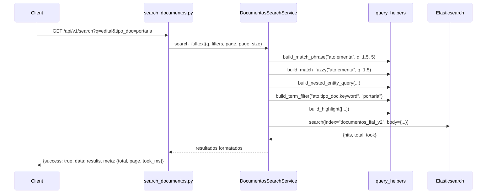
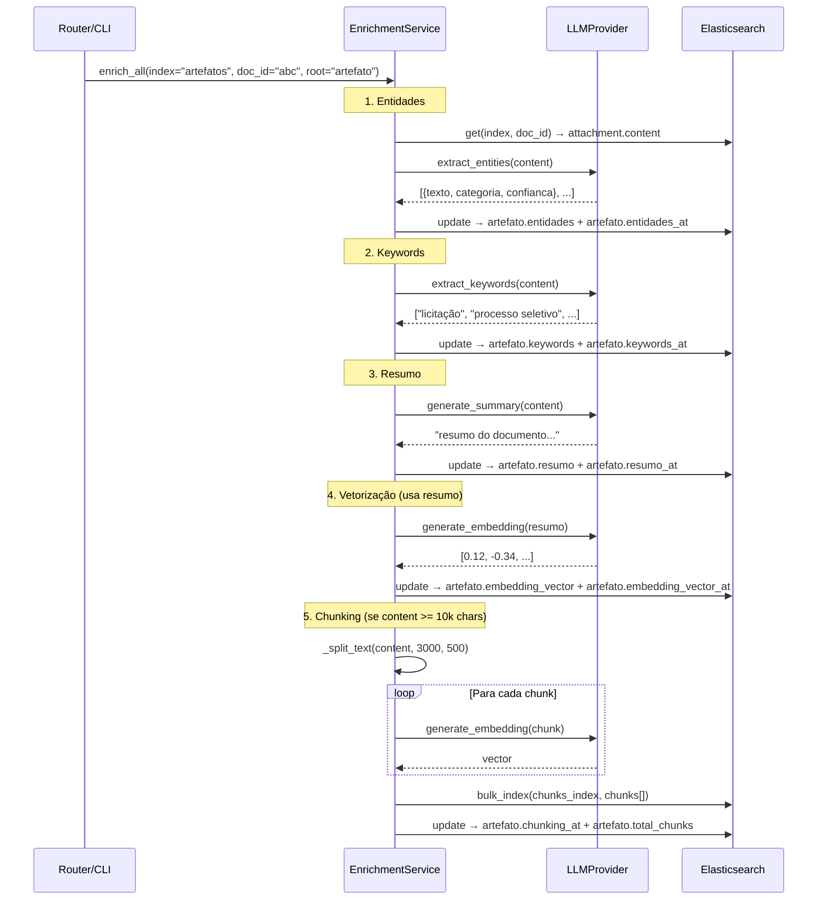
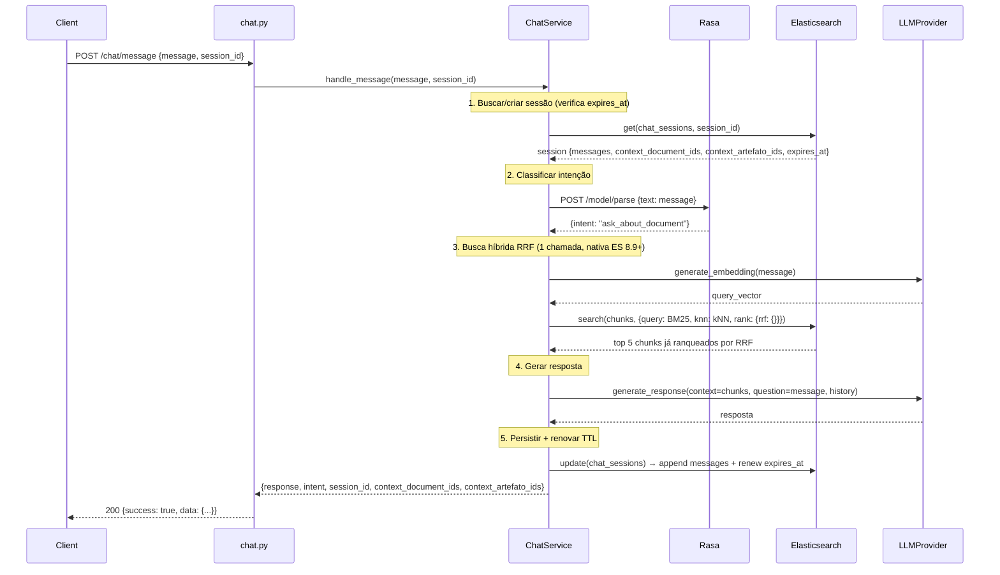
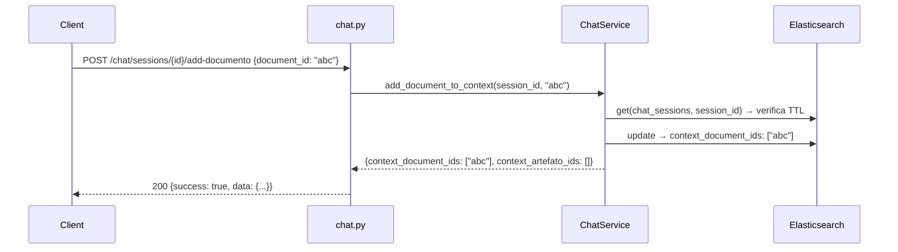
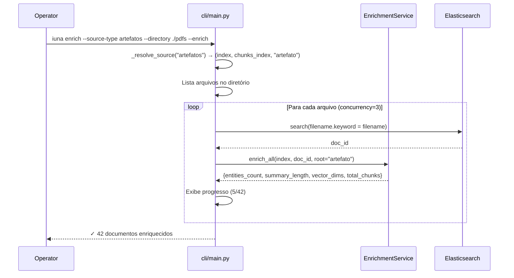

# 🏗️ Design — IUNA API (Arquitetura Simplificada)

**Projeto**: IUNA API  
**Versão**: 2.0.0  
**Princípio-Chave**: SIMPLICIDADE > GENERALIDADE

> **Existem apenas 2 tipos de objetos: `documentos_ifal_v2` e `artefatos`.**  
> Sem framework genérico. Sem DocumentAdapter. Sem SEARCH_CONFIG. Cada tipo tem seu serviço concreto.

---

## 0. Setup do Ambiente

### 0.1 Elasticsearch (dependência externa)

- ES roda fora do docker-compose (cloud ou instância dedicada).
- Credenciais via `.env`: `ELASTICSEARCH_HOSTS`, `ELASTICSEARCH_USER`, `ELASTICSEARCH_PASSWORD`.
- **Conexão via HTTPS** (URL com `https://`). Em dev com certificado auto-assinado, usar `verify_certs=False`.
- **Sufixo de índice**: variável `ES_INDEX_SUFFIX` (default `""`, valor `_test` para testes).
  - Exemplo: `documentos_ifal_v2_test`, `artefatos_chunks_test`.
- **Ingest Attachment Pipeline** é pré-requisito para extração de texto de PDFs via ES. Deve ser criado antes de indexar documentos. Ver `elastic/setup/20260622_ingest_pipeline.md`.
- **Criação de índices** via CLI:

```bash
iuna setup-indices              # cria todos os índices
iuna setup-indices --suffix _test  # cria com sufixo
iuna setup-indices --recreate      # deleta e recria
```

O comando lê os arquivos `elastic/*.json` e cria cada índice com o mapping definido.

### 0.2 Rasa (container no docker-compose)

- Container `rasa` definido no `docker-compose.yml`.
- Treinamento: `docker compose run rasa train`.
- Fallback: se Rasa indisponível, chat classifica como `ask_about_document` por padrão.
- URL configurável via `RASA_API_URL`.

### 0.3 Variáveis de Ambiente (.env.example completo)

```env
# === Projeto ===
PROJECT_NAME="IUNA API"
API_V1_STR="/api/v1"

# === Segurança ===
API_SECRET_TOKEN=              # Bearer token para autenticação

# === Elasticsearch ===
ELASTICSEARCH_HOSTS="https://seu-elastic:9200"
ELASTICSEARCH_USER=elastic
ELASTICSEARCH_PASSWORD=
ES_INDEX_SUFFIX=               # "" para prod, "_test" para testes

# === LLM Provider ===
ACTIVE_LLM_PROVIDER="gemini"   # gemini | claude | ollama
GEMINI_API_KEY=
CLAUDE_API_KEY=
OLLAMA_BASE_URL="http://localhost:11434"
OLLAMA_MODEL="llama3"

# === Rasa ===
RASA_API_URL="http://rasa:5005"

# === Chat ===
CHAT_SESSION_TTL_HOURS=24
CHAT_HISTORY_MAX_MESSAGES=10

# === Batch/CLI ===
BATCH_DEFAULT_CONCURRENCY=3
```

---

## 1. Arquitetura Simplificada

### 1.1 Diagrama em Camadas

```
┌─────────────────────────────────────────────────────────────┐
│                        CAMADA API                            │
│  search_documentos · search_artefatos · crud_documentos     │
│  crud_artefatos · enrichment · chat · stats · health        │
├─────────────────────────────────────────────────────────────┤
│                      CAMADA SERVICES                         │
│                                                             │
│  ESPECÍFICOS:                    COMPARTILHADOS:            │
│  ┌──────────────────────┐       ┌────────────────────────┐ │
│  │ DocumentosSearchSvc  │       │ EnrichmentService      │ │
│  │ ArtefatosSearchSvc   │       │ ChunkingService (*)    │ │
│  │ DocumentosCrudSvc    │       │ ChatService            │ │
│  │ ArtefatosCrudSvc     │       │ VectorService          │ │
│  └──────────────────────┘       │ SummaryService         │ │
│                                 │ EntitiesService        │ │
│                                 │ ChunksSearchService    │ │
│                                 │ StatsService           │ │
│                                 └────────────────────────┘ │
├─────────────────────────────────────────────────────────────┤
│                    CAMADA INFRAESTRUTURA                     │
│  ESClient · RasaClient · LLM Providers · PDF Extractor      │
├─────────────────────────────────────────────────────────────┤
│              DEPENDÊNCIAS EXTERNAS                           │
│  Elasticsearch (cloud) · Rasa (container) · LLM (cloud/local)│
└─────────────────────────────────────────────────────────────┘

(*) ChunkingService é parte do EnrichmentService (método enrich_chunks)
```

### 1.2 Tabela de Services

| Service | Tipo | Responsabilidade |
|---------|------|-----------------|
| `DocumentosSearchService` | Específico | Busca full-text, filtros, facetas para `documentos_ifal_v2` |
| `ArtefatosSearchService` | Específico | Busca full-text, filtros simples para `artefatos` |
| `DocumentosCrudService` | Específico | CRUD de documentos (indexação, consulta, deleção) |
| `ArtefatosCrudService` | Específico | CRUD de artefatos (upload PDF, consulta, deleção) |
| `EnrichmentService` | Compartilhado | Resumo, vetorização, entidades, keywords, chunking — recebe `(index, doc_id, root)` |
| `ChunksSearchService` | Compartilhado | Busca em chunks de ambos os tipos |
| `ChatService` | Compartilhado | RAG com Rasa + LLM + histórico |
| `StatsService` | Compartilhado | Estatísticas agregadas |

### 1.3 Princípio Fundamental

> **Existem apenas 2 tipos fixos. Não existe extensibilidade para N tipos.**

- `documentos_ifal_v2` é o mais específico (metadados ricos sob `ato.*`).
- `artefatos` é genérico (metadados mínimos sob `artefato.*`).

**O que é COMPARTILHADO** — services que recebem `index_name` + `root_prefix` + `doc_id`:
- `EnrichmentService` — sabe que conteúdo está em `attachment.content` e grava em `{root}.resumo`, `{root}.entidades`, etc.
- `ChunksSearchService` — busca em índices de chunks.
- `ChatService` — busca híbrida nos chunks de ambos os tipos.

**O que é ESPECÍFICO** — cada tipo tem seu service concreto com campos hardcoded:
- `DocumentosSearchService` — filtros ricos (tipo_doc, orgao, esfera, ano...), facetas.
- `ArtefatosSearchService` — filtros simples (tipo, uploaded_by, período).
- `DocumentosCrudService` / `ArtefatosCrudService` — lógica de criação/deleção específica.

---

## 2. Estrutura de Arquivos

```
app/
├── api/
│   └── routers/
│       ├── search_documentos.py    # GET /search (documentos)
│       ├── search_artefatos.py     # GET /artefatos/search
│       ├── crud_documentos.py      # POST/GET/DELETE /documentos
│       ├── crud_artefatos.py       # POST/GET/DELETE /artefatos
│       ├── enrichment.py           # POST /summary, /vectorization, /entities, /chunking
│       ├── chat.py                 # POST /chat/message
│       ├── stats.py                # GET /stats
│       └── health.py               # GET /health-check, /info
├── services/
│   ├── documentos_search.py        # DocumentosSearchService
│   ├── artefatos_search.py         # ArtefatosSearchService
│   ├── documentos_crud.py          # DocumentosCrudService
│   ├── artefatos_crud.py           # ArtefatosCrudService
│   ├── enrichment.py               # EnrichmentService (compartilhado)
│   ├── chunks_search.py            # ChunksSearchService (compartilhado)
│   ├── chat.py                     # ChatService
│   ├── summary.py                  # SummaryService (usado pelo Enrichment)
│   ├── vector.py                   # VectorService (usado pelo Enrichment)
│   ├── entities.py                 # EntitiesService (usado pelo Enrichment)
│   └── stats.py                    # StatsService
├── clients/
│   ├── es_client.py                # ESClient (async, singleton)
│   └── rasa_client.py              # RasaClient
├── providers/
│   ├── base.py                     # BaseLLMProvider (interface)
│   ├── gemini.py                   # GeminiProvider
│   ├── claude.py                   # ClaudeProvider
│   ├── ollama.py                   # OllamaProvider
│   └── factory.py                  # get_llm_provider()
├── core/
│   ├── exceptions.py               # Exceções customizadas
│   ├── pdf_extractor_local.py       # Extração local de texto de PDF (fallback offline/testes)
│   └── query_helpers.py            # Funções utilitárias de query ES
├── cli/
│   └── main.py                     # Comandos: setup-indices, enrich, index, delete
├── config.py                       # Settings (pydantic-settings)
└── main.py                         # FastAPI app + startup/shutdown
```

> **Nota**: A extração primária de texto de PDFs é feita via ES Ingest Attachment Pipeline (Apache Tika). O arquivo `pdf_extractor_local.py` é apenas o fallback local para cenários offline/testes.

---

## 3. Configuração

```python
# app/config.py
from pydantic_settings import BaseSettings, SettingsConfigDict

class Settings(BaseSettings):
    # Projeto
    PROJECT_NAME: str = "IUNA API"
    API_V1_STR: str = "/api/v1"

    # Segurança
    API_SECRET_TOKEN: str = ""

    # Elasticsearch
    ELASTICSEARCH_HOSTS: str = "https://localhost:9200"
    ELASTICSEARCH_USER: str = "elastic"
    ELASTICSEARCH_PASSWORD: str = ""
    ES_INDEX_SUFFIX: str = ""  # "_test" para testes

    # LLM
    ACTIVE_LLM_PROVIDER: str = "gemini"  # gemini | claude | ollama
    GEMINI_API_KEY: str = ""
    CLAUDE_API_KEY: str = ""
    OLLAMA_BASE_URL: str = "http://localhost:11434"
    OLLAMA_MODEL: str = "llama3"

    # Rasa
    RASA_API_URL: str = "http://rasa:5005"

    # Chat
    CHAT_SESSION_TTL_HOURS: int = 24
    CHAT_HISTORY_MAX_MESSAGES: int = 10

    # Batch
    BATCH_DEFAULT_CONCURRENCY: int = 3

    model_config = SettingsConfigDict(env_file=".env", case_sensitive=True)

    # Helpers para nomes de índice
    @property
    def index_documentos(self) -> str:
        return f"documentos_ifal_v2{self.ES_INDEX_SUFFIX}"

    @property
    def index_documentos_chunks(self) -> str:
        return f"documentos_ifal_v2_chunks{self.ES_INDEX_SUFFIX}"

    @property
    def index_artefatos(self) -> str:
        return f"artefatos{self.ES_INDEX_SUFFIX}"

    @property
    def index_artefatos_chunks(self) -> str:
        return f"artefatos_chunks{self.ES_INDEX_SUFFIX}"

    @property
    def index_chat_sessions(self) -> str:
        return f"chat_sessions{self.ES_INDEX_SUFFIX}"

settings = Settings()
```

---

## 3.5 Contratos da API (Endpoints)

### Visão geral das rotas

| # | Método | Rota | Módulo |
|---|--------|------|--------|
| | **Health (sem auth)** | | |
| 1 | GET | `/health-check` | Status básico |
| 2 | GET | `/info` | Nome/versão |
| 3 | GET | `/health` | Verifica ES + Rasa + LLM |
| | **Stats** | | |
| 4 | GET | `/stats` | Estatísticas agregadas |
| | **CRUD — Documentos** | | |
| 5 | POST | `/documentos/upload` | Upload PDF + metadados (opcionais) |
| 6 | GET | `/documentos/{document_id}` | Consulta por ID |
| 7 | GET | `/documentos/by-filename/{filename}` | Consulta por filename |
| 8 | DELETE | `/documentos/{document_id}` | Deletar doc + chunks |
| | **CRUD — Artefatos** | | |
| 9 | POST | `/artefatos/upload` | Upload PDF + metadados mínimos |
| 10 | GET | `/artefatos/{artefato_id}` | Consulta por ID |
| 11 | GET | `/artefatos/by-filename/{filename}` | Consulta por filename |
| 12 | DELETE | `/artefatos/{artefato_id}` | Deletar artefato + chunks |
| | **Busca — Documentos** | | |
| 13 | GET | `/documentos/search` | Full-text + filtros |
| 14 | GET | `/documentos/search/facets` | Agregações/facetas |
| 15 | GET | `/documentos/search/related/{document_id}` | Relacionados (kNN + entidades + keywords + MLT com RRF) |
| 16 | GET | `/documentos/search/by-entity` | Busca por entidade |
| 17 | GET | `/documentos/search/by-keyword` | Busca por keyword |
| 18 | GET | `/documentos/search/suggest` | Autocomplete |
| 19 | GET | `/documentos/search/chunks` | Busca em chunks de documentos |
| | **Busca — Artefatos** | | |
| 20 | GET | `/artefatos/search` | Full-text + filtros |
| 21 | GET | `/artefatos/search/related/{artefato_id}` | Relacionados (kNN + entidades + keywords + MLT com RRF) |
| 22 | GET | `/artefatos/search/by-entity` | Busca por entidade |
| 23 | GET | `/artefatos/search/by-keyword` | Busca por keyword |
| 24_s | GET | `/artefatos/search/suggest` | Autocomplete |
| 25_s | GET | `/artefatos/search/chunks` | Busca em chunks de artefatos |
| | **Enriquecimento — Documentos** | | |
| 24 | POST | `/documentos/summary/generate` | Gerar resumo |
| 25 | POST | `/documentos/vectorization/generate` | Gerar embedding |
| 26 | POST | `/documentos/entities/extract` | Extrair entidades |
| 27 | POST | `/documentos/keywords/extract` | Extrair keywords |
| 28 | POST | `/documentos/chunking/generate` | Segmentar em chunks |
| | **Enriquecimento — Artefatos** | | |
| 29 | POST | `/artefatos/summary/generate` | Gerar resumo |
| 30 | POST | `/artefatos/vectorization/generate` | Gerar embedding |
| 31 | POST | `/artefatos/entities/extract` | Extrair entidades |
| 32 | POST | `/artefatos/keywords/extract` | Extrair keywords |
| 33 | POST | `/artefatos/chunking/generate` | Segmentar em chunks |
| | **Chat** | | |
| 32 | POST | `/chat/message` | Enviar mensagem (RAG) |
| 33 | GET | `/chat/sessions/{session_id}` | Recuperar histórico |
| 34 | GET | `/chat/sessions` | Listar sessões ativas |
| 35 | DELETE | `/chat/sessions/{session_id}` | Encerrar/limpar sessão |
| 36 | POST | `/chat/sessions/{session_id}/add-documento` | Adicionar doc ao contexto |
| 37 | POST | `/chat/sessions/{session_id}/add-artefato` | Adicionar artefato ao contexto |
| 38 | DELETE | `/chat/sessions/{session_id}/context` | Limpar contexto da sessão |
| | **Gestão Complementar** | | |
| 39 | PATCH | `/documentos/{document_id}` | Atualizar metadados (sem PDF) |
| 40 | PATCH | `/artefatos/{artefato_id}` | Atualizar metadados (sem PDF) |
| 41 | GET | `/documentos` | Listagem paginada de todos |
| 42 | GET | `/artefatos` | Listagem paginada de todos |
| 43 | GET | `/documentos/{document_id}/enrichment-status` | Status de enriquecimento |
| 44 | GET | `/artefatos/{artefato_id}/enrichment-status` | Status de enriquecimento |
| 45 | POST | `/documentos/{document_id}/enrich` | Enriquecer (tudo ou selecionado) |
| 46 | POST | `/artefatos/{artefato_id}/enrich` | Enriquecer (tudo ou selecionado) |
| 47 | GET | `/documentos/entities` | Listar entidades com contagem |
| 48 | GET | `/artefatos/entities` | Listar entidades com contagem |
| | **Scoring / Relevância por Uso** | | |
| 49 | POST | `/documentos/{document_id}/score` | Registrar interação (click, add-to-chat, etc.) |
| 50 | POST | `/artefatos/{artefato_id}/score` | Registrar interação |
| | **Busca Legado — documentos_ifal** | | |
| 51 | GET | `/legado/documentos/search` | Full-text legado com filtros + `exact_phrase` + `with_aggregations` |
| 52 | GET | `/legado/documentos/{doc_id}/similar` | Similares MLT (ato.ementa + ato.tags) |
| 53 | GET | `/legado/documentos/{doc_id}` | Documento por ES _id (viewNormativa) |

> Todas as rotas (exceto 1, 2) estão sob `/api/v1/` e exigem `Authorization: Bearer <token>`.
> O prefixo `/documentos/` ou `/artefatos/` no path define o tipo — mesmo controller pode servir ambos internamente.

---

### 3.5.1 CRUD — Documentos

#### `POST /api/v1/documentos/upload`
```
Request: multipart/form-data
  - file: <arquivo PDF> (obrigatório)
  - titulo: "string" (opcional — pode ser extraído do PDF)
  - ementa: "string" (opcional — pode ser gerado pelo backend)
  - tipo_doc: "string" (opcional)
  - numero: "string" (opcional)
  - ano: int (opcional — pode ser inferido)
  - data_publicacao: "YYYY-MM-DD" (opcional)
  - publico: bool (default true)
  - tags: "string,string" (opcional)
  - orgao: "string" (opcional)
  - sigla: "string" (opcional)
  - esfera: "string" (opcional)

Nota: Metadados são em grande parte opcionais — o backend pode
gerá-los/inferi-los a partir do conteúdo do PDF. O mínimo é o arquivo PDF.

Response 200:
{
  "success": true,
  "data": {
    "_id": "...",
    "ato": { "ato_id": "...", "titulo": "...", ... },
    "attachment": { "content_length": 35000 }
  }
}

Response 409 (conflito — mesmo filename):
{ "success": false, "error": "Documento já existe: filename.pdf" }
```

#### `GET /api/v1/documentos/{document_id}`
```
Response 200:
{ "success": true, "data": { "_id": "...", "_source": { ...documento completo... } } }

Response 404:
{ "success": false, "error": "Documento não encontrado" }
```

#### `DELETE /api/v1/documentos/{document_id}`
```
Response 200:
{ "success": true, "data": { "deleted": true, "chunks_deleted": 5 } }
```

---

### 3.5.2 CRUD — Artefatos

#### `POST /api/v1/artefatos/upload`
```
Request: multipart/form-data
  - file: <arquivo PDF>
  - titulo: "string" (obrigatório)
  - uploaded_by: "string" (obrigatório)
  - tipo: "string" (opcional)
  - tags: "string,string" (opcional, separados por vírgula)

Response 200:
{
  "success": true,
  "data": {
    "_id": "uuid",
    "artefato": { "artefato_id": "...", "titulo": "...", ... },
    "attachment": { "content_length": 45000 }
  }
}
```

#### `GET /api/v1/artefatos/{artefato_id}`
```
Response 200:
{ "success": true, "data": { "_id": "...", "_source": { ...artefato completo... } } }
```

---

### 3.5.3 Busca — Documentos

#### `GET /api/v1/documentos/search`
```
Query Params:
  q: "string" (obrigatório)
  page: int (default 1)
  page_size: int (default 20)
  tipo_doc, orgao, esfera, ano, fonte, publico, data_inicio, data_fim, categoria

Response 200:
{
  "success": true,
  "data": {
    "results": [
      { "_id": "...", "ato": {...}, "highlights": {"ato.ementa": ["...<em>termo</em>..."]} }
    ]
  },
  "meta": { "total": 150, "page": 1, "page_size": 20, "took_ms": 42 }
}
```

#### `GET /api/v1/documentos/search/facets`
```
Response 200:
{ "success": true, "data": { "facets": { "tipo_doc": [...], "orgao": [...], "ano": [...] } } }
```

#### `GET /api/v1/documentos/search/related/{document_id}`
```
Query Params: limit (default 10)

Retorna documentos relacionados ao documento indicado, combinando todos os sinais
de enriquecimento disponíveis com RRF nativo (ES 8.9+):
  - kNN sobre ato.embedding_vector     (similaridade semântica)
  - nested match sobre ato.entidades   (entidades nomeadas em comum)
  - terms boost sobre ato.keywords     (keywords em comum)
  - more_like_this sobre ato.ementa + attachment.content (similaridade textual)

Fallback progressivo conforme enriquecimento disponível:
  - Enriquecimento completo → kNN + entidades + keywords + MLT
  - Só embedding            → kNN + MLT
  - Só entidades/keywords   → entidades + keywords + MLT
  - Sem enriquecimento      → MLT puro

O próprio documento é excluído dos resultados.

Response 200:
{
  "success": true,
  "data": {
    "results": [
      {
        "_id": "...",
        "_score": 0.87,
        "_source": { "ato": { "titulo": "...", "tipo_doc": "...", "ano": 2024, ... } },
        "signals": ["knn", "entities", "keywords"]
      }
    ],
    "enrichment_used": ["embedding", "entities", "keywords"],
    "total": 10
  }
}
```

#### `GET /api/v1/documentos/search/by-entity`
```
Query Params: entity_text (obrigatório), entity_category (opcional), page, page_size
Response 200: { "success": true, "data": { "results": [...] } }
```

#### `GET /api/v1/documentos/search/suggest`
```
Query Params: q (min 2 chars), limit (default 5)
Response 200: { "success": true, "data": { "suggestions": ["..."] } }
```

#### `GET /api/v1/documentos/search/chunks`
```
Query Params: q, document_id (opcional), page, page_size
Response 200: { "success": true, "data": { "results": [{ "chunk_index": 3, "content": "...", "parent_document_id": "...", ... }] } }
```

---

### 3.5.4 Busca — Artefatos

#### `GET /api/v1/artefatos/search`
```
Query Params: q, page, page_size, tipo, uploaded_by, data_inicio, data_fim
Response 200: (mesma estrutura, campos de artefato)
```

#### `GET /api/v1/artefatos/search/related/{artefato_id}`
```
Query Params: limit (default 10)

Mesma lógica de search_related de documentos, adaptada para artefatos:
  - kNN sobre artefato.embedding_vector
  - nested match sobre artefato.entidades
  - terms boost sobre artefato.keywords
  - more_like_this sobre artefato.titulo + attachment.content

Mesmo fallback progressivo e exclusão do próprio artefato.

Response 200: mesma estrutura de /documentos/search/related/{id}, com campos de artefato.
```

#### `GET /api/v1/artefatos/search/by-entity`
#### `GET /api/v1/artefatos/search/suggest`
#### `GET /api/v1/artefatos/search/chunks`
> Mesma estrutura das rotas de documentos, adaptada para artefatos.

---

### 3.5.5 Enriquecimento

As rotas de enriquecimento seguem o mesmo padrão para ambos os tipos, com o prefixo no path:

#### `POST /api/v1/documentos/summary/generate`
#### `POST /api/v1/artefatos/summary/generate`
```
Request Body:
{
  "document_id": "string"     // OU
  "filename": "string"        // identificar o documento
}
(Alternativamente: "text": "string" para processar texto bruto sem gravar)

Response 200:
{ "success": true, "data": { "resumo": "Resumo gerado pelo LLM..." } }
```

#### `POST /api/v1/documentos/vectorization/generate`
#### `POST /api/v1/artefatos/vectorization/generate`
```
Request Body: (mesma estrutura)
Response 200:
{ "success": true, "data": { "embedding": [0.012, ...], "dims": 768 } }
```

#### `POST /api/v1/documentos/entities/extract`
#### `POST /api/v1/artefatos/entities/extract`
```
Request Body: (mesma estrutura)
Response 200:
{
  "success": true,
  "data": {
    "entidades": [
      { "texto": "IFAL", "categoria": "ORGANIZACAO", "confianca": 0.95 }
    ]
  }
}
```

#### `POST /api/v1/documentos/keywords/extract`
#### `POST /api/v1/artefatos/keywords/extract`
```
Request Body:
{ "document_id": "string" }
(ou "text": "string" para texto bruto)

Response 200:
{
  "success": true,
  "data": {
    "keywords": ["licitação", "processo seletivo", "ética pública", "comissão permanente"]
  }
}
```

#### `GET /api/v1/documentos/search/by-keyword`
#### `GET /api/v1/artefatos/search/by-keyword`
```
Query Params: keyword (obrigatório), page, page_size

Busca documentos que possuem a keyword no campo {root}.keywords.

Response 200:
{
  "success": true,
  "data": { "results": [{ "_id": "...", "matched_keywords": ["licitação"] }] },
  "meta": { "total": 25, "page": 1, "page_size": 20, "took_ms": 12 }
}
```

#### `POST /api/v1/documentos/chunking/generate`
#### `POST /api/v1/artefatos/chunking/generate`
```
Request Body:
{
  "document_id": "string",
  "chunk_size": 3000,     // opcional, mínimo 3000
  "chunk_overlap": 500    // opcional
}

Response 200:
{ "success": true, "data": { "total_chunks": 12, "skipped": false } }

Response 200 (doc < 10k chars):
{ "success": true, "data": { "total_chunks": 0, "skipped": true, "reason": "content < 10000 chars" } }

Response 422 (chunk_size < 3000):
{ "success": false, "error": "chunk_size mínimo é 3000" }
```

> O prefixo no path (`/documentos/` ou `/artefatos/`) define o tipo. O controller resolve internamente qual índice e root usar. Mesma lógica (EnrichmentService), paths diferentes para clareza.

---

### 3.5.6 Chat

#### `POST /api/v1/chat/message`
```
Request Body:
{
  "message": "string" (obrigatório),
  "session_id": "string" (obrigatório),
  "source_type": "documentos" | "artefatos" (opcional, default: busca em ambos)
}

Nota: os documentos do contexto NÃO são passados aqui. Eles ficam persistidos na sessão
(context_document_ids / context_artefato_ids) e são adicionados via add-documento/add-artefato.
O parâmetro source_type serve apenas para restringir o índice de chunks quando a sessão
não tem documentos específicos no contexto.

Response 200:
{
  "success": true,
  "data": {
    "response": "Resposta fundamentada nos documentos...",
    "intent": "ask_about_document",
    "session_id": "uuid",
    "context_used": true,
    "context_document_ids": ["abc123"],
    "context_artefato_ids": []
  }
}
```

#### `GET /api/v1/chat/sessions/{session_id}`
```
Response 200:
{
  "success": true,
  "data": {
    "session_id": "...",
    "messages": [
      { "role": "user", "content": "...", "timestamp": "..." },
      { "role": "assistant", "content": "...", "timestamp": "..." }
    ],
    "context_document_ids": ["abc123"],
    "context_artefato_ids": [],
    "created_at": "...",
    "last_activity_at": "...",
    "expires_at": "..."
  }
}
```

Retorna 404 se sessão não existe ou já expirou (`expires_at < now`).
```

#### `GET /api/v1/chat/sessions`
```
Query Params: page (default 1), page_size (default 20)
Response 200:
{ "success": true, "data": { "sessions": [{ "session_id": "...", "last_activity_at": "...", "message_count": 12 }] }, "meta": {...} }
```

#### `DELETE /api/v1/chat/sessions/{session_id}`
```
Response 200:
{ "success": true, "data": { "deleted": true } }
```

#### `POST /api/v1/chat/sessions/{session_id}/add-documento`
```
Request Body:
{ "document_id": "string" }

Adiciona o document_id à lista context_document_ids da sessão (sem duplicar).
A partir desta chamada, todas as mensagens da sessão buscarão contexto apenas
nos chunks deste documento (e dos demais já adicionados). Se o documento não
tiver chunks, o ChatService usa o attachment.content completo como fallback.

Retorna 404 se o document_id não existe no índice documentos_ifal_v2.
Retorna 404 se a sessão não existe ou expirou.

Response 200:
{
  "success": true,
  "data": {
    "session_id": "...",
    "context_document_ids": ["id1", "id2"],
    "context_artefato_ids": []
  }
}
```

#### `POST /api/v1/chat/sessions/{session_id}/add-artefato`
```
Request Body:
{ "artefato_id": "string" }

Adiciona o artefato_id à lista context_artefato_ids da sessão (sem duplicar).
Mesma semântica de add-documento, mas para o índice artefatos.

Retorna 404 se o artefato_id não existe no índice artefatos.
Retorna 404 se a sessão não existe ou expirou.

Response 200:
{
  "success": true,
  "data": {
    "session_id": "...",
    "context_document_ids": [],
    "context_artefato_ids": ["xyz456"]
  }
}
```

#### `DELETE /api/v1/chat/sessions/{session_id}/context`
```
Limpa context_document_ids=[] e context_artefato_ids=[] da sessão.
As próximas mensagens voltam a buscar em todos os chunks (sem restrição por doc).

Response 200:
{
  "success": true,
  "data": {
    "session_id": "...",
    "context_document_ids": [],
    "context_artefato_ids": []
  }
}
```

---

### 3.5.7 Gestão Complementar

#### `PATCH /api/v1/documentos/{document_id}`
```
Request Body (JSON — campos parciais, só o que quer atualizar):
{
  "titulo": "string",
  "ementa": "string",
  "tipo_doc": "string",
  "numero": "string",
  "ano": 2024,
  "publico": true,
  "tags": ["string"],
  "orgao": "string",
  "esfera": "string"
}

Atualiza metadados do documento SEM reenviar o PDF.

Response 200:
{ "success": true, "data": { "_id": "...", "updated_fields": ["titulo", "tags"] } }
```

#### `PATCH /api/v1/artefatos/{artefato_id}`
```
Request Body (JSON — campos parciais):
{
  "titulo": "string",
  "tipo": "string",
  "tags": ["string"],
  "uploaded_by": "string"
}

Response 200:
{ "success": true, "data": { "_id": "...", "updated_fields": ["titulo"] } }
```

#### `GET /api/v1/documentos`
```
Query Params: page (default 1), page_size (default 20)

Listagem paginada de todos os documentos (sem busca textual).

Response 200:
{
  "success": true,
  "data": { "results": [{ "_id": "...", "ato": { "titulo": "...", "tipo_doc": "..." } }] },
  "meta": { "total": 500, "page": 1, "page_size": 20 }
}
```

#### `GET /api/v1/artefatos`
```
Query Params: page (default 1), page_size (default 20)

Listagem paginada de todos os artefatos.

Response 200:
{
  "success": true,
  "data": { "results": [{ "_id": "...", "artefato": { "titulo": "...", "tipo": "..." } }] },
  "meta": { "total": 80, "page": 1, "page_size": 20 }
}
```

#### `GET /api/v1/documentos/{document_id}/enrichment-status`
```
Retorna status de enriquecimento do documento.

Response 200:
{
  "success": true,
  "data": {
    "resumo_at": "2026-06-20T14:30:00Z",
    "entidades_at": "2026-06-20T14:31:00Z",
    "embedding_vector_at": "2026-06-20T14:32:00Z",
    "chunking_at": null,
    "total_chunks": 0
  }
}
```

#### `GET /api/v1/artefatos/{artefato_id}/enrichment-status`
```
Response 200: (mesma estrutura)
```

#### `POST /api/v1/documentos/{document_id}/enrich`
```
Request Body (opcional — se vazio, executa todos):
{
  "operations": ["summary", "entities", "vectorization", "chunking"]
}

Enriquece o documento com as operações selecionadas (ou todas se omitido).
Ordem: entidades → resumo → vetorização → chunking.

Response 200:
{
  "success": true,
  "data": {
    "entities_count": 8,
    "summary_length": 450,
    "vector_dims": 768,
    "total_chunks": 12
  }
}
```

#### `POST /api/v1/artefatos/{artefato_id}/enrich`
```
Response 200: (mesma estrutura)
```

#### `GET /api/v1/documentos/entities`
```
Query Params: category (opcional), limit (default 50)

Lista entidades extraídas de todos os documentos com contagem.

Response 200:
{
  "success": true,
  "data": {
    "entities": [
      { "texto": "IFAL", "categoria": "ORGANIZACAO", "doc_count": 120 },
      { "texto": "Edital 01/2024", "categoria": "DOCUMENTO", "doc_count": 3 }
    ]
  }
}
```

#### `GET /api/v1/artefatos/entities`
```
Response 200: (mesma estrutura para artefatos)
```

---

### 3.5.8 Scoring / Relevância por Uso

> **Conceito**: documentos frequentemente acessados provavelmente são mais relevantes para futuras buscas. O `popularity_score` captura esse sinal implícito de uso — sem exigir que ninguém avalie ou etiquete documentos manualmente.

#### Por que `log1p` e não boost linear?

Sem moderação, documentos antigos e populares dominariam os resultados para sempre — um edital de 2015 muito acessado apareceria antes de uma resolução recente de 2024 mesmo que a busca seja sobre 2024.

A função `log1p(x)` cresce rapidamente no início e vai desacelerando:

```
score=0    → log1p(0)   = 0.00
score=10   → log1p(10)  = 2.40
score=100  → log1p(100) = 4.61
score=1000 → log1p(1000)= 6.91
```

Um documento com 1.000 interações recebe boost ~3× maior que um com 10 — não 100×. Isso garante que a popularidade influencia sem monopolizar. O `factor: 0.5` na `field_value_factor` reduz ainda mais o impacto, tornando o boost suave por padrão.

Documentos que são clicados em resultados de busca ou adicionados ao contexto de conversas ganham score. Esse score eleva a posição do documento em buscas futuras.

#### `POST /api/v1/documentos/{document_id}/score`
#### `POST /api/v1/artefatos/{artefato_id}/score`
```
Request Body:
{
  "action": "click" | "add_to_chat" | "download" | "share"
}

Cada ação tem um peso (configurável via constantes):
- click: +1
- add_to_chat: +3
- download: +2
- share: +2

Response 200:
{
  "success": true,
  "data": { "document_id": "...", "new_score": 15, "action": "add_to_chat", "points": 3 }
}
```

#### Implementação no ES

Novo campo no documento pai:
- `{root}.popularity_score`: integer (default 0) — score acumulado de interações.

A busca full-text aplica um boost baseado no popularity_score via `function_score`:
```json
{
  "function_score": {
    "query": { ...query normal... },
    "functions": [
      {
        "field_value_factor": {
          "field": "{root}.popularity_score",
          "modifier": "log1p",
          "factor": 0.5,
          "missing": 0
        }
      }
    ],
    "boost_mode": "sum"
  }
}
```

#### Constantes Parametrizáveis

```python
# app/core/scoring.py
SCORE_WEIGHTS = {
    "click": 1,
    "add_to_chat": 3,
    "download": 2,
    "share": 2,
    # Novas ações podem ser adicionadas aqui
}

# Fator de influência do score na busca (0 = desativado, 1 = forte)
SCORE_BOOST_FACTOR = 0.5
SCORE_BOOST_MODIFIER = "log1p"  # log1p suaviza documentos com score muito alto
```

#### Comportamento automático

Além da rota explícita de score, o sistema incrementa automaticamente:
- Quando `add-documento` ou `add-artefato` é chamado no chat → incrementa `add_to_chat` (+3)
- O click é registrado pelo frontend via rota explícita

---

### 3.5.9 Stats e Health

#### `GET /api/v1/stats`
```
Response 200:
{
  "success": true,
  "data": {
    "documentos_ifal_v2": { "total": 500, "sem_resumo": 120, "sem_entidades": 200, "sem_embedding": 150, "sem_chunking": 300 },
    "artefatos": { "total": 80, "sem_resumo": 60, "sem_entidades": 70, "sem_embedding": 65, "sem_chunking": 40 },
    "chunks": { "documentos_ifal_v2_chunks": 1200, "artefatos_chunks": 450 }
  },
  "meta": { "took_ms": 25 }
}
Headers: Cache-Control: max-age=60
```

#### `GET /api/v1/health`
```
Response 200 (tudo ok):
{
  "success": true,
  "data": {
    "elasticsearch": { "status": "ok" },
    "rasa": { "status": "ok" },
    "llm": { "status": "ok", "provider": "gemini" }
  }
}

Response 503 (dependência falha):
{
  "success": false,
  "data": {
    "elasticsearch": { "status": "unavailable" },
    "rasa": { "status": "ok" },
    "llm": { "status": "ok", "provider": "gemini" }
  }
}
```

---

## 4. Modelagem de Dados

### 4.1 `documentos_ifal_v2` — Documentos com metadados ricos

Mapping existente + campos de enriquecimento sob `ato.*`:

```json
{
  "ato": {
    "ato_id": "keyword",
    "titulo": "text",
    "ementa": "text",
    "tipo_doc": "text + keyword",
    "numero": "text + keyword",
    "ano": "long",
    "data_publicacao": "date",
    "publico": "boolean",
    "tags": "text + keyword",
    "arquivo": "text + keyword",
    "fonte": {
      "orgao": "text + keyword",
      "sigla": "text + keyword",
      "esfera": "text + keyword",
      "uf": "text + keyword",
      "uf_sigla": "text + keyword",
      "url": "text + keyword"
    },
    "resumo": "text",
    "resumo_at": "date",
    "embedding_vector": "dense_vector (768, cosine)",
    "embedding_vector_at": "date",
    "entidades": "nested { texto, categoria, confianca }",
    "entidades_at": "date",
    "keywords": "text + keyword (array de strings)",
    "keywords_at": "date",
    "chunking_at": "date",
    "total_chunks": "integer",
    "popularity_score": "integer (default 0)"
  },
  "attachment": {
    "content": "text",
    "title": "text + keyword"
  },
  "filename": "text + keyword",
  "data": "text + keyword"
}
```

### 4.2 `artefatos` — Documentos genéricos

Metadados mínimos sob `artefato.*`. Tudo o mais é inferido por IA:

```json
{
  "artefato": {
    "artefato_id": "keyword",
    "titulo": "text + keyword",
    "tipo": "keyword",
    "tags": "text + keyword",
    "uploaded_by": "keyword",
    "created_at": "date",
    "updated_at": "date",
    "resumo": "text",
    "resumo_at": "date",
    "embedding_vector": "dense_vector (768, cosine)",
    "embedding_vector_at": "date",
    "entidades": "nested { texto, categoria, confianca }",
    "entidades_at": "date",
    "keywords": "text + keyword (array de strings)",
    "keywords_at": "date",
    "chunking_at": "date",
    "total_chunks": "integer",
    "popularity_score": "integer (default 0)"
  },
  "attachment": {
    "content": "text",
    "title": "text + keyword",
    "content_length": "long"
  },
  "filename": "text + keyword"
}
```

### 4.3 `*_chunks` — Chunks (mesma estrutura para ambos)

```json
{
  "parent_document_id": "keyword",
  "parent_filename": "keyword",
  "chunk_index": "integer",
  "content": "text",
  "total_chunks": "integer",
  "chunk_size": "integer",
  "embedding_vector": "dense_vector (768, cosine)",
  "created_at": "date"
}
```

### 4.4 `chat_sessions`

```json
{
  "session_id": "keyword",
  "client_id": "keyword",
  "messages": "nested { role: keyword, content: text, timestamp: date }",
  "context_document_ids": "keyword[]",
  "context_artefato_ids": "keyword[]",
  "created_at": "date",
  "last_activity_at": "date",
  "expires_at": "date"
}
```

**TTL**: ao criar a sessão, `expires_at = now + CHAT_SESSION_TTL_HOURS`. Ao buscar a sessão,
filtrar `expires_at > now`. Ao receber mensagem em sessão válida, renovar
`last_activity_at = now` e `expires_at = now + CHAT_SESSION_TTL_HOURS`.

**Contexto de documentos**: `context_document_ids` e `context_artefato_ids` persistem os IDs
adicionados via `add-documento`/`add-artefato`. O `ChatService` lê esses campos a cada
`handle_message` para decidir onde buscar contexto — não recebe IDs no request.

### 4.5 Regra de Enriquecimento

> **Enriquecimento vive APENAS no documento pai.** Chunks têm somente `content` + `embedding_vector`.
> Campos de enriquecimento no pai: `{root}.resumo`, `{root}.entidades`, `{root}.embedding_vector`, `{root}.chunking_at`, `{root}.total_chunks`.

---

## 5. Query Helpers (funções utilitárias)

**NÃO é uma classe genérica. NÃO é um QueryBuilder com injeção de config.**  
Apenas funções puras que montam fragmentos de query ES:

```python
# app/core/query_helpers.py

def build_match_phrase(field: str, q: str, boost: float = 1.0, slop: int = 0) -> dict:
    """Monta cláusula match_phrase com boost e slop."""
    return {
        "match_phrase": {
            field: {"query": q, "boost": boost, "slop": slop}
        }
    }

def build_match_fuzzy(field: str, q: str, boost: float = 1.0,
                      fuzziness: str = "1", prefix_length: int = 3) -> dict:
    """Monta cláusula match com fuzziness."""
    return {
        "match": {
            field: {
                "query": q, "boost": boost,
                "fuzziness": fuzziness, "prefix_length": prefix_length
            }
        }
    }

def build_nested_entity_query(path: str, text_field: str, q: str,
                              boost: float = 1.0, fuzziness: str = "1") -> dict:
    """Monta query nested para entidades."""
    return {
        "nested": {
            "path": path,
            "query": {
                "match": {
                    text_field: {
                        "query": q, "boost": boost, "fuzziness": fuzziness
                    }
                }
            }
        }
    }

def build_highlight(fields: list[str], tag: str = "em") -> dict:
    """Monta configuração de highlight."""
    return {
        "highlight": {
            "pre_tags": [f"<{tag}>"],
            "post_tags": [f"</{tag}>"],
            "fields": {f: {} for f in fields}
        }
    }

def build_term_filter(field: str, value) -> dict:
    """Monta filtro term."""
    return {"term": {field: value}}

def build_range_filter(field: str, gte=None, lte=None) -> dict:
    """Monta filtro range."""
    conditions = {}
    if gte is not None:
        conditions["gte"] = gte
    if lte is not None:
        conditions["lte"] = lte
    return {"range": {field: conditions}}
```

Os search services chamam essas funções diretamente. Simples. Sem mágica.

---

## 5.5 Estratégias de Busca por Similaridade: kNN, MLT e RRF

Os métodos `search_related` (seções 6 e 7) combinam três estratégias complementares. Cada uma captura um aspecto diferente da "relevância".

### kNN — k-Nearest Neighbors (similaridade semântica)

Cada documento possui um campo `embedding_vector` — uma lista de ~768 números gerada pelo modelo de embedding. O texto embedado depende do estado de enriquecimento do documento:

| Estado | Texto embedado | `embedding_source` |
|--------|---------------|-------------------|
| Resumo existe | `{root}.resumo` | `"resumo"` |
| Sem resumo | Primeiros 5000 chars de `attachment.content` | `"inicio_documento"` |

O campo `embedding_source` é gravado junto com `embedding_vector` e permite identificar documentos com vetor parcial (início do documento) para re-embedar quando o resumo estiver disponível. Não gera resumo automaticamente — as operações são independentes.

Na query ES:
```json
"knn": {
  "field": "ato.embedding_vector",
  "query_vector": [...],   ← embedding da query/doc de referência
  "k": 10,
  "num_candidates": 100
}
```

**Forte em**: significados parecidos com vocabulário diferente (ex: "edital" ≈ "chamamento público").  
**Fraco em**: termos exatos, nomes próprios, siglas.  
**Pré-requisito**: documento precisa ter `embedding_vector`. Vetores gerados de `"resumo"` tendem a ter maior qualidade semântica que os de `"inicio_documento"`.

---

### MLT — More Like This (similaridade textual)

O ES analisa as palavras mais características de um documento de referência (via TF-IDF) e monta uma query automática para encontrar documentos com vocabulário parecido.

Na query ES:
```json
"more_like_this": {
  "fields": ["ato.ementa", "ato.titulo", "attachment.content"],
  "like": [{"_index": "documentos_ifal_v2", "_id": "<doc_id>"}],
  "min_term_freq": 1,
  "max_query_terms": 25
}
```

**Forte em**: documentos com terminologia idêntica.  
**Fraco em**: sinônimos ou variações de vocabulário.  
**Vantagem**: funciona mesmo sem enriquecimento — usa o texto bruto do documento.

---

### RRF — Reciprocal Rank Fusion (fusão de rankings)

Problema: kNN retorna uma lista ranqueada, MLT retorna outra, entidades retornam uma terceira. Como combinar as três em uma única lista?

O RRF resolve com uma fórmula de pontuação por posição: cada documento recebe `1 / (k + posição)` em cada lista (k=60 por padrão), e as pontuações são somadas. Um documento que aparece bem colocado em múltiplas listas sobe ao topo — mesmo sem ser o 1º em nenhuma.

```
Doc A: 2º no kNN  → 1/(60+2) ≈ 0.016
       1º no MLT  → 1/(60+1) ≈ 0.016
       Total ≈ 0.032  ← sobe ao topo

Doc B: 1º no kNN  → 1/(60+1) ≈ 0.016
       10º no MLT → 1/(60+10) ≈ 0.014
       Total ≈ 0.030
```

No ES 8.9+, RRF é nativo — basta adicionar `"rank": {"rrf": {"window_size": N}}` à query que já tem `"query"` e `"knn"`. O ES faz a fusão internamente em uma única chamada.

**Forte em**: robustez — um sinal compensa a fraqueza do outro.  
**Requer**: ES 8.9+ (projeto usa 8.12+).

---

### Fallback progressivo em `search_related`

O `search_related` usa os sinais disponíveis conforme o estado de enriquecimento do documento:

| Enriquecimento | Sinais usados | Observação |
|---------------|--------------|------------|
| Completo | kNN + entidades + keywords + MLT (com RRF) | Melhor qualidade |
| Só embedding | kNN + MLT (com RRF) | Sem sobreposição semântica de entidades |
| Só entidades/keywords | entidades + keywords + MLT (sem RRF) | Sem kNN, query bool normal |
| Sem enriquecimento | MLT puro | Fallback mínimo, sempre disponível |

A resposta inclui `enrichment_used` para rastreabilidade (ex: `["embedding", "entities", "keywords"]`).

---

## 6. DocumentosSearchService

Classe concreta que conhece TODOS os campos de `documentos_ifal_v2`. Sem abstração, sem config.

```python
# app/services/documentos_search.py

class DocumentosSearchService:
    def __init__(self, es_client: ESClient):
        self.es = es_client
        self.index = settings.index_documentos

    async def search_fulltext(self, q: str, filters: dict = None,
                              page: int = 1, page_size: int = 20) -> dict:
        """Busca full-text com relevância em documentos_ifal_v2."""
        should = []

        # match_phrase (alta relevância)
        should.append(build_match_phrase("ato.ementa", q, boost=1.5, slop=5))
        should.append(build_match_phrase("ato.titulo", q, boost=1.5, slop=2))
        should.append(build_match_phrase("ato.tags", q, boost=1.5, slop=2))
        should.append(build_match_phrase("attachment.content", q, boost=1.25, slop=5))
        should.append(build_match_phrase("ato.resumo", q, boost=1.0, slop=5))

        # match com fuzziness
        should.append(build_match_fuzzy("ato.ementa", q, boost=1.5))
        should.append(build_match_fuzzy("ato.tags", q, boost=1.5))
        should.append(build_match_fuzzy("attachment.content", q, boost=1.0))
        should.append(build_match_fuzzy("ato.resumo", q, boost=0.75))
        should.append(build_nested_entity_query(
            "ato.entidades", "ato.entidades.texto", q, boost=1.0
        ))

        # Monta query bool
        body = {
            "query": {"bool": {"should": should, "minimum_should_match": 1}},
            **build_highlight(["ato.ementa", "ato.titulo", "attachment.content", "ato.resumo"]),
            "from": (page - 1) * page_size,
            "size": page_size
        }

        # Aplica filtros hardcoded
        if filters:
            body["query"]["bool"]["filter"] = self._build_filters(filters)

        return await self.es.search(index=self.index, body=body)

    def _build_filters(self, filters: dict) -> list:
        """Monta filtros específicos de documentos."""
        clauses = []
        # Filtros term
        TERM_FIELDS = {
            "tipo_doc": "ato.tipo_doc.keyword",
            "orgao": "ato.fonte.orgao.keyword",
            "esfera": "ato.fonte.esfera.keyword",
            "ano": "ato.ano",
            "fonte": "ato.fonte.sigla.keyword",
            "publico": "ato.publico",
            "categoria": "ato.tipo_doc.keyword",
        }
        for param, field in TERM_FIELDS.items():
            if param in filters and filters[param] is not None:
                clauses.append(build_term_filter(field, filters[param]))

        # Filtro de período (range em data_publicacao)
        if filters.get("data_inicio") or filters.get("data_fim"):
            clauses.append(build_range_filter(
                "ato.data_publicacao",
                gte=filters.get("data_inicio"),
                lte=filters.get("data_fim")
            ))
        return clauses

    async def search_facets(self, q: str = None, filters: dict = None) -> dict:
        """Busca com agregações (facetas) para documentos."""
        aggs = {
            "tipo_doc": {"terms": {"field": "ato.tipo_doc.keyword", "size": 50}},
            "orgao": {"terms": {"field": "ato.fonte.orgao.keyword", "size": 50}},
            "esfera": {"terms": {"field": "ato.fonte.esfera.keyword", "size": 20}},
            "ano": {"terms": {"field": "ato.ano", "size": 50, "order": {"_key": "desc"}}},
            "tags": {"terms": {"field": "ato.tags.keyword", "size": 30}},
            "sigla": {"terms": {"field": "ato.fonte.sigla.keyword", "size": 30}},
        }
        body = {"size": 0, "aggs": aggs}
        if q:
            # Adiciona query para facetas filtradas
            body["query"] = {"bool": {"should": [
                build_match_fuzzy("ato.ementa", q, boost=1.5),
                build_match_fuzzy("attachment.content", q),
            ], "minimum_should_match": 1}}
        return await self.es.search(index=self.index, body=body)

    async def search_related(self, document_id: str, limit: int = 10) -> dict:
        """
        Busca documentos relacionados usando todos os sinais de enriquecimento disponíveis.

        Combina via RRF nativo (ES 8.9+):
          - kNN semântico (embedding_vector)
          - overlap de entidades nomeadas (nested match)
          - overlap de keywords (terms boost)
          - more_like_this sobre ementa + content (fallback textual)

        Fallback progressivo: usa os sinais disponíveis conforme enriquecimento do doc.
        O próprio documento é sempre excluído dos resultados.
        """
        doc = await self.es.get(index=self.index, id=document_id)
        source = doc["_source"].get("ato", {})
        vector    = source.get("embedding_vector")
        entities  = [e["texto"] for e in source.get("entidades", [])]
        keywords  = source.get("keywords", [])

        enrichment_used = []
        should_clauses = []

        # MLT sempre presente como base textual
        mlt_clause = {
            "more_like_this": {
                "fields": ["ato.ementa", "ato.titulo", "attachment.content"],
                "like": [{"_index": self.index, "_id": document_id}],
                "min_term_freq": 1,
                "max_query_terms": 25,
                "boost": 0.5,
            }
        }
        should_clauses.append(mlt_clause)

        # Entidades (nested match com boost)
        if entities:
            enrichment_used.append("entities")
            should_clauses.append({
                "nested": {
                    "path": "ato.entidades",
                    "query": {"terms": {"ato.entidades.texto": entities}},
                    "boost": 1.5,
                }
            })

        # Keywords (terms boost)
        if keywords:
            enrichment_used.append("keywords")
            should_clauses.append({
                "terms": {"ato.keywords": keywords, "boost": 1.2}
            })

        body = {
            "query": {
                "bool": {
                    "should": should_clauses,
                    "minimum_should_match": 1,
                    "must_not": [{"term": {"_id": document_id}}],
                }
            },
            "size": limit,
        }

        # kNN + RRF nativo quando embedding disponível
        if vector:
            enrichment_used.append("embedding")
            body["knn"] = {
                "field": "ato.embedding_vector",
                "query_vector": vector,
                "k": limit,
                "num_candidates": limit * 10,
                "filter": {"bool": {"must_not": [{"term": {"_id": document_id}}]}},
            }
            body["rank"] = {"rrf": {"window_size": limit * 2}}

        result = await self.es.search(index=self.index, body=body)

        # Anota quais sinais estavam disponíveis na resposta
        hits = result["hits"]["hits"]
        for hit in hits:
            hit["signals"] = enrichment_used

        return {"hits": hits, "enrichment_used": enrichment_used, "total": len(hits)}

    async def search_by_entity(self, entity_text: str,
                               entity_category: str = None, limit: int = 20) -> dict:
        """Busca por entidade (nested query)."""
        must = [{"match": {"ato.entidades.texto": entity_text}}]
        if entity_category:
            must.append({"term": {"ato.entidades.categoria": entity_category}})

        body = {
            "query": {
                "nested": {
                    "path": "ato.entidades",
                    "query": {"bool": {"must": must}},
                    "inner_hits": {}
                }
            },
            "size": limit
        }
        return await self.es.search(index=self.index, body=body)

    async def suggest(self, q: str, limit: int = 5) -> list:
        """Autocomplete de títulos e tags."""
        body = {
            "query": {"bool": {"should": [
                {"match_phrase_prefix": {"ato.titulo": {"query": q, "max_expansions": 10}}},
                {"match_phrase_prefix": {"ato.tags": {"query": q, "max_expansions": 10}}},
            ]}},
            "_source": ["ato.titulo", "ato.tags"],
            "size": limit
        }
        return await self.es.search(index=self.index, body=body)
```

---

## 7. ArtefatosSearchService

Classe concreta para `artefatos`. Mais simples — sem facetas.

```python
# app/services/artefatos_search.py

class ArtefatosSearchService:
    def __init__(self, es_client: ESClient):
        self.es = es_client
        self.index = settings.index_artefatos

    async def search_fulltext(self, q: str, filters: dict = None,
                              page: int = 1, page_size: int = 20) -> dict:
        """Busca full-text em artefatos."""
        should = [
            # match_phrase
            build_match_phrase("artefato.titulo", q, boost=1.5, slop=2),
            build_match_phrase("attachment.content", q, boost=1.25, slop=5),
            build_match_phrase("artefato.resumo", q, boost=1.0, slop=5),
            # match com fuzziness
            build_match_fuzzy("artefato.titulo", q, boost=1.5),
            build_match_fuzzy("attachment.content", q, boost=1.0),
            build_match_fuzzy("artefato.resumo", q, boost=0.75),
            build_nested_entity_query(
                "artefato.entidades", "artefato.entidades.texto", q, boost=1.0
            ),
        ]

        body = {
            "query": {"bool": {"should": should, "minimum_should_match": 1}},
            **build_highlight(["artefato.titulo", "attachment.content", "artefato.resumo"]),
            "from": (page - 1) * page_size,
            "size": page_size
        }

        if filters:
            body["query"]["bool"]["filter"] = self._build_filters(filters)

        return await self.es.search(index=self.index, body=body)

    def _build_filters(self, filters: dict) -> list:
        """Filtros simples de artefatos."""
        clauses = []
        if filters.get("tipo"):
            clauses.append(build_term_filter("artefato.tipo", filters["tipo"]))
        if filters.get("uploaded_by"):
            clauses.append(build_term_filter("artefato.uploaded_by", filters["uploaded_by"]))
        if filters.get("data_inicio") or filters.get("data_fim"):
            clauses.append(build_range_filter(
                "artefato.created_at",
                gte=filters.get("data_inicio"),
                lte=filters.get("data_fim")
            ))
        return clauses

    async def search_related(self, artefato_id: str, limit: int = 10) -> dict:
        """
        Busca artefatos relacionados usando todos os sinais de enriquecimento disponíveis.
        Mesma lógica de DocumentosSearchService.search_related, adaptada para artefatos.
        """
        doc = await self.es.get(index=self.index, id=artefato_id)
        source = doc["_source"].get("artefato", {})
        vector   = source.get("embedding_vector")
        entities = [e["texto"] for e in source.get("entidades", [])]
        keywords = source.get("keywords", [])

        enrichment_used = []
        should_clauses = []

        # MLT base textual
        should_clauses.append({
            "more_like_this": {
                "fields": ["artefato.titulo", "attachment.content"],
                "like": [{"_index": self.index, "_id": artefato_id}],
                "min_term_freq": 1,
                "max_query_terms": 25,
                "boost": 0.5,
            }
        })

        if entities:
            enrichment_used.append("entities")
            should_clauses.append({
                "nested": {
                    "path": "artefato.entidades",
                    "query": {"terms": {"artefato.entidades.texto": entities}},
                    "boost": 1.5,
                }
            })

        if keywords:
            enrichment_used.append("keywords")
            should_clauses.append({
                "terms": {"artefato.keywords": keywords, "boost": 1.2}
            })

        body = {
            "query": {
                "bool": {
                    "should": should_clauses,
                    "minimum_should_match": 1,
                    "must_not": [{"term": {"_id": artefato_id}}],
                }
            },
            "size": limit,
        }

        if vector:
            enrichment_used.append("embedding")
            body["knn"] = {
                "field": "artefato.embedding_vector",
                "query_vector": vector,
                "k": limit,
                "num_candidates": limit * 10,
                "filter": {"bool": {"must_not": [{"term": {"_id": artefato_id}}]}},
            }
            body["rank"] = {"rrf": {"window_size": limit * 2}}

        result = await self.es.search(index=self.index, body=body)
        hits = result["hits"]["hits"]
        for hit in hits:
            hit["signals"] = enrichment_used

        return {"hits": hits, "enrichment_used": enrichment_used, "total": len(hits)}

    async def search_by_entity(self, entity_text: str,
                               entity_category: str = None, limit: int = 20) -> dict:
        """Busca por entidade em artefatos."""
        must = [{"match": {"artefato.entidades.texto": entity_text}}]
        if entity_category:
            must.append({"term": {"artefato.entidades.categoria": entity_category}})

        body = {
            "query": {
                "nested": {
                    "path": "artefato.entidades",
                    "query": {"bool": {"must": must}},
                    "inner_hits": {}
                }
            },
            "size": limit
        }
        return await self.es.search(index=self.index, body=body)

    async def suggest(self, q: str, limit: int = 5) -> list:
        """Autocomplete de títulos."""
        body = {
            "query": {"match_phrase_prefix": {
                "artefato.titulo": {"query": q, "max_expansions": 10}
            }},
            "_source": ["artefato.titulo", "artefato.tags"],
            "size": limit
        }
        return await self.es.search(index=self.index, body=body)
```

---

## 8. ChunksSearchService (compartilhado)

```python
# app/services/chunks_search.py

class ChunksSearchService:
    def __init__(self, es_client: ESClient):
        self.es = es_client

    async def search_chunks(self, q: str, source_type: str = None,
                            document_id: str = None, page: int = 1,
                            page_size: int = 20) -> dict:
        """
        Busca em chunks.
        - source_type: "documentos_ifal_v2" | "artefatos" | None (ambos)
        - document_id: restringe a um documento pai
        """
        indices = self._resolve_indices(source_type)

        body = {
            "query": {"bool": {
                "must": [{"match": {"content": q}}]
            }},
            **build_highlight(["content"]),
            "from": (page - 1) * page_size,
            "size": page_size
        }

        if document_id:
            body["query"]["bool"]["filter"] = [
                build_term_filter("parent_document_id", document_id)
            ]

        return await self.es.search(index=",".join(indices), body=body)

    def _resolve_indices(self, source_type: str = None) -> list[str]:
        if source_type == "documentos_ifal_v2":
            return [settings.index_documentos_chunks]
        elif source_type == "artefatos":
            return [settings.index_artefatos_chunks]
        else:
            return [settings.index_documentos_chunks, settings.index_artefatos_chunks]
```

---

## 8.5 Pipeline de Enriquecimento: Por Que Esta Ordem?

O `enrich_all` executa as operações em uma sequência específica. A ordem importa porque algumas etapas dependem do resultado de etapas anteriores.

```
entidades → keywords → resumo → embedding → chunking
```

### Por que entidades e keywords primeiro?

São derivadas diretamente do `attachment.content` (texto bruto do PDF) e **não dependem de nenhuma outra etapa**. Ao extrai-las cedo, elas ficam disponíveis imediatamente para buscas por `search_by_entity` e `search_related`, mesmo que o documento ainda não tenha resumo ou embedding.

### Por que resumo antes do embedding?

O embedding **é gerado a partir do resumo**, não do texto bruto. Resumos são semanticamente mais densos: removem ruído (cabeçalhos, rodapés, tabelas de formatação) e condensam o significado central. Um embedding de 768 dimensões gerado de 500 palavras de resumo representa o documento melhor do que o mesmo embedding gerado de 50.000 palavras de texto bruto — o sinal semântico se dilui com o tamanho.

### Por que chunking por último?

É a etapa mais cara: deleta chunks anteriores, segmenta o texto, gera um embedding por chunk (potencialmente dezenas de chamadas de API), e indexa em bulk. Se uma etapa anterior falhar, o chunking não foi desperdiçado.

### Por que o threshold de 10.000 caracteres?

Documentos pequenos (< 10k chars ≈ ~5 páginas) cabem inteiros no contexto do LLM. Chunkear um documento de 2 páginas em fragmentos de 3.000 chars produziria 1 chunk mal aproveitado. O threshold garante que chunking só acontece quando há texto suficiente para a segmentação ser útil.

### Por que overlap de 500 chars entre chunks?

Frases e parágrafos que ficam na fronteira entre dois chunks seriam perdidos em buscas se não houvesse sobreposição. O overlap de 500 chars (~2-3 parágrafos) garante que o contexto de cada chunk inclui o final do anterior, evitando cortes em meio a um raciocínio.

---

## 9. EnrichmentService (compartilhado)

O **único** service compartilhado entre os dois tipos. Recebe 3 parâmetros que dizem tudo:
- `index_name` — qual índice (ex: `documentos_ifal_v2` ou `artefatos`)
- `doc_id` — ID do documento
- `root_prefix` — prefixo dos campos (ex: `"ato"` ou `"artefato"`)

```python
# app/services/enrichment.py

class EnrichmentService:
    def __init__(self, es_client: ESClient, llm_provider: BaseLLMProvider):
        self.es = es_client
        self.llm = llm_provider

    async def enrich_summary(self, index: str, doc_id: str, root: str) -> str:
        """Gera resumo e grava em {root}.resumo + {root}.resumo_at."""
        doc = await self.es.get(index=index, id=doc_id)
        content = doc["_source"]["attachment"]["content"]

        summary = await self.llm.generate_summary(content)

        await self.es.update(index=index, id=doc_id, body={"doc": {
            root: {"resumo": summary, "resumo_at": "now"}
        }})
        return summary

    async def enrich_vector(self, index: str, doc_id: str, root: str) -> list[float]:
        """Gera embedding a partir do resumo. Se resumo não existe, gera primeiro."""
        doc = await self.es.get(index=index, id=doc_id)
        resumo = doc["_source"].get(root, {}).get("resumo")

        if not resumo:
            resumo = await self.enrich_summary(index, doc_id, root)

        vector = await self.llm.generate_embedding(resumo)

        await self.es.update(index=index, id=doc_id, body={"doc": {
            root: {"embedding_vector": vector, "embedding_vector_at": "now"}
        }})
        return vector

    async def enrich_entities(self, index: str, doc_id: str, root: str) -> list[dict]:
        """Extrai entidades do conteúdo e grava em {root}.entidades."""
        doc = await self.es.get(index=index, id=doc_id)
        content = doc["_source"]["attachment"]["content"]

        entities = await self.llm.extract_entities(content)

        await self.es.update(index=index, id=doc_id, body={"doc": {
            root: {"entidades": entities, "entidades_at": "now"}
        }})
        return entities

    async def enrich_keywords(self, index: str, doc_id: str, root: str) -> list[str]:
        """Extrai keywords/termos-chave do conteúdo e grava em {root}.keywords."""
        doc = await self.es.get(index=index, id=doc_id)
        content = doc["_source"]["attachment"]["content"]

        keywords = await self.llm.extract_keywords(content)

        await self.es.update(index=index, id=doc_id, body={"doc": {
            root: {"keywords": keywords, "keywords_at": "now"}
        }})
        return keywords

    async def enrich_chunks(self, index: str, chunks_index: str,
                            doc_id: str, root: str,
                            chunk_size: int = 3000, overlap: int = 500) -> int:
        """
        Segmenta documento em chunks se conteúdo >= 10.000 chars.
        Vetoriza cada chunk. Indexa no chunks_index.
        Atualiza {root}.chunking_at e {root}.total_chunks no pai.
        """
        doc = await self.es.get(index=index, id=doc_id)
        content = doc["_source"]["attachment"]["content"]
        filename = doc["_source"].get("filename", "")

        if len(content) < 10_000:
            return 0  # Documento pequeno demais para chunking

        # Deleta chunks anteriores
        await self.es.delete_by_query(
            index=chunks_index,
            body={"query": {"term": {"parent_document_id": doc_id}}}
        )

        # Segmenta
        chunks = self._split_text(content, chunk_size, overlap)

        # Vetoriza e indexa cada chunk
        actions = []
        for i, chunk_content in enumerate(chunks):
            vector = await self.llm.generate_embedding(chunk_content)
            actions.append({
                "parent_document_id": doc_id,
                "parent_filename": filename,
                "chunk_index": i,
                "content": chunk_content,
                "total_chunks": len(chunks),
                "chunk_size": len(chunk_content),
                "embedding_vector": vector,
                "created_at": "now"
            })

        await self.es.bulk_index(index=chunks_index, documents=actions)

        # Atualiza documento pai
        await self.es.update(index=index, id=doc_id, body={"doc": {
            root: {"chunking_at": "now", "total_chunks": len(chunks)}
        }})
        return len(chunks)

    async def enrich_all(self, index: str, chunks_index: str,
                         doc_id: str, root: str) -> dict:
        """Executa todo o enriquecimento na ordem correta."""
        entities = await self.enrich_entities(index, doc_id, root)
        keywords = await self.enrich_keywords(index, doc_id, root)
        summary = await self.enrich_summary(index, doc_id, root)
        vector = await self.enrich_vector(index, doc_id, root)
        total_chunks = await self.enrich_chunks(index, chunks_index, doc_id, root)

        return {
            "entities_count": len(entities),
            "keywords_count": len(keywords),
            "summary_length": len(summary),
            "vector_dims": len(vector),
            "total_chunks": total_chunks
        }

    def _split_text(self, text: str, chunk_size: int, overlap: int) -> list[str]:
        """Segmenta texto em chunks com overlap."""
        chunks = []
        start = 0
        while start < len(text):
            end = start + chunk_size
            chunks.append(text[start:end])
            start = end - overlap
        return chunks
```

**Simples. 3 parâmetros (index, doc_id, root) dizem tudo que o service precisa saber.**

---

## 10. ESClient

```python
# app/clients/es_client.py

from elasticsearch import AsyncElasticsearch

class ESClient:
    """Cliente async singleton para Elasticsearch."""

    def __init__(self):
        self._client: AsyncElasticsearch | None = None

    async def connect(self):
        self._client = AsyncElasticsearch(
            hosts=settings.ELASTICSEARCH_HOSTS.split(","),
            basic_auth=(settings.ELASTICSEARCH_USER, settings.ELASTICSEARCH_PASSWORD),
            verify_certs=False  # self-signed cert em dev
        )

    async def close(self):
        if self._client:
            await self._client.close()

    async def search(self, index: str, body: dict) -> dict:
        return await self._client.search(index=index, body=body)

    async def get(self, index: str, id: str) -> dict:
        return await self._client.get(index=index, id=id)

    async def index(self, index: str, id: str = None, body: dict = None) -> dict:
        return await self._client.index(index=index, id=id, document=body)

    async def update(self, index: str, id: str, body: dict) -> dict:
        return await self._client.update(index=index, id=id, body=body)

    async def delete(self, index: str, id: str) -> dict:
        return await self._client.delete(index=index, id=id)

    async def delete_by_query(self, index: str, body: dict) -> dict:
        return await self._client.delete_by_query(index=index, body=body)

    async def bulk_index(self, index: str, documents: list[dict]) -> dict:
        actions = []
        for doc in documents:
            actions.append({"index": {"_index": index}})
            actions.append(doc)
        return await self._client.bulk(operations=actions)

    async def create_index(self, index: str, body: dict):
        if not await self._client.indices.exists(index=index):
            await self._client.indices.create(index=index, body=body)

    async def delete_index(self, index: str):
        if await self._client.indices.exists(index=index):
            await self._client.indices.delete(index=index)

    async def ping(self) -> bool:
        return await self._client.ping()

# Singleton
es_client = ESClient()
```

---

## 11. LLM Providers

### 11.1 Gemini (default)

- **SDK**: `google-genai` (pacote moderno; NÃO usar `google-generativeai` que está deprecated)
- **Modelo de geração de texto**: `gemini-flash-latest` (resolve atualmente para gemini-3.5-flash)
- **Modelo de embedding**: `gemini-embedding-001` (768 dimensões)
- **Rate limits**: free tier tem limites estritos. O código deve implementar exponential backoff com retry.

```python
# app/providers/base.py
from abc import ABC, abstractmethod

class BaseLLMProvider(ABC):
    @abstractmethod
    async def generate_summary(self, text: str) -> str: ...

    @abstractmethod
    async def generate_embedding(self, text: str) -> list[float]: ...

    @abstractmethod
    async def extract_entities(self, text: str) -> list[dict]: ...

    @abstractmethod
    async def extract_keywords(self, text: str) -> list[str]: ...

    @abstractmethod
    async def generate_response(self, context: str, question: str,
                                history: list[dict] = None) -> str: ...

    @abstractmethod
    async def health_check(self) -> bool: ...
```

```python
# app/providers/factory.py
def get_llm_provider() -> BaseLLMProvider:
    match settings.ACTIVE_LLM_PROVIDER:
        case "gemini":
            return GeminiProvider(api_key=settings.GEMINI_API_KEY)
        case "claude":
            return ClaudeProvider(api_key=settings.CLAUDE_API_KEY)
        case "ollama":
            return OllamaProvider(
                base_url=settings.OLLAMA_BASE_URL,
                model=settings.OLLAMA_MODEL
            )
        case _:
            raise ValueError(f"Provider desconhecido: {settings.ACTIVE_LLM_PROVIDER}")
```

Cada provider implementa os métodos com a SDK específica. Embedding usa modelo compatível com 768 dims.

---

## 12. CRUD Services

### 12.1 DocumentosCrudService

```python
# app/services/documentos_crud.py

class DocumentosCrudService:
    def __init__(self, es_client: ESClient):
        self.es = es_client
        self.index = settings.index_documentos
        self.chunks_index = settings.index_documentos_chunks

    async def create(self, metadata: dict, force: bool = False) -> dict:
        """Indexa documento. Gera ato_id se não fornecido."""
        ato_id = metadata.get("ato", {}).get("ato_id") or str(uuid4())
        metadata.setdefault("ato", {})["ato_id"] = ato_id

        if not force:
            existing = await self._find_by_id_or_filename(ato_id, metadata.get("filename"))
            if existing:
                raise ConflictError(f"Documento já existe: {ato_id}")

        result = await self.es.index(index=self.index, id=ato_id, body=metadata)
        return result

    async def get_by_id(self, document_id: str) -> dict:
        return await self.es.get(index=self.index, id=document_id)

    async def get_by_filename(self, filename: str) -> dict:
        body = {"query": {"term": {"filename.keyword": filename}}}
        result = await self.es.search(index=self.index, body=body)
        hits = result["hits"]["hits"]
        if not hits:
            raise NotFoundError(f"Documento não encontrado: {filename}")
        return hits[0]

    async def delete(self, document_id: str) -> dict:
        """Remove documento + chunks associados."""
        await self.es.delete_by_query(
            index=self.chunks_index,
            body={"query": {"term": {"parent_document_id": document_id}}}
        )
        return await self.es.delete(index=self.index, id=document_id)

    async def _find_by_id_or_filename(self, doc_id: str, filename: str = None) -> dict | None:
        try:
            return await self.es.get(index=self.index, id=doc_id)
        except NotFoundError:
            pass
        if filename:
            try:
                return await self.get_by_filename(filename)
            except NotFoundError:
                pass
        return None
```

### 12.2 ArtefatosCrudService

```python
# app/services/artefatos_crud.py

class ArtefatosCrudService:
    def __init__(self, es_client: ESClient):
        self.es = es_client
        self.index = settings.index_artefatos
        self.chunks_index = settings.index_artefatos_chunks

    async def upload(self, file_content: bytes, filename: str,
                     titulo: str, uploaded_by: str,
                     tipo: str = None, tags: list[str] = None,
                     force: bool = False) -> dict:
        """
        Upload de PDF: indexa artefato com extração de texto.

        Estratégia de extração:
        - Primária: Envia PDF como base64 no campo `data` com
          `?pipeline=attachment_pipeline`. ES/Tika extrai texto para
          `attachment.content`. O campo `data` é removido pela pipeline após extração.
        - Fallback local: `pdf_extractor_local.py` (pdfplumber/PyPDF2) para
          offline/testes quando ES Ingest Pipeline não está disponível.

        Se re-upload (mesmo filename) → deleta chunks antigos e reindexa.
        """
        # Verificar existência
        existing = await self._find_by_filename(filename)
        if existing and not force:
            raise ConflictError(f"Artefato já existe: {filename}")

        # Se re-upload, deletar chunks antigos
        if existing:
            old_id = existing["_id"]
            await self.es.delete_by_query(
                index=self.chunks_index,
                body={"query": {"term": {"parent_document_id": old_id}}}
            )
            await self.es.delete(index=self.index, id=old_id)

        # Extração de texto via ES Ingest Pipeline (primário)
        # Envia PDF como base64 → pipeline extrai texto → campo `data` removido
        import base64
        data_b64 = base64.b64encode(file_content).decode("utf-8")
        artefato_id = str(uuid4())
        now = datetime.utcnow().isoformat()

        body = {
            "artefato": {
                "artefato_id": artefato_id,
                "titulo": titulo,
                "tipo": tipo,
                "tags": tags or [],
                "uploaded_by": uploaded_by,
                "created_at": now,
                "updated_at": now,
            },
            "data": data_b64,  # removido pela pipeline após extração
            "filename": filename,
        }

        # Indexa com pipeline — ES/Tika extrai texto para attachment.content
        result = await self.es.index(
            index=self.index, id=artefato_id, body=body,
            pipeline=settings.ES_INGEST_PIPELINE
        )
        return result

    async def get_by_id(self, artefato_id: str) -> dict:
        return await self.es.get(index=self.index, id=artefato_id)

    async def get_by_filename(self, filename: str) -> dict:
        body = {"query": {"term": {"filename.keyword": filename}}}
        result = await self.es.search(index=self.index, body=body)
        hits = result["hits"]["hits"]
        if not hits:
            raise NotFoundError(f"Artefato não encontrado: {filename}")
        return hits[0]

    async def delete(self, artefato_id: str) -> dict:
        """Remove artefato + chunks."""
        await self.es.delete_by_query(
            index=self.chunks_index,
            body={"query": {"term": {"parent_document_id": artefato_id}}}
        )
        return await self.es.delete(index=self.index, id=artefato_id)

    async def _find_by_filename(self, filename: str) -> dict | None:
        try:
            return await self.get_by_filename(filename)
        except NotFoundError:
            return None
```

---

## 12.5 Arquitetura do Chat: RAG, Rasa e Sessões

O `ChatService` implementa um padrão chamado **RAG (Retrieval-Augmented Generation)**. Entender o porquê dessa arquitetura justifica a maioria das decisões de implementação.

### O problema que RAG resolve

LLMs (como Gemini ou Claude) são treinados com conhecimento geral até uma data de corte — eles não conhecem os documentos específicos do IFAL. Se perguntarmos diretamente ao LLM sobre um edital interno, ele vai alucinar uma resposta plausível mas incorreta.

RAG resolve isso em duas etapas:
1. **Retrieve**: busca os trechos de documento mais relevantes para a pergunta
2. **Generate**: envia esses trechos como contexto para o LLM, que responde baseado neles

O LLM deixa de ser uma fonte de conhecimento e passa a ser um **motor de linguagem natural** que processa documentos reais.

### Por que Rasa para classificação de intenção?

A pergunta "por que não usar o próprio LLM para classificar a intenção?" é legítima. A razão é pragmática:

| | Rasa | LLM |
|-|------|-----|
| Custo por classificação | Grátis (local) | ~0,001 tokens por req |
| Latência | < 50ms | 500ms–2s |
| Retreinamento | Sem custo (docker) | Impossível |
| Isolamento | Independente da API | Depende da disponibilidade |

Para um sistema que pode receber centenas de mensagens por dia, usar o LLM só para dizer "é chitchat ou pergunta sobre documento" seria desperdício de tokens e latência. Rasa classifica localmente e, se cair, o fallback é `ask_about_document` — o caminho mais seguro.

### Busca híbrida nos chunks: diferença em relação ao `search_related`

Embora ambos usem RRF, o objetivo é diferente:

| | `search_related` | Chat `_hybrid_search` |
|-|-----------------|----------------------|
| Busca em | Documentos (índice pai) | Chunks (índice de fragmentos) |
| Input | ID de um documento | Texto da mensagem do usuário |
| Objetivo | Documentos com assunto parecido | Trechos relevantes para responder a pergunta |
| kNN base | Embedding do documento | Embedding da mensagem |

No chat, a granularidade é o **trecho** (chunk), não o documento inteiro. Um documento de 80 páginas pode ter 30 chunks, mas só 2 ou 3 são relevantes para uma pergunta específica. A busca híbrida (BM25 + kNN via RRF) garante que tanto a correspondência lexical ("cláusula 4.2") quanto a semântica ("quais são os prazos?") sejam consideradas.

### Por que o `document_id` fica na sessão e não no request?

```
POST /chat/message         → NÃO recebe document_id
POST /chat/sessions/{id}/add-documento → persiste document_id na sessão
```

Essa separação existe porque o contexto de uma conversa é **stateful** — o usuário diz uma vez "vamos falar sobre o edital X" e todas as mensagens seguintes devem usar esse contexto automaticamente. Se o `document_id` fosse passado em cada request:

- O frontend precisaria manter o estado e reenviar em cada mensagem
- Um erro no frontend (esquecer de enviar) quebraria o contexto silenciosamente
- O chat não seria verdadeiramente conversacional — seria stateless

### Design da sessão: `expires_at` em vez de ILM

O Elasticsearch tem um recurso chamado **ILM (Index Lifecycle Management)** que pode deletar documentos automaticamente por idade. Optamos por não usá-lo por simplicidade: o campo `expires_at` no documento é suficiente.

- **Expiração**: ao buscar a sessão, verificamos `expires_at > now`. Se expirada, recriamos.
- **Renovação**: a cada mensagem, `expires_at = now + TTL`, mantendo sessões ativas vivas.
- **Sem cron, sem infra extra**: nenhum processo externo necessário. Sessões expiradas ficam no índice até que o ES as compacte naturalmente, mas são ignoradas pela aplicação.

A desvantagem é que o índice `chat_sessions` acumula documentos expirados. Para produção com alto volume, considerar uma rotina periódica de `delete_by_query` com filtro `expires_at < now`.

---

## 13. ChatService

```python
# app/services/chat.py

class ChatService:
    def __init__(self, es_client: ESClient, llm_provider: BaseLLMProvider,
                 rasa_client: RasaClient):
        self.es = es_client
        self.llm = llm_provider
        self.rasa = rasa_client
        self.sessions_index = settings.index_chat_sessions
        self.chunks_indices = [
            settings.index_documentos_chunks,
            settings.index_artefatos_chunks
        ]

    async def handle_message(
        self, message: str, session_id: str, source_type: str = None
    ) -> dict:
        """
        Processa mensagem do chat.

        Os IDs de documentos/artefatos do contexto NÃO vêm do request — são lidos
        da sessão persistida (context_document_ids / context_artefato_ids).
        source_type é um filtro de índice usado apenas quando a sessão não tem
        documentos específicos no contexto.
        """
        # 1. Buscar ou criar sessão (verifica TTL)
        session = await self._get_or_create_session(session_id)

        # 2. Classificar intenção via Rasa (fallback: ask_about_document)
        intent = await self._classify_intent(message)

        # 3. Decidir estratégia
        history = session.get("messages", [])[-settings.CHAT_HISTORY_MAX_MESSAGES:]
        if intent == "chitchat":
            response = await self.llm.generate_response(
                context="", question=message, history=history
            )
        else:  # ask_about_document (default)
            context = await self._build_context(message, session, source_type)
            response = await self.llm.generate_response(
                context=context, question=message, history=history
            )

        # 4. Persistir mensagem + renovar TTL
        await self._append_and_renew(session_id, message, response)

        return {
            "response": response,
            "intent": intent,
            "session_id": session_id,
            "context_used": bool(
                session.get("context_document_ids") or session.get("context_artefato_ids")
            ),
            "context_document_ids": session.get("context_document_ids", []),
            "context_artefato_ids": session.get("context_artefato_ids", []),
        }

    async def _get_or_create_session(self, session_id: str) -> dict:
        """
        Retorna sessão existente e válida, ou cria nova.
        Considera expirada se expires_at < now.
        """
        now = datetime.utcnow()
        try:
            doc = await self.es.get(index=self.sessions_index, id=session_id)
            source = doc["_source"]
            expires_at = datetime.fromisoformat(source["expires_at"])
            if expires_at > now:
                return source
        except Exception:
            pass

        # Cria (ou recria se expirada)
        expires_at = now + timedelta(hours=settings.CHAT_SESSION_TTL_HOURS)
        session = {
            "session_id": session_id,
            "messages": [],
            "context_document_ids": [],
            "context_artefato_ids": [],
            "created_at": now.isoformat(),
            "last_activity_at": now.isoformat(),
            "expires_at": expires_at.isoformat(),
        }
        await self.es.index(index=self.sessions_index, id=session_id, body=session)
        return session

    async def add_document_to_context(self, session_id: str, document_id: str) -> dict:
        """Adiciona document_id a context_document_ids (sem duplicar)."""
        session = await self._get_or_create_session(session_id)
        ids = session.get("context_document_ids", [])
        if document_id not in ids:
            ids.append(document_id)
        await self.es.update(
            index=self.sessions_index,
            id=session_id,
            body={"doc": {"context_document_ids": ids}}
        )
        return {
            "session_id": session_id,
            "context_document_ids": ids,
            "context_artefato_ids": session.get("context_artefato_ids", []),
        }

    async def add_artefato_to_context(self, session_id: str, artefato_id: str) -> dict:
        """Adiciona artefato_id a context_artefato_ids (sem duplicar)."""
        session = await self._get_or_create_session(session_id)
        ids = session.get("context_artefato_ids", [])
        if artefato_id not in ids:
            ids.append(artefato_id)
        await self.es.update(
            index=self.sessions_index,
            id=session_id,
            body={"doc": {"context_artefato_ids": ids}}
        )
        return {
            "session_id": session_id,
            "context_document_ids": session.get("context_document_ids", []),
            "context_artefato_ids": ids,
        }

    async def clear_context(self, session_id: str) -> dict:
        """Zera context_document_ids e context_artefato_ids da sessão."""
        await self.es.update(
            index=self.sessions_index,
            id=session_id,
            body={"doc": {"context_document_ids": [], "context_artefato_ids": []}}
        )
        return {"session_id": session_id, "context_document_ids": [], "context_artefato_ids": []}

    async def _classify_intent(self, message: str) -> str:
        """Classifica via Rasa. Fallback: ask_about_document."""
        try:
            result = await self.rasa.parse(message)
            return result.get("intent", {}).get("name", "ask_about_document")
        except Exception:
            return "ask_about_document"

    async def _build_context(self, message: str, session: dict, source_type: str = None) -> str:
        """
        Monta contexto para o LLM a partir da sessão.

        Prioridade:
        1. Se sessão tem context_document_ids → busca nos chunks desses documentos
        2. Se sessão tem context_artefato_ids → busca nos chunks desses artefatos
        3. Sem contexto específico → busca em todos os chunks (filtrado por source_type)

        Para cada doc/artefato: se tem chunks → busca híbrida RRF; se não tem → texto completo.
        """
        contexts = []

        for doc_id in session.get("context_document_ids", []):
            ctx = await self._context_for_doc(
                message, doc_id, settings.index_documentos,
                settings.index_documentos_chunks, "ato"
            )
            contexts.append(ctx)

        for artefato_id in session.get("context_artefato_ids", []):
            ctx = await self._context_for_doc(
                message, artefato_id, settings.index_artefatos,
                settings.index_artefatos_chunks, "artefato"
            )
            contexts.append(ctx)

        if contexts:
            return "\n\n---\n\n".join(contexts)

        # Sem documentos específicos → busca livre nos chunks
        indices = self._resolve_chunks_indices(source_type)
        chunks = await self._hybrid_search(message, indices)
        return self._format_chunks_context(chunks)

    async def _context_for_doc(
        self, message: str, doc_id: str,
        index: str, chunks_index: str, root: str
    ) -> str:
        """Contexto de um documento específico: chunks (RRF) ou texto completo."""
        doc = await self.es.get(index=index, id=doc_id)
        source = doc["_source"]
        has_chunks = source.get(root, {}).get("total_chunks", 0) > 0
        if has_chunks:
            chunks = await self._hybrid_search(message, [chunks_index], doc_id)
            return self._format_chunks_context(chunks)
        return source.get("attachment", {}).get("content", "")

    async def _hybrid_search(
        self, query: str, indices: list[str], document_id: str = None
    ) -> list[dict]:
        """
        Busca híbrida usando RRF nativo do ES 8.9+ (única chamada).
        Combina BM25 (match) + kNN (embedding_vector) com Reciprocal Rank Fusion.
        """
        query_vector = await self.llm.generate_embedding(query)
        doc_filter = {"term": {"parent_document_id": document_id}} if document_id else None

        query_clause = (
            {"bool": {
                "must": [{"match": {"content": query}}],
                "filter": [doc_filter]
            }} if doc_filter
            else {"match": {"content": query}}
        )

        knn_clause = {
            "field": "embedding_vector",
            "query_vector": query_vector,
            "k": 5,
            "num_candidates": 50,
            **({"filter": doc_filter} if doc_filter else {}),
        }

        body = {
            "query": query_clause,
            "knn": knn_clause,
            "rank": {"rrf": {"window_size": 10}},
            "size": 5,
        }

        result = await self.es.search(index=",".join(indices), body=body)
        return result["hits"]["hits"]

    def _resolve_chunks_indices(self, source_type: str = None) -> list[str]:
        if source_type == "documentos_ifal_v2":
            return [settings.index_documentos_chunks]
        elif source_type == "artefatos":
            return [settings.index_artefatos_chunks]
        return self.chunks_indices

    async def _append_and_renew(self, session_id: str, user_msg: str, assistant_msg: str):
        """Adiciona as duas mensagens ao histórico e renova expires_at."""
        now = datetime.utcnow()
        expires_at = now + timedelta(hours=settings.CHAT_SESSION_TTL_HOURS)
        new_messages = [
            {"role": "user",      "content": user_msg,      "timestamp": now.isoformat()},
            {"role": "assistant", "content": assistant_msg, "timestamp": now.isoformat()},
        ]
        # Scripted upsert: append nas messages + atualiza timestamps
        script = {
            "source": """
                ctx._source.messages.addAll(params.new_messages);
                if (ctx._source.messages.size() > params.max_messages) {
                    ctx._source.messages = ctx._source.messages.subList(
                        ctx._source.messages.size() - params.max_messages,
                        ctx._source.messages.size()
                    );
                }
                ctx._source.last_activity_at = params.now;
                ctx._source.expires_at = params.expires_at;
            """,
            "params": {
                "new_messages": new_messages,
                "max_messages": settings.CHAT_HISTORY_MAX_MESSAGES,
                "now": now.isoformat(),
                "expires_at": expires_at.isoformat(),
            }
        }
        await self.es.update(
            index=self.sessions_index,
            id=session_id,
            body={"script": script}
        )

    def _format_chunks_context(self, chunks: list[dict]) -> str:
        return "\n\n".join(hit["_source"]["content"] for hit in chunks)
```

---

## 14. CLI

Quatro modos de seleção de documentos, mutuamente exclusivos:

| Modo | Flag | Uso típico |
|------|------|-----------|
| Por quantidade | `--count N` | Dia-a-dia: processa os próximos N não-enriquecidos |
| Por IDs | `--ids id1,id2` | Re-processar docs específicos |
| Por diretório | `--directory <path>` | Ingestão inicial a partir de PDFs locais |
| Varredura total | `--from-es` | Enriquecimento em massa de todo o índice |

### Estratégia de chamadas LLM (`--enrich`)

Quando `summary + entities + keywords` são todos selecionados, o CLI usa `enrich_combined()` — **uma única chamada LLM** que retorna os três em JSON estruturado. Isso reduz o custo em ~67% vs 3 chamadas individuais (mesmo conteúdo enviado 1x em vez de 3x). A `GeminiProvider` tem override otimizado; outros providers fazem fallback para 3 chamadas.

### Estratégia de embedding (`--vectorize`)

- **Se resumo existe**: embeda o resumo (`embedding_source: "resumo"`) — representação semântica compacta
- **Se não há resumo**: embeda os primeiros **5000 chars** do conteúdo (`embedding_source: "inicio_documento"`) — sem chamada LLM, custo zero além do embedding
- `--vectorize` é independente de `--summarize`; não gera resumo automaticamente

### Split de provedor

```env
ACTIVE_LLM_PROVIDER=ollama        # geração: summary, entities, keywords, chat
ACTIVE_EMBEDDING_PROVIDER=gemini  # embeddings: vectorization, chunking
```

Permite usar Ollama local (gratuito) para geração e Gemini (gratuito no free tier) para embeddings simultaneamente. `EnrichmentService` recebe dois providers: `llm` e `embed`.

### Paginação `--from-es`

Usa **Scroll API** (`scroll="10m"`) — `search_after` por `_id` exigiria `indices.id_field_data.enabled=true` no ES. Com `--skip-existing` (default `True`), filtra na query ES com `must_not: exists: {root}.resumo_at`. Docs com `attachment.content` vazio são excluídos via `must_not: wildcard: attachment.content: "*"`.

```python
# app/cli/main.py (implementação atual)
@app.command()
def enrich(
    source_type: str = typer.Option(..., "--source-type"),
    ids: str = typer.Option(None, "--ids"),
    count: int = typer.Option(None, "--count"),
    directory: str = typer.Option(None, "--directory"),
    from_es: bool = typer.Option(False, "--from-es"),
    batch_size: int = typer.Option(50, "--batch-size"),
    summarize: bool = typer.Option(False, "--summarize"),
    vectorize: bool = typer.Option(False, "--vectorize"),
    entities: bool = typer.Option(False, "--entities"),
    keywords: bool = typer.Option(False, "--keywords"),
    chunk: bool = typer.Option(False, "--chunk"),
    enrich_all: bool = typer.Option(False, "--enrich"),
    force: bool = typer.Option(False, "--force"),
    skip_existing: bool = typer.Option(True, "--skip-existing/--no-skip-existing"),
    concurrency: int = typer.Option(3, "--concurrency"),
): ...

@app.command()
def index(
    source_type: str = typer.Option(...),
    directory: str = typer.Option(...),
    force: bool = False,
):
    """Indexa documentos/artefatos a partir de diretório."""
    pass

@app.command()
def delete(
    id: str = typer.Option(...),
    source_type: str = typer.Option(...),
):
    """Deleta documento/artefato + chunks."""
    pass


def _resolve_source(source_type: str) -> tuple[str, str, str]:
    """Resolve index_name, chunks_index, root_prefix para o source_type."""
    if source_type == "documentos_ifal_v2":
        return (
            settings.index_documentos,
            settings.index_documentos_chunks,
            "ato"
        )
    elif source_type == "artefatos":
        return (
            settings.index_artefatos,
            settings.index_artefatos_chunks,
            "artefato"
        )
    else:
        raise ValueError(f"source_type inválido: {source_type}")
```

**Nota**: O CLI usa `_resolve_source` para mapear `source_type` → `(index, chunks_index, root)` e passa esses 3 valores para o `EnrichmentService`. Zero duplicação de lógica.

---

## 15. Auth Middleware

```python
# Middleware simples de Bearer token

from fastapi import Request, HTTPException
from fastapi.security import HTTPBearer, HTTPAuthorizationCredentials

security = HTTPBearer()

async def verify_token(credentials: HTTPAuthorizationCredentials = Depends(security)):
    """Compara token recebido com API_SECRET_TOKEN."""
    if credentials.credentials != settings.API_SECRET_TOKEN:
        raise HTTPException(status_code=401, detail="Token inválido")
    return credentials.credentials
```

Rotas públicas (sem auth): `/health-check`, `/info`.  
Todas as demais rotas `/api/v1/` usam `Depends(verify_token)`.

---

## 16. Response Models + Error Handling

### 16.1 Resposta padrão

```python
# Envelope de resposta
{
    "success": true,
    "data": { ... },
    "meta": {
        "total": 150,
        "page": 1,
        "page_size": 20,
        "took_ms": 42
    }
}
```

### 16.2 Error Handling

```python
# app/core/exceptions.py

class IunaBaseError(Exception):
    status_code: int = 500
    detail: str = "Erro interno"

class NotFoundError(IunaBaseError):
    status_code = 404

class ConflictError(IunaBaseError):
    status_code = 409

class ValidationError(IunaBaseError):
    status_code = 422

class ServiceUnavailableError(IunaBaseError):
    status_code = 503
```

```python
# Exception handler global no main.py
@app.exception_handler(IunaBaseError)
async def iuna_error_handler(request, exc):
    return JSONResponse(
        status_code=exc.status_code,
        content={"success": False, "error": exc.detail},
        headers={"X-Request-Id": request.state.request_id}
    )
```

### 16.3 Códigos HTTP

| Código | Situação |
|--------|----------|
| 200 | Sucesso |
| 400 | Query `q` vazia |
| 401 | Token inválido/ausente |
| 404 | Documento não encontrado |
| 409 | Conflito (documento já existe) |
| 422 | Parâmetros inválidos |
| 503 | ES indisponível |

Header `X-Request-Id` em todas as respostas.

---

## 17. Decisões Técnicas

| # | Decisão | Justificativa |
|---|---------|---------------|
| 1 | **2 tipos fixos, sem framework genérico** | Complexidade zero. Se um 3º tipo surgir, criamos um 3º service. |
| 2 | **Services de busca concretos (não abstratos)** | Cada tipo tem campos e filtros próprios. Abstração adicionaria indireção sem benefício. |
| 3 | **EnrichmentService compartilhado com (index, doc_id, root)** | O enriquecimento é idêntico para ambos — lê `attachment.content`, grava em `{root}.*`. |
| 4 | **query_helpers.py como funções puras** | Reutilizáveis sem estado. Cada service monta a query que precisa. |
| 5 | **Sem DocumentAdapter** | Cada CRUD service conhece seu próprio mapping. Sem indireção. |
| 6 | **Sem SEARCH_CONFIG dict** | Campos hardcoded no service. Fácil de ler, fácil de debugar. |
| 7 | **ES_INDEX_SUFFIX para testes** | Permite rodar testes contra índices isolados sem afetar produção. |
| 8 | **PDF extraction primária via ES Ingest Pipeline (Apache Tika)** | Envia PDF como base64 com `?pipeline=attachment_pipeline`. ES/Tika extrai texto. Fallback local (`pdf_extractor_local.py` com pdfplumber) apenas para offline/testes. |
| 9 | **Embedding a partir do resumo** | Resumos são mais densos semanticamente que texto bruto. Melhora qualidade do kNN. |
| 10 | **Chunking só para docs >= 10k chars** | Docs pequenos cabem inteiros no contexto do LLM. Evita overhead desnecessário. |
| 11 | **RRF nativo ES (8.9+) para busca híbrida no chat** | Uma única query com `rank: {rrf: {}}` combina BM25 + kNN sem duas chamadas separadas e sem merge manual. Disponível a partir do ES 8.9 (projeto usa 8.12+). |
| 12 | **Rasa com fallback** | Se Rasa cair, chat continua funcionando no modo `ask_about_document`. |
| 21 | **TTL de sessão via campo `expires_at` + filtro** | `expires_at = created_at + CHAT_SESSION_TTL_HOURS`. Renovado a cada mensagem. Sessões expiradas retornam 404 e são recriadas. Sem ILM ou cron — simples e sem infra extra. |
| 22 | **`document_ids` vivem na sessão, não no request** | `POST /chat/message` não recebe IDs de documentos. O contexto é construído a partir de `context_document_ids`/`context_artefato_ids` persistidos na sessão via `add-documento`/`add-artefato`. Separa o gerenciamento de contexto do envio de mensagens. |
| 13 | **CLI com Typer** | API moderna, tipada, autocompletion. Compartilha services com a API HTTP. |
| 14 | **Bearer token simples** | Consumidores são apps, não humanos. Token único é suficiente. |
| 15 | **ES via HTTPS com `verify_certs=False`** | Instância de dev usa certificado auto-assinado. Em produção, habilitar verificação. |
| 16 | **SDK `google-genai` para Gemini** | Pacote oficial moderno. `google-generativeai` está deprecated. Exponential backoff obrigatório por rate limits do free tier. |
| 17 | **LegadoSearchService standalone (não estende BaseSearchService)** | O índice legado não tem `popularity_score` — sem `function_score`. Replicar comportamento exato do Laravel é mais direto sem herança forçada de uma base que pressupõe enriquecimento. |
| 18 | **`with_aggregations=true` por padrão no legado** | O sistema Laravel retornava facetas junto com a busca na página 1. Manter esse default evita breaking change para clientes migrando do legado. Para v2, default é `false` — cliente controla se usa `/facets` ou `with_aggregations`. |
| 19 | **`/{doc_id}/related` registrado antes de `/{doc_id}`** | FastAPI casa rotas em ordem de registro. Sem essa ordenação, o segmento "related" seria capturado como `doc_id` pela rota genérica. Mesmo princípio se aplica a `/similar` no legado. |
| 23 | **`search_related` usa todos os sinais de enriquecimento com fallback progressivo** | kNN + entidades + keywords + MLT combinados via RRF nativo. Se o documento não tem enriquecimento completo, usa os sinais disponíveis: só embedding → kNN+MLT; só entidades/keywords → entidades+keywords+MLT; sem nada → MLT puro. Resposta inclui `enrichment_used` para rastreabilidade. |
| 20 | **`exact_phrase` e `with_aggregations` propagados para v2** | Parâmetros introduzidos no legado que trazem valor para todos os endpoints de busca. Consistência de interface entre legado e v2. |

---

## 18. Diagramas de Sequência

### 18.1 Fluxo de Busca (documentos)



### 18.2 Fluxo de Enriquecimento



### 18.3 Fluxo de Chat (RAG)



**Fluxo alternativo — adicionar documento ao contexto:**



### 18.4 Fluxo CLI Batch



---

## 19. LegadoSearchService

Serviço standalone para o índice `documentos_ifal` (legado pré-enriquecimento).
**Não estende `BaseSearchService`** — o índice legado não possui `popularity_score` (sem `function_score`), nem entidades, keywords ou embedding. Replicar a lógica do `IndexController` e `viewNormativa` do sistema Laravel legado.

### 19.1 Diferenças em relação ao DocumentosSearchService (v2)

| Aspecto | v2 (`documentos_ifal_v2`) | Legado (`documentos_ifal`) |
|---------|--------------------------|---------------------------|
| Enriquecimento | resumo, entidades, keywords, embedding | **Não possui** |
| Boost de popularidade | `function_score` com `popularity_score` | **Não aplica** |
| MLT similar | `attachment.content` + campos ato | Apenas `ato.ementa` + `ato.tags` |
| Facetas | endpoint dedicado `/facets` + `with_aggregations=false` | Sem endpoint dedicado, `with_aggregations=true` por padrão |
| Filtro de período | `data_inicio`/`data_fim` (datas ISO) | `periodo` string (`"2024"` ou `"2020-2024"`) |
| Fallback automático | Não | Sim — sem `tipo_doc` se 0 resultados |

### 19.2 Estrutura de Arquivos

```
app/
├── services/
│   └── legado_search_service.py    # LegadoSearchService (standalone)
├── api/
│   └── routers/
│       └── search_legado.py        # GET /legado/documentos/search|/{id}|/{id}/similar
└── config.py                       # +index_documentos_ifal property
```

### 19.3 LegadoSearchService

```python
# app/services/legado_search_service.py

def _periodo_to_range(periodo: str) -> dict | None:
    """
    "2024"       → {"gte": "2024-01-01", "lte": "2024-12-31"}
    "2020-2024"  → {"gte": "2020-01-01", "lte": "2024-12-31"}
    "all" / None → None (sem filtro)
    """

class LegadoSearchService:
    async def search(index, q, page, page_size, exact_phrase, tipo_doc,
                     esfera, ano, orgao, publico, periodo, with_aggregations) -> dict:
        """
        Monta multi_match (best_fields+fuzziness ou phrase) com filtros.
        with_aggregations=True: inclui aggs de tipo_doc, esfera, ano.
        Fallback: se total==0 e tipo_doc, repete sem tipo_doc.
        """

    async def get_by_id(index, doc_id) -> dict:
        """
        Recupera documento pelo ES _id (= ato.arquivo no legado).
        Retorna: {id, arquivo_id, source, ato, filename}
        Equivalente ao viewNormativa do Laravel.
        """

    async def similar(index, doc_id, page_size=6) -> dict:
        """
        More Like This em ato.ementa + ato.tags.
        Equivalente ao likeDocuments do Laravel.
        """
```

### 19.4 Router search_legado.py

```
Prefixo: /legado/documentos
Tag:     legado - documentos_ifal
Auth:    Depends(verify_token)

Ordem de registro (crítica):
  1. GET /search
  2. GET /{doc_id}/similar   ← ANTES de /{doc_id} (FastAPI casa rota mais específica primeiro)
  3. GET /{doc_id}
```

### 19.5 Configuração

```python
# app/config.py — property adicionada
@property
def index_documentos_ifal(self) -> str:
    return f"documentos_ifal{self.ES_INDEX_SUFFIX}"
```

---

## Resumo da Filosofia

```
┌─────────────────────────────────────────────────────────┐
│  ❌ NÃO EXISTE                │  ✅ EXISTE              │
├─────────────────────────────────────────────────────────┤
│  DocumentAdapter              │  DocumentosCrudService  │
│  SEARCH_CONFIG dict           │  DocumentosSearchService│
│  QueryBuilder class           │  query_helpers (funções)│
│  N tipos extensíveis          │  2 tipos fixos          │
│  source_type everywhere       │  Services concretos     │
│  Abstração por abstração      │  Simplicidade total     │
└─────────────────────────────────────────────────────────┘
```

O único lugar onde os dois tipos convergem é no `EnrichmentService` — porque a lógica de enriquecimento é literalmente idêntica: lê `attachment.content`, processa com LLM, grava em `{root}.*`. Três parâmetros resolvem tudo.
